

  

<h2 align="center">Universidad Peruana de Ciencias Aplicadas</h2>  
<h3 align="center">Carrera de Ingeniería de Sistemas</h3>  
<h3 align="center">Ciclo 2025-2</h3>  

<strong>Código del curso:</strong> 1ASI0730
  

<strong>Nombre del curso:</strong> Aplicaciones Web
  

<strong>NRC:</strong> 7468
  

<strong>Profesor:</strong> Angel Augusto Velasquez Nuñez
  

<h1 align="center">Informe de Trabajo Final</h1>  

<strong>Startup:</strong> Mythicore
  

<strong>Producto:</strong> AuraNeuro
  

---

## Integrantes  

- U202118152 – Gutierrez Tume, Stanley Jeremy – Team Leader  
- U202320574 – Meza Huanacune, Juan José – Backend Engineer  
- U202324129 – Chacaliaza Minaya, Eduardo Fabián – Frontend & UX/UI Engineer  
- U202320442 – Quispe Barzola, Fabricio Fabián – Data & IoT Integration Engineer  
- U202321510 – Meza Jhimy Pool, Romero – Frontend & UX/UI Engineer  

---

<strong>Septiembre 2025</strong>

---

## Registro de Versiones del Informe
| Versión | Fecha       | Autor            | Descripción                                   |
|---------|-------------|------------------|-----------------------------------------------|
| 0.1.0   | 2025-09-13  | Equipo Mythicore | Versión inicial del informe con capítulos I–V |

---

## Project Report Collaboration Insights

**Repositorio:** [https://github.com/upc-2025-1asi0730-MithyCore/project-report](https://github.com/upc-2025-1asi0730-Mithycore/project-report)  

### Evidencias de colaboración (se adjuntarán al final)
- Historial de **commits** en GitHub (con convenciones de mensajes).  
- Capturas de **pull requests** revisados y aprobados.  
- Registro de **issues** cerrados en el tablero (Jira/Trello).  
- Ejemplo de **tag de release** en el repositorio.  

---

## Contenido
1. [Student Outcome](#student-outcome)  

2. [Capitulo I: Introduccion](#capitulo-i-introduccion)  
   2.1. [Startup Profile](#21-startup-profile)  
       2.1.1. [Descripcion de la Startup](#211-descripcion-de-la-startup)  
       2.1.2. [Perfiles de integrantes del equipo](#212-perfiles-de-integrantes-del-equipo)  
   2.2. [Solution Profile](#22-solution-profile)  
       2.2.1. [Antecedentes y problematica](#221-antecedentes-y-problematica)  
       2.2.2. [Lean UX Process](#222-lean-ux-process)  
           2.2.2.1. [Lean UX Problem Statements](#2221-lean-ux-problem-statements)  
           2.2.2.2. [Lean UX Assumptions](#2222-lean-ux-assumptions)  
           2.2.2.3. [Lean UX Hypothesis Statements](#2223-lean-ux-hypothesis-statements)  
           2.2.2.4. [Lean UX Canvas](#2224-lean-ux-canvas)  
   2.3. [Segmentos objetivo](#23-segmentos-objetivo)  

3. [Capitulo II: Requirements Elicitation & Analysis](#capitulo-ii-requirements-elicitation--analysis)  
   3.1. [Competidores](#31-competidores)  
       3.1.1. [Analisis competitivo](#311-analisis-competitivo)  
       3.1.2. [Estrategias y tacticas frente a competidores](#312-estrategias-y-tacticas-frente-a-competidores)  
   3.2. [Entrevistas](#32-entrevistas)  
       3.2.1. [Diseno de entrevistas](#321-diseno-de-entrevistas)  
       3.2.2. [Registro de entrevistas](#322-registro-de-entrevistas)  
       3.2.3. [Analisis de entrevistas](#323-analisis-de-entrevistas)  
   3.3. [Needfinding](#33-needfinding)  
       3.3.1. [User Personas](#331-user-personas)  
       3.3.2. [User Task Matrix](#332-user-task-matrix)  
       3.3.3. [User Journey Mapping](#333-user-journey-mapping)  
       3.3.4. [Empathy Mapping](#334-empathy-mapping)  
   3.4. [Big Picture EventStorming](#34-big-picture-eventstorming)  
   3.5. [Ubiquitous Language](#35-ubiquitous-language)  

4. [Capitulo III: Requirements Specification](#capitulo-iii-requirements-specification)  
   4.1. [User Stories](#41-user-stories)  
   4.2. [Impact Mapping](#42-impact-mapping)  
   4.3. [Product Backlog](#43-product-backlog)  

5. [Capitulo IV: Product Design](#capitulo-iv-product-design)  
   5.1. [Style Guidelines](#51-style-guidelines)  
       5.1.1. [General Style Guidelines](#511-general-style-guidelines)  
       5.1.2. [Web Style Guidelines](#512-web-style-guidelines)  
   5.2. [Information Architecture](#52-information-architecture)  
       5.2.1. [Organization Systems](#521-organization-systems)  
       5.2.2. [Labeling Systems](#522-labeling-systems)  
       5.2.3. [SEO Tags and Meta Tags](#523-seo-tags-and-meta-tags)  
       5.2.4. [Searching Systems](#524-searching-systems)  
       5.2.5. [Navigation Systems](#525-navigation-systems)  
   5.3. [Landing Page UI Design](#53-landing-page-ui-design)  
       5.3.1. [Landing Page Wireframe](#531-landing-page-wireframe)  
       5.3.2. [Landing Page Mock-up](#532-landing-page-mock-up)  

6. [Capitulo V: Product Implementation, Validation & Deployment](#capitulo-v-product-implementation-validation--deployment)  
   6.1. [Software Configuration Management](#61-software-configuration-management)  
       6.1.1. [Software Development Environment Configuration](#611-software-development-environment-configuration)  
       6.1.2. [Source Code Management](#612-source-code-management)  
       6.1.3. [Source Code Style Guide & Conventions](#613-source-code-style-guide--conventions)  
       6.1.4. [Software Deployment Configuration](#614-software-deployment-configuration)  
   6.2. [Landing Page, Services & Applications Implementation](#62-landing-page-services--applications-implementation)  
       6.2.1. [Sprint 1](#621-sprint-1)  
           6.2.1.1. [Sprint Planning 1](#6211-sprint-planning-1)  
           6.2.1.2. [Aspect Leaders and Collaborators](#6212-aspect-leaders-and-collaborators)  
           6.2.1.3. [Sprint Backlog 1](#6213-sprint-backlog-1)  
           6.2.1.4. [Development Evidence for Sprint Review](#6214-development-evidence-for-sprint-review)  
           6.2.1.5. [Execution Evidence for Sprint Review](#6215-execution-evidence-for-sprint-review)  
           6.2.1.6. [Services Documentation Evidence for Sprint Review](#6216-services-documentation-evidence-for-sprint-review)  
           6.2.1.7. [Software Deployment Evidence for Sprint Review](#6217-software-deployment-evidence-for-sprint-review)  
           6.2.1.8. [Team Collaboration Insights during Sprint](#6218-team-collaboration-insights-during-sprint)  

7. [Conclusiones](#conclusiones)  
8. [Bibliografia](#bibliografia)  
9. [Anexos](#anexos)  

# Student Outcome

El curso contribuye al cumplimiento del **ABET – EAC - Student Outcome 5**:  
*“La capacidad de funcionar efectivamente en un equipo cuyos miembros juntos proporcionan liderazgo, crean un entorno de colaboración e inclusivo, establecen objetivos, planifican tareas y cumplen objetivos.”*

En la siguiente tabla se describen las acciones realizadas y las conclusiones del equipo en relación con este Outcome.  
La información se irá ampliando en cada entrega (TB1, TP1, TB2, TF1).

| Criterio específico | Acciones realizadas | Conclusiones |
|----------------------|---------------------|--------------|
| **Trabaja en equipo para proporcionar liderazgo en forma conjunta** | **Stanley Jeremy Gutierrez Tume (U202118152)** – TB1: asumió el rol de *Team Leader*. Organizó las primeras reuniones de coordinación, asignó responsabilidades iniciales y supervisó la creación del repositorio en GitHub. Dirigió la redacción del Capítulo I y validó la versión inicial del documento.  **Juan José Meza Huanacune (U202320574)** – TB1: apoyó en la definición de GitFlow y convenciones de commits, configuró la estructura inicial del repositorio y coordinó la parte técnica de backend.  **Eduardo Fabián Chacaliaza Minaya (U202324129)** – TB1: lideró el diseño UX/UI inicial del Landing Page y colaboró en la elaboración de los perfiles de los integrantes en el Capítulo I.  **Fabricio Fabián Quispe Barzola (U202320442)** – TB1: investigó y documentó la problemática utilizando el método 5W2H, incorporando fuentes bibliográficas y referencias actualizadas.  **Romero Meza Jhimy Pool (U202321510)** – TB1: diseñó la estructura de la Landing Page, priorizando información clave para que los usuarios pudieran interactuar de manera más fluida y eficaz. | En TB1 logramos un liderazgo compartido y coordinado, encabezado por Stanley, lo que permitió distribuir tareas de manera clara. Cada integrante asumió un área clave (liderazgo general, backend, frontend/UX, datos/IoT). Esto facilitó un inicio ordenado y con responsabilidades definidas. |
| **Crea un entorno colaborativo e inclusivo, establece metas, planifica tareas y cumple objetivos** | **Stanley Jeremy Gutierrez Tume (U202118152)** – TB1: estableció las metas iniciales del sprint, promovió la participación de todos y organizó un cronograma de entregables.  **Juan José Meza Huanacune (U202320574)** – TB1: coordinó la creación de issues en GitHub, facilitó la organización del backlog inicial y propuso lineamientos técnicos de backend.  **Eduardo Fabián Chacaliaza Minaya (U202324129)** – TB1: definió criterios visuales iniciales y aportó en la planificación del Sprint 1, cuidando la consistencia de diseño.  **Fabricio Fabián Quispe Barzola (U202320442)** – TB1: colaboró en la construcción del backlog inicial y propuso herramientas colaborativas para documentación y entrevistas.  **Romero Meza Jhimy Pool (U202321510)** – TB1: colaboró en el diseño de la Landing Page, cuidando los elementos visuales y proponiendo la paleta de colores base del proyecto. | En TB1 se consolidó un entorno inclusivo y colaborativo donde todos los miembros aportaron sus habilidades. Se cumplieron los objetivos iniciales: creación del repositorio, organización del flujo de trabajo, redacción del Capítulo I y definición del problema con sustento bibliográfico. Esto establece una base sólida para los próximos sprints. |

---

# Capítulo I: Introducción

## 1.1 Startup Profile

### 1.1.1 Descripción de la startup
**Mythicore** es una plataforma digital para atención neurológica que integra dispositivos IoT y analítica de IA.  
Su propósito es mejorar el diagnóstico temprano, monitorear en tiempo real a pacientes con enfermedades crónicas y facilitar la telemedicina mediante datos objetivos, reduciendo hospitalizaciones y optimizando la calidad de vida.

- **Misión**  
Brindar atención neurológica personalizada mediante IoT e inteligencia artificial, mejorando el diagnóstico, el seguimiento y la prevención de crisis en pacientes.  

- **Visión**  
Convertirse en la plataforma líder en salud neurológica digital, integrando monitoreo continuo y telemedicina segura a nivel global.  

### 1.1.2 Perfiles de los integrantes del equipo

| Foto | Nombre y Código | Rol | Descripción |
|------|-----------------|-----|-------------|
| 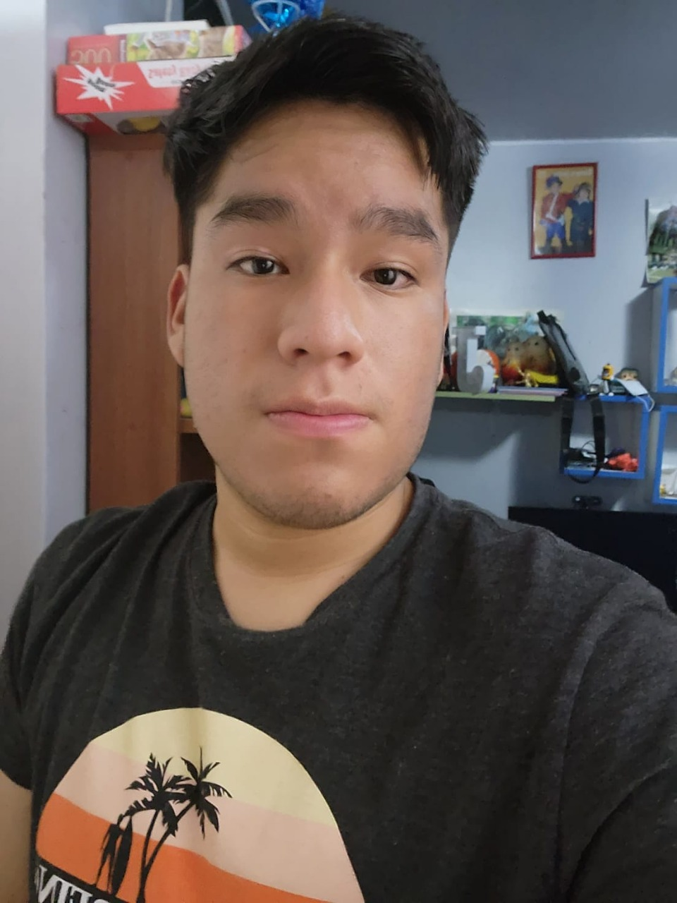 | **Stanley Jeremy Gutierrez Tume (U202118152)** | **Team Leader** | Estudiante de Ingeniería de Software, asume el rol de *Team Leader*. Su enfoque colaborativo le permite asignar tareas de manera eficiente, mientras que sus habilidades técnicas en HTML y CSS respaldan la capacidad para materializar ideas. Busca constantemente oportunidades de crecimiento y aprendizaje, y está comprometido con impulsar la innovación y el éxito en entornos de desarrollo de software. |
| 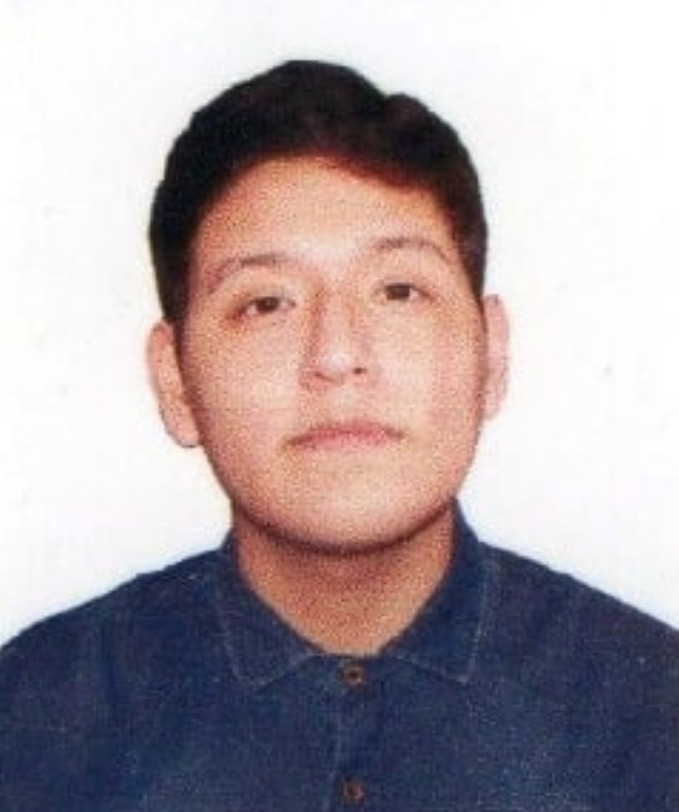 | **Juan José Meza Huanacune (U202320574)** | **Backend Engineer** | Estudiante de Ingeniería de Software, asume el rol de *Backend Engineer*. Tiene experiencia en arquitecturas backend con C#, Java y Python, además del manejo de bases de datos relacionales. Su capacidad de organización, liderazgo y aplicación de metodologías ágiles le permite coordinar tareas y asegurar el cumplimiento de objetivos del equipo. |
|  | **Eduardo Fabián Chacaliaza Minaya (U202324129)** | **Frontend & UX/UI Engineer** | Estudiante de Ingeniería de Software, desempeña el rol de *Frontend & UX/UI Engineer*. Domina HTML5, CSS3 y JavaScript, junto con frameworks modernos como Vue.js y React. Se especializa en diseño de interfaces accesibles y centradas en el usuario, aportando creatividad y una visión enfocada en la experiencia de usuario para lograr aplicaciones intuitivas y atractivas. |
| 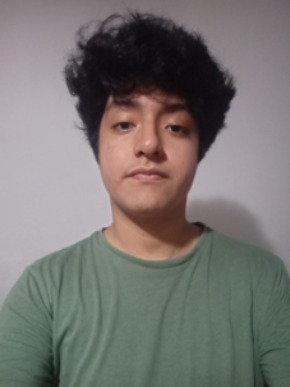 | **Fabricio Fabián Quispe Barzola (U202320442)** | **Data & IoT Integration Engineer** | Estudiante de Ingeniería de Software, cumple el rol de *Data & IoT Integration Engineer*. Cuenta con conocimientos en machine learning, procesamiento de datos y analítica con Python y R, además de experiencia en la integración de dispositivos IoT. Su aporte principal es implementar soluciones inteligentes que conecten sensores y servicios en la nube, garantizando un flujo de datos seguro y en tiempo real. |
|  | **Romero Meza Jhimy Pool (U202321510)** | **Frontend & UX/UI Engineer** | Estudiante de Ingeniería de Software, cumple el rol de UX/UI Designer & Frontend Engineer. Cuenta con conocimientos en diseño de interfaces, experiencia de usuario y desarrollo frontend con tecnologías modernas. Su aporte principal es la conceptualización y creación de wireframes, mockups y prototipos interactivos, asegurando que la experiencia del usuario sea clara, intuitiva y alineada con los objetivos del proyecto. Además, garantiza la coherencia visual del sistema y facilita la transición entre la fase de diseño y desarrollo.  |

---

## 1.2 Solution Profile

### 1.2.1 Antecedentes y problematica
Las enfermedades neurologicas, como la epilepsia, el Parkinson y el Alzheimer, representan un reto creciente para los sistemas de salud a nivel mundial. En muchos casos, los diagnosticos se realizan en etapas avanzadas debido a la ausencia de herramientas de monitoreo continuo y a la dependencia de consultas medicas periodicas. Esto ocasiona tratamientos poco personalizados, hospitalizaciones evitables y una disminucion en la calidad de vida de los pacientes.  

Los especialistas coinciden en que la integracion de **Internet of Things (IoT)** y **analitica de Inteligencia Artificial (IA)** puede transformar la atencion neurológica, facilitando un monitoreo en tiempo real, detecciones tempranas y la telemedicina. Sin embargo, actualmente las soluciones disponibles son fragmentadas, costosas o de dificil acceso, lo que genera una brecha significativa para pacientes y profesionales de la salud.  

**AuraNeuro**, producto de la startup **Mythicore**, surge como respuesta a esta necesidad, proponiendo un sistema de monitoreo neurologico continuo que capture datos biomédicos mediante dispositivos IoT, los procese con algoritmos de IA y los integre en una plataforma accesible para especialistas y pacientes.  

---

#### 1.2.1.1 What  
**¿Cual es el problema?**  
La falta de monitoreo continuo en pacientes neurologicos provoca diagnosticos tardios, tratamientos poco ajustados y hospitalizaciones innecesarias.  

**¿Cual es la relacion con el usuario?**  
El sistema permite identificar en tiempo real cambios neurologicos mediante biomarcadores capturados por sensores IoT, facilitando que el paciente y el especialista tomen medidas preventivas y correctivas oportunas.  

---

#### 1.2.1.2 Who  
**¿Quienes estan involucrados?**  
Pacientes con enfermedades neurologicas cronicas, en rehabilitacion o en riesgo; neurologos y especialistas; hospitales y aseguradoras.  

**¿A quienes les sucede el problema?**  
A pacientes que dependen de consultas medicas espaciadas y no cuentan con monitoreo objetivo y constante de su condicion.  

**¿Quien lo utilizara?**  
Pacientes adultos (20–65 años) diagnosticados o en riesgo, junto con neurologos que requieren datos objetivos para la toma de decisiones clinicas.  

---

#### 1.2.1.3 Where  
**¿Donde esta el cliente cuando usa el producto?**  
En hospitales, clinicas o en su propio domicilio, utilizando dispositivos portatiles y la aplicacion digital vinculada.  

**¿Donde surge el problema?**  
En la atencion tradicional, limitada a consultas periodicas y sin continuidad de informacion entre cada evaluacion medica.  

---

#### 1.2.1.4 When  
**¿Cuando sucede el problema?**  
Entre citas medicas y en momentos criticos como crisis epilepticas, episodios de perdida de memoria o deterioro cognitivo progresivo.  

**¿Cuando utiliza el cliente el producto?**  
De manera continua (mediante sensores portatiles), durante las 24 horas del dia, con acceso a reportes y alertas en tiempo real.  

---

#### 1.2.1.5 Why  
**¿Cual es la causa del problema?**  
La dependencia de registros subjetivos (anamnesis), la falta de herramientas tecnologicas accesibles y la fragmentacion de datos medicos provocan errores de diagnostico y tratamientos poco oportunos.  

---

#### 1.2.1.6 How  
**¿En que condiciones se usa el producto?**  
- En la rutina diaria del paciente, con sensores portatiles conectados a una aplicacion movil.  
- En consultas medicas, donde el especialista accede a un panel con datos procesados por IA.  

**¿Como nos conocieron los usuarios?**  
A traves de programas de salud digital, recomendaciones de especialistas y alianzas con hospitales y aseguradoras.  

**¿Como prefieren acceder al contenido?**  
Mediante una aplicacion movil intuitiva y una plataforma web para especialistas, con reportes claros y notificaciones de alertas.  

---

#### 1.2.1.7 How much  
- Segun la **Organizacion Mundial de la Salud (OMS, 2020)**, mas de 50 millones de personas en el mundo padecen epilepsia, y hasta un 70% podria vivir sin crisis con diagnostico y tratamiento oportunos.  
- Estudios en **The Lancet Neurology (2019)** muestran que el monitoreo remoto reduce hasta en un 59% las hospitalizaciones evitables en pacientes cronicos.  
- Implementaciones piloto de EEG portatiles han demostrado reducir hasta 4 dias de estancia en UCI, disminuyendo costos y mejorando la calidad de vida.  

---

**Conclusion:**  
Los antecedentes evidencian que la atencion neurologica tradicional es insuficiente para un diagnostico temprano y un seguimiento adecuado. El impacto de la falta de monitoreo continuo se traduce en hospitalizaciones evitables, menor calidad de vida y altos costos para el sistema de salud. **AuraNeuro** propone cerrar esta brecha mediante una plataforma accesible que integre IoT e IA, ofreciendo valor tanto a pacientes como a especialistas.

## 1.2.2. Lean UX Process

### 1.2.2.1. Lean UX Problem Statements

**Domain**  
Plataforma de salud neurológica digital con IoT, IA y telemedicina, integrada a historias clínicas electrónicas (EHR) y apoyada en un servicio externo gratuito para enriquecer datos clínicos.

**Customer segments**  
- Pacientes neurológicos y sus cuidadores.  
- Profesionales de salud (neurólogos, fisioterapeutas, psicólogos clínicos).  
- Instituciones y aseguradoras que buscan reducir costos y complicaciones.  
- Centros de investigación y biotecnología interesados en ensayos clínicos.  

**Pain points**  
- Diagnósticos tardíos por datos intermitentes.  
- Información dispersa y poco interoperable entre dispositivos y EHR.  
- Dificultad para evaluar adherencia y ajustar tratamientos a tiempo.  
- Falta de evidencias objetivas que respalden las decisiones clínicas rápidas.  

**Gap**  
Las soluciones actuales suelen ofrecer solo piezas aisladas (wearables, teleconsulta o apps), pero no una integración completa de señales neurológicas en tiempo real con analítica de IA, telemedicina y servicios externos relevantes para la práctica clínica.

**Vision / Strategy**  
Unificar en una plataforma única:  
1. Captura de señales IoT (EEG, EMG, acelerometría).  
2. Analítica con IA para detección, predicción y alertas.  
3. Telemedicina segura entre paciente y médico.  
4. Registro automático en EHR.  
5. Enriquecimiento con servicio externo gratuito (ej. ClinicalTrials.gov o RxNorm).  

**Initial segment**  
- Pacientes con epilepsia atendidos en servicios de neurología hospitalaria, y neurólogos que requieren datos objetivos y alertas predictivas.  

---

### 1.2.2.2 Lean UX Assumptions

A partir de los problemas identificados en el apartado anterior, se formulan las siguientes suposiciones iniciales que orientan el desarrollo de la plataforma AuraNeuro. Estas asunciones se dividen en tres dimensiones: negocio, usuarios y tecnologia.

**Business Assumptions**  
- Se asume que, si la plataforma demuestra una reduccion en hospitalizaciones y mortalidad, las instituciones de salud estaran dispuestas a adoptarla.  
- Se asume que, si se integra un servicio externo de valor (como ensayos clinicos o validacion de medicamentos), los profesionales percibiran diferenciacion frente a otras soluciones.  
- Se asume que, si se ofrece un modelo SaaS con costos accesibles, la plataforma podra ser sostenible y escalable.  

**User Assumptions**  
- Se asume que, si los pacientes reciben alertas y retroalimentacion clara, se motivaran a utilizar los dispositivos IoT de manera continua.  
- Se asume que, si los medicos disponen de dashboards integrados con datos confiables y externos, confiaran en la herramienta y la usaran de forma rutinaria.  
- Se asume que, si los pacientes observan resultados tangibles sobre adherencia y evolucion, incrementaran su confianza en el sistema.  

**Technical Assumptions**  
- Se asume que, si las señales IoT pueden procesarse en la nube con baja latencia, sera posible generar alertas en tiempo real.  
- Se asume que, si la API RESTful orquesta adecuadamente datos internos y externos, la integracion sera viable y estable.  
- Se asume que, si el servicio externo gratuito mantiene un SLA aceptable, se garantizara disponibilidad sin costos adicionales.  

**Conclusion**  
Estas suposiciones proporcionan el punto de partida para la formulacion de hipotesis que seran validadas en fases posteriores del Lean UX Process, reduciendo incertidumbre y alineando la propuesta con las necesidades reales del entorno.

---

### 1.2.2.3 Lean UX Hypothesis Statements

Con base en las suposiciones de negocio, usuario y tecnologia, se formulan las siguientes hipotesis que orientan la validacion del producto AuraNeuro:

**Business Hypotheses**  
- Si la plataforma ofrece alertas predictivas y logra reducir hospitalizaciones y mortalidad en al menos un 15%, entonces las instituciones de salud adoptaran la solucion. Lo sabremos al comparar indicadores de hospitalizacion antes y despues de la implementacion piloto.  
- Si integramos un servicio externo de referencia (ej. ClinicalTrials.gov), entonces los medicos percibiran diferenciacion frente a soluciones existentes. Lo sabremos al medir el porcentaje de especialistas que valoran este aspecto en entrevistas y encuestas.  
- Si ofrecemos un modelo SaaS con costos accesibles (<10 USD por paciente al mes), entonces la plataforma sera sostenible y escalable. Lo sabremos al validar la aceptacion del modelo de pago en pruebas de mercado.  

**User Hypotheses**  
- Si los pacientes reciben alertas predictivas personalizadas, entonces aumentara su adherencia al tratamiento en al menos un 15%. Lo sabremos al medir el cumplimiento de rutinas dentro de la aplicacion.  
- Si los medicos disponen de dashboards integrados con datos IoT y servicios externos, entonces incrementara su uso regular de la plataforma. Lo sabremos al registrar la frecuencia de acceso y la duracion de sesiones en pruebas piloto.  
- Si los pacientes visualizan resultados claros sobre adherencia y evolucion, entonces aumentara su confianza en el sistema. Lo sabremos al medir la satisfaccion mediante encuestas post-uso.  

**Technical Hypotheses**  
- Si procesamos señales IoT en la nube con latencia menor a 500 ms en el 95% de las llamadas, entonces garantizaremos una experiencia en tiempo real. Lo sabremos al monitorear las metricas de rendimiento del sistema.  
- Si la API RESTful integra datos internos y externos de manera estable, entonces la interoperabilidad sera viable. Lo sabremos al medir uptime y tasa de errores durante pruebas de integracion.  
- Si el servicio externo gratuito mantiene un SLA superior al 90%, entonces podremos garantizar disponibilidad sin costos adicionales. Lo sabremos al registrar la estabilidad del servicio en el periodo de prueba.  

**Conclusion**  
Estas hipotesis transforman las suposiciones en criterios medibles de exito, abarcando las dimensiones de negocio, usuario y tecnologia. Su validacion permitira reducir riesgos y ajustar la propuesta de AuraNeuro a las necesidades reales del entorno.

### 1.2.2.4 Lean UX Canvas

Con base en los problemas, supuestos e hipótesis previamente definidos, se elaboró el **Lean UX Canvas** de la solución AuraNeuro.  
Este instrumento permite visualizar de manera integrada los principales elementos de la propuesta: el problema de negocio, los usuarios y clientes, los beneficios esperados, las ideas de solución, los resultados de negocio, las hipótesis a validar y los aprendizajes críticos necesarios en etapas iniciales.  

  

# Capítulo II: Requirements Elicitation & Analysis
  
La recolección y análisis de requisitos es una etapa fundamental en el desarrollo de cualquier proyecto. Este proceso implica identificar, comprender y documentar las necesidades y expectativas de los stakeholders, así como los objetivos y restricciones del proyecto.  

A través de entrevistas, encuestas y estudios de mercado, se busca obtener una comprensión clara de los requerimientos de la solución. En este capítulo se incluyen los competidores directos e indirectos de la plataforma, para entender el estado del arte y definir nuestras fortalezas frente a ellos.  

---

## 2.1. Competidores

En esta sección se presentan algunos competidores relevantes en el ámbito del monitoreo neurológico y la telemedicina, así como un análisis de las características que nuestra plataforma IoT busca superar.

---

  

Ceribell: Es una empresa especializada en electroencefalografía portátil para cuidados intensivos. Su sistema permite obtener resultados de EEG en minutos, facilitando diagnósticos rápidos en emergencias neurológicas. Sin embargo, su enfoque está limitado al ámbito hospitalario y no ofrece un ecosistema integral de seguimiento remoto para pacientes crónicos.  

---

  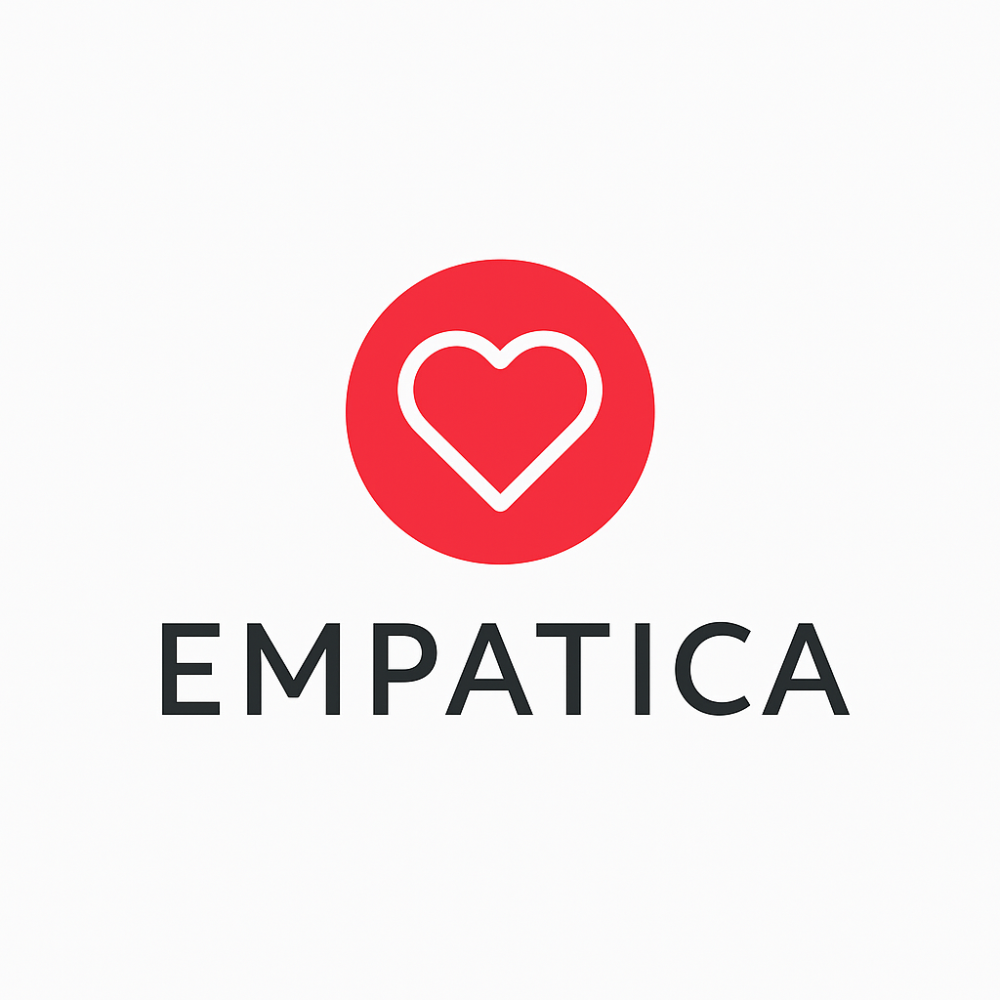

Empatica: Fabricante de dispositivos wearables biomédicos como el EmbracePlus, que mide actividad eléctrica de la piel, frecuencia cardíaca y patrones de sueño. Sus soluciones están dirigidas principalmente a investigación clínica y monitoreo de epilepsia, pero carecen de una plataforma analítica avanzada para predicción personalizada de crisis en pacientes.  

---

  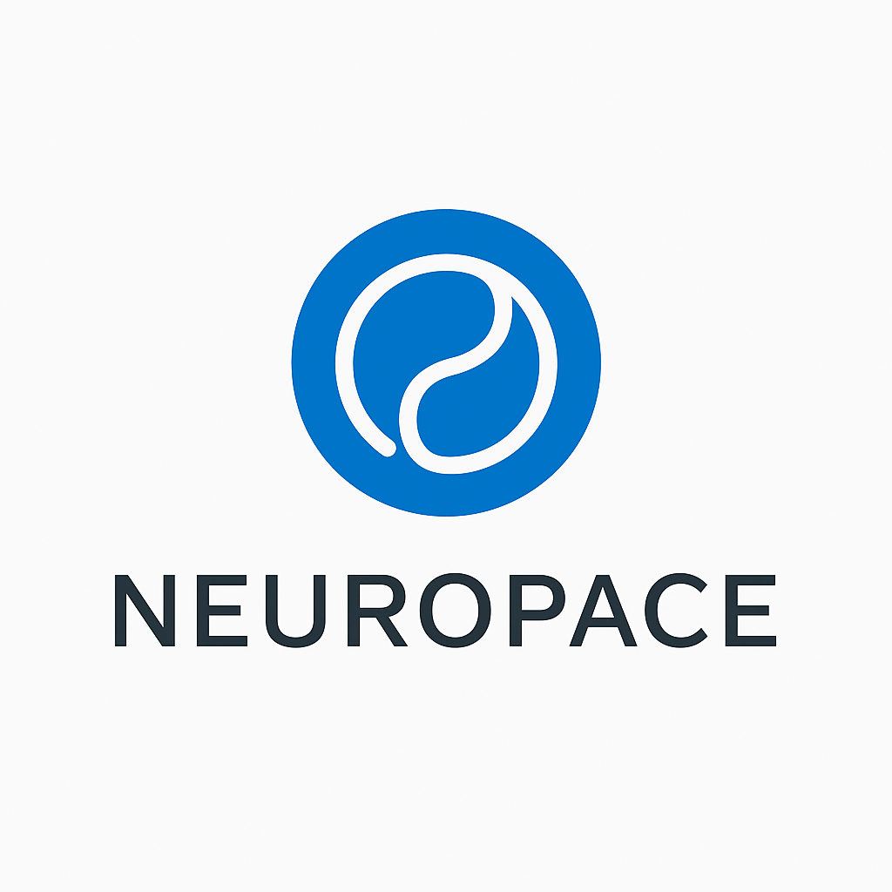

NeuroPace: Ofrece el RNS System, un dispositivo implantable que detecta y responde a actividad cerebral anormal en pacientes con epilepsia. Es una solución pionera en estimulación cerebral, aunque presenta un alto costo y está limitado a casos muy específicos, sin opciones de integración con telemedicina ni con monitoreo cotidiano de calidad de vida.  

---

## Fortalezas de Nuestra Plataforma IoT  
- Combina **sensores portátiles e implantables** en un mismo ecosistema.  
- Permite un **monitoreo continuo y remoto**, más allá del entorno hospitalario.  
- Integra **inteligencia artificial** para predicción de crisis y episodios neurológicos.  
- Ofrece una **interfaz multiplataforma** (app móvil para pacientes, dashboard web para médicos).  
- Incluye un **módulo de investigación** con exportación de datos anonimizados para ensayos clínicos.  

---
### 2.1.1. Análisis competitivo  

El análisis competitivo nos brinda una visión clara de cómo nos comparamos con nuestros competidores en el mercado. Nos ayuda a identificar áreas en las que podemos mejorar, así como oportunidades para diferenciarnos y destacar. Esta comprensión nos permite desarrollar estrategias más efectivas como grupo, lo que nos ayuda a alcanzar nuestros objetivos y mantenernos competitivos en el mercado.  

---

#### Competitive Analysis Landscape  

| ¿Por qué llevar a cabo este análisis? | Llevar a cabo este análisis nos brindará información crítica que nos permitirá tomar decisiones más informadas y estratégicas para el desarrollo, comercialización y crecimiento de nuestra plataforma. |
|---------------------------------------|-----------------------------------------------------------------------------------------------------------------------------------------------------------------------------------|

| Perfil | Nuestro Proyecto (Plataforma IoT) | Ceribell | Empatica | NeuroPace |
|--------|------------------------------------|----------|----------|-----------|
| **Overview** | Plataforma IoT y de telemedicina para monitoreo neurológico continuo, integración de datos en la nube y analítica avanzada con IA. | EEG portátil para emergencias hospitalarias, diagnóstico rápido en UCI. | Wearables biomédicos para investigación clínica y monitoreo de epilepsia. | Dispositivo implantable (RNS System) para epilepsia resistente, con estimulación cerebral adaptativa. |
| **Ventaja competitiva / Valor al cliente** | Seguimiento remoto 24/7, alertas predictivas y telemedicina integrada. | Diagnóstico rápido y portátil. | Datos fisiológicos continuos y validados para investigación. | Detección y respuesta automática a actividad cerebral anómala. |
| **Mercado objetivo** | Pacientes con enfermedades neurológicas crónicas, hospitales, clínicas e investigadores. | Hospitales y UCIs. | Centros de investigación y pacientes con epilepsia. | Pacientes con epilepsia severa, candidatos a implantes. |
| **Estrategias de marketing** | Posicionamiento como plataforma integral de prevención y personalización médica. | Marketing B2B enfocado en hospitales. | Alianzas con universidades e instituciones médicas. | Difusión clínica en epileptología y neurocirugía. |
| **Productos y Servicios** | App móvil para pacientes y familiares, dashboard web para médicos, integración con EHR, módulo de investigación. | Dispositivo EEG portátil y software de análisis. | Pulsera *EmbracePlus* y plataforma de datos biomédicos. | RNS System (implante cerebral y software). |
| **Precios y Costos** | Modelo de suscripción mensual/anual para pacientes e instituciones. | Venta directa de hardware y licencias. | Venta de dispositivos + servicios de análisis. | Alto costo quirúrgico + mantenimiento de hardware. |
| **Canales de distribución** | Plataforma web y móvil, integración con hospitales, clínicas y aseguradoras. | Venta hospitalaria y distribuidores médicos. | Online y a través de centros de investigación. | Cirugías especializadas en hospitales de referencia. |

---

#### Análisis SWOT  

| Factor | Nuestro Proyecto | Ceribell | Empatica | NeuroPace |
|--------|------------------|----------|----------|-----------|
| **Fortalezas** | Integración completa IoT + IA + telemedicina; multiplataforma; datos anonimizados para investigación. | Resultados de EEG inmediatos en UCI. | Wearables validados científicamente. | Estimulación cerebral adaptativa altamente innovadora. |
| **Debilidades** | Proyecto en fase inicial, necesidad de certificaciones médicas y financiamiento. | Limitado a entornos hospitalarios, no es continuo ni remoto. | Carece de analítica avanzada predictiva. | Alto costo y aplicable solo a pacientes con epilepsia refractaria. |
| **Oportunidades** | Creciente demanda de telemedicina, prevención y salud digital; alianzas con hospitales y aseguradoras. | Expansión a hospitales de menor escala. | Expansión en mercados de salud digital y bienestar. | Integración con sistemas de monitoreo remoto en el futuro. |
| **Amenazas** | Competencia de grandes empresas tecnológicas y dispositivos médicos consolidados. | Aparición de nuevas soluciones de EEG portátiles. | Competidores en el área de wearables de salud. | Nuevas técnicas no invasivas que reduzcan su uso. |

### 2.1.2. Estrategias y Tácticas frente a Competidores

**Objetivo.** Definir cómo competiremos y ganaremos tracción frente a soluciones existentes (hospitalarias, wearables clínicos e implantes), priorizando diferenciadores de **monitoreo continuo remoto**, **IA predictiva** e **integración clínica**. (Según plantilla se debe incluir esta sección). 

#### a) Estrategias por competidor

| Competidor | Fortalezas clave | Debilidades / brechas | Nuestra estrategia | Tácticas concretas | Métricas/KPI |
|---|---|---|---|---|---|
| **Ceribell** (EEG portátil UCI) | EEG rápido en emergencias; validación clínica hospitalaria | Enfoque intra-hospitalario; sin seguimiento remoto longitudinal | **Extender el cuidado post-alta** con **RPM** (Remote Patient Monitoring) y alertas en casa | • Kits de alta con sensores + app  • Integración **EHR/HL7-FHIR** para continuidad de cuidados  • Protocolos de alerta temprana a neurología | Adopción post-alta (% pacientes activos a 30/90 días)  Tiempo respuesta ante alerta  # de hospitales integrados |
| **Empatica** (wearables biomédicos) | Wearables validados; datos fisiológicos continuos | Foco investigación; analítica predictiva limitada al usuario | **Diferenciación en IA clínica**: predicción de crisis y episodios motores con panel médico | • Modelos ML multiseñal (EEG/EMG/actigrafía/sueño)  • Panel clínico con riesgo minuto-a-minuto  • Programa de “co-desarrollo” con centros de epilepsia | AUC/Se/Sp en predicción de crisis  Reducción de eventos no detectados  # acuerdos de investigación |
| **NeuroPace** (RNS implantable) | Respuesta adaptativa a actividad anómala; resultados en epilepsia refractaria | Invasivo y costoso; nicho de pacientes | **Alternativa no invasiva** en etapas tempranas y triage pre-implante | • Protocolos de triage: usar nuestra plataforma antes de implante  • Reportes de evolución para comités de epilepsia  • Detección de patrones pre-ictales para evitar progresión | % pacientes que evitan implante  Reducción de crisis/mes  Satisfacción de comité (NPS clínico) |

#### b) Estrategias transversales (producto, GTM y cumplimiento)

| Frente | Tácticas | Métricas/KPI |
|---|---|---|
| **Producto & IA** | Algoritmos de detección temprana (convulsiones, bradicinesia/temblor, alteraciones de sueño), explicación de modelos para uso clínico | AUC/Se/Sp por patología; tiempo de inferencia; % explicaciones aceptadas por médicos |
| **Integración clínica** | APIs **FHIR/HL7**, interoperabilidad con EHR y PACS; flujos de telemedicina con historial en contexto | # integraciones activas; tiempo de onboarding hospital; % consultas con datos embebidos |
| **Seguridad & cumplimiento** | Cifrado E2E; anonimización para investigación; roadmap HIPAA/GDPR/ISO 27001 | Incidentes de seguridad (0); auditorías aprobadas; % datasets anonimizados |
| **GTM (go-to-market)** | Pilotos con hospitales neurológicos y aseguradoras (RPM); casos de uso por línea (Epilepsia, Parkinson, EM) | # pilotos activos; tasa de conversión piloto→contrato; costo de adquisición por institución |
| **Modelo de negocio** | Suscripción por paciente/mes (RPM) y licencias B2B para instituciones; tier de investigación | ARPU por segmento; churn; margen por institución |
| **Evidencia clínica** | Estudios observacionales + publicaciones conjuntas con centros; dataset abierto anonimizado | # publicaciones; # citaciones; # descargas de dataset |
| **Soporte al paciente** | Educación y adherencia (recordatorios, coaching), canal para cuidadores con alertas graduadas | Adherencia al uso (>80%/90 días); tiempo de respuesta cuidador; NPS paciente/caregiver |

#### c) Tácticas de corto plazo (TB1 → TP1)

1. **Piloto de telemetría** con 10–20 pacientes de epilepsia y Parkinson (app + sensores, dashboard mínimo).  
2. **Primeras reglas de alerta** (umbral + tendencia) mientras se entrena el modelo predictivo.  
3. **Integración EHR “light”** (exportación FHIR y resúmenes PDF) para consulta médica.  
4. **Acuerdo de investigación** con 1 centro de neurociencias (data-sharing anonimizado).  
5. **MVP de panel clínico**: lista de pacientes, alertas, evolución de crisis/temblor y “riesgo próximo” básico.

## 2.2 Entrevistas
- 2.2.1. Diseño de entrevistas  

Muy buenos días/tardes/noches, estamos contentos de que haya aceptado esta entrevista. Somos estudiantes de la carrera de Ingeniería de Software e Informática de la UPC. A nombre del grupo desarrollador de la Plataforma IoT para la Optimización de la Atención Neurológica, queremos conversar con usted sobre las dificultades y necesidades que enfrentan los pacientes con enfermedades neurológicas y los profesionales de la salud que los atienden.  

Nuestro objetivo es conocer su experiencia y su perspectiva, ya que buscamos validar y mejorar nuestro producto. Esta plataforma integra dispositivos IoT que recolectan datos neurológicos en tiempo real (EEG, EMG, actividad motora, calidad del sueño, etc.) con inteligencia artificial para generar reportes, alertas predictivas y facilitar el seguimiento remoto por parte de los médicos. Sus respuestas serán muy valiosas para construir una solución útil, accesible y empática.  

---

### Segmento #1: Pacientes con enfermedades neurológicas crónicas  

**Preguntas complementarias:**  
- ¿Cuál es tu nombre completo?  
- ¿Cuántos años tienes?  
- ¿Dónde resides actualmente?  
- ¿Vives solo o acompañado?  
- ¿Tienes algún diagnóstico neurológico específico?  
- ¿Has recibido tratamiento o seguimiento médico especializado anteriormente?  
- ¿Qué dispositivos tecnológicos usas con mayor frecuencia? 
- ¿Qué navegador web utilizas normalmente? 
- ¿Cuáles son los métodos que utilizas más para autenticarte o logearte en plataformas?  

**Preguntas principales:** *Obtener información sobre el impacto de la enfermedad, necesidades, expectativas y aceptación de nuevas tecnologías*  
- ¿Cómo ha impactado tu condición en tu vida diaria o en la de tus familiares?  
- ¿Qué dificultades enfrentas actualmente para llevar un control de tu enfermedad?  
- ¿Qué tan útil consideras que sería contar con un sistema que envíe alertas tempranas sobre crisis o anomalías?  
- ¿Qué información te gustaría poder consultar en una aplicación?  
- ¿Qué tan dispuesto estarías a usar dispositivos IoT para mejorar tu seguimiento médico?  
- ¿Cuáles serían tus principales preocupaciones respecto al uso de esta tecnología?  

### Segmento #2: Psicólogos clínicos / Neuropsicólogos  

**Preguntas complementarias:**  
- ¿Cuál es su nombre completo?  
- ¿Cuántos años tiene?  
- ¿Dónde ejerce actualmente su profesión? (clínica, hospital, consultorio privado, universidad, etc.)  
- ¿Cuántos años de experiencia tiene en el área de neurología / salud mental?  
- ¿Cuál es su especialidad o campo principal de trabajo? (neurología, neuropsicología, psicología clínica, terapia de rehabilitación, etc.)  
- ¿Con qué frecuencia atiende a pacientes con enfermedades neurológicas crónicas?  
- ¿Qué dispositivos tecnológicos utiliza con mayor frecuencia en su práctica profesional? (ejemplo: laptop, tablet, smartphone, dispositivos médicos digitales)  
- ¿Qué software o plataformas médicas emplea habitualmente? (ejemplo: historias clínicas electrónicas, Epic, Cerner, otros)  
- ¿Qué navegador web utiliza normalmente para su trabajo? (ejemplo: Chrome, Safari, Edge, Opera)  
- ¿Cuáles son los métodos que utiliza más para autenticarse en sistemas o plataformas profesionales? (ejemplo: correo institucional, Gmail, SMS, autenticación en dos pasos, otros)  

**Preguntas principales (Segmento 2 – Profesionales de la salud):**  
- ¿Cómo realiza actualmente el seguimiento de sus pacientes con epilepsia u otras condiciones neurológicas?  
- ¿Qué tan útil considera contar con una plataforma que integre registros de crisis, calidad de sueño y datos biométricos en tiempo real?  
- ¿Qué marcas o sistemas le generan más confianza para trabajar con este tipo de soluciones?  
- ¿Le sería útil acceder a los registros de sus pacientes desde una aplicación web conectada a la nube?  
- ¿Qué comunidades científicas sigue para mantenerse actualizado en este tema?  
- ¿Cómo cree que estas herramientas digitales impactarían en el sistema de salud en general?  
- ¿Cómo visualiza el futuro de la neurología con IoT y plataformas digitales integradas?  

### Segmento #3: Proveedores IoT

**Preguntas complementarias:**  
- ¿Cuál es el nombre de su empresa o marca?  
- ¿Cuál es su nombre completo y cargo dentro de la empresa?  
- ¿Cuántos años de experiencia tiene su empresa en el desarrollo de dispositivos IoT para el sector salud?  
- ¿Qué tipo de dispositivos IoT produce o distribuye actualmente? (ejemplo: bandas EEG, wearables, relojes inteligentes, sensores implantables, otros)  
- ¿En qué mercados o regiones tienen mayor presencia?  
- ¿Cuáles son los principales clientes a los que venden sus soluciones? (hospitales, clínicas, investigadores, aseguradoras, pacientes directamente)  
- ¿Qué dispositivos tecnológicos utilizan con mayor frecuencia en su operación diaria? (ejemplo: servidores, plataformas cloud, aplicaciones de monitoreo)  
- ¿Qué software o plataformas emplean para la gestión y seguridad de datos recolectados por sus dispositivos?  
- ¿Qué navegador web utilizan normalmente para el trabajo administrativo o de integración de plataformas?  
- ¿Cuáles son los métodos más utilizados para autenticar usuarios en sus dispositivos o plataformas? (ejemplo: correo institucional, Gmail, SMS, autenticación en dos pasos, biometría)  

**Preguntas principales:**  
- ¿Cómo desarrollan actualmente sus dispositivos IoT aplicados a la salud neurológica y cuáles son sus principales funcionalidades?  
- ¿Qué tan capacitado considera que está su equipo en la integración de dispositivos IoT con plataformas digitales de salud, como historias clínicas electrónicas o dashboards médicos?  
- ¿Qué marcas, certificaciones o estándares internacionales considera fundamentales para que los profesionales de la salud confíen en sus dispositivos? 
- ¿Le sería útil contar con alianzas estratégicas que permitan acceder a los datos de sus dispositivos desde aplicaciones web o plataformas en la nube utilizadas por médicos y hospitales?  
- ¿En qué comunidades profesionales o foros online participa su empresa para mantenerse actualizada sobre tendencias y regulaciones de IoT en el sector salud?  
- ¿Cómo cree que la adopción de dispositivos IoT impactará en hospitales, clínicas y aseguradoras que atienden a pacientes neurológicos?  
- ¿Cómo visualiza el futuro de los dispositivos IoT aplicados a la neurología en los próximos 5 a 10 años?  

---  

**Despedida:** 
Muchas gracias por tu tiempo hoy. Tu opinión y las ideas que compartiste nos ayudarán mucho a mejorar nuestro producto. Apreciamos tu sinceridad y disposición para participar. Si necesitas más información, no dudes en contactarnos. ¡Gracias!

- 2.2.2 Registro de entrevistas  

## Segmento 1: Pacientes con enfermedades neurológicas crónicas  

### Entrevista N°1  

- **Nombre:** Cesar Aaron Cornejo  
- **Sexo:** Masculino  
- **Edad:** 21  
- **Estado Civil:** Soltero
- **Link:** [Entrevista Aaron](https://upcedupe-my.sharepoint.com/:v:/g/personal/u202320574_upc_edu_pe/EZxZ3WlYjT1Cp7yqP_OKdSIBRR0IFKAnrzwQjBEJNXY9YQ?nav=eyJyZWZlcnJhbEluZm8iOnsicmVmZXJyYWxBcHAiOiJTdHJlYW1XZWJBcHAiLCJyZWZlcnJhbFZpZXciOiJTaGFyZURpYWxvZy1MaW5rIiwicmVmZXJyYWxBcHBQbGF0Zm9ybSI6IldlYiIsInJlZmVycmFsTW9kZSI6InZpZXcifX0%3D&e=j1Yf0B)
- **Condición:** Paciente diagnosticado con epilepsia  

**Detalles de la entrevista:**  
Cesar Aaron Cornejo es un joven de 21 años que reside en Lima. Durante la conversación compartió que una de las principales dificultades que enfrenta es la imprevisibilidad de sus crisis, las cuales generan ansiedad y preocupación, tanto en él como en su familia.  

Actualmente lleva un registro manual de sus episodios en un cuaderno, aunque reconoce que este método no siempre es preciso, ya que puede olvidar anotar detalles importantes. Señala que esta limitación dificulta que su neuróloga tenga información completa para ajustar su tratamiento.  

Aaron considera que recibir alertas tempranas sobre posibles crisis en tiempo real sería muy útil, pues le permitiría tomar precauciones inmediatas y dar mayor tranquilidad a su familia. Le interesaría consultar en una aplicación móvil datos como la frecuencia y duración de las crisis, la calidad de su sueño y los factores desencadenantes, presentados en gráficos y estadísticas fáciles de entender.  

En cuanto a tecnologías de monitoreo, se muestra abierto al uso de **wearables** como relojes inteligentes de marcas confiables (Garmin, Fitbit), y señala que aceptaría sensores implantables siempre que fueran seguros y validados médicamente. Para él, la posibilidad de que su neuróloga pueda acceder a sus datos a través de una aplicación web conectada a su historia clínica representaría un gran avance, reduciendo la necesidad de visitas presenciales.  

Finalmente, menciona que ha participado en comunidades online como foros de la **Epilepsy Foundation** o grupos de Facebook sobre epilepsia, los cuales le han ayudado a sentirse acompañado. Afirma que el uso de estas herramientas digitales le daría mayor independencia y mejoraría la calidad de vida tanto para él como para su familia.  

- **Duración:** 4 minutos con 21 segundos

---

### Resumen de los puntos clave en la entrevista  

- El entrevistado se llama **Cesar Aaron Cornejo**, tiene 21 años, vive en Lima y está diagnosticado con epilepsia.  
- Su principal dificultad es la **imprevisibilidad de las crisis**, lo que genera ansiedad en él y preocupación en su familia.  
- Actualmente lleva un **registro manual** de sus episodios, pero reconoce que es incompleto y poco confiable.  
- Considera muy útil contar con **alertas tempranas** que detecten anomalías en tiempo real, para actuar con mayor seguridad.  
- Le gustaría consultar en una app móvil registros de crisis, calidad del sueño y factores desencadenantes, con **gráficos y estadísticas claras**.  
- Tiene **confianza en wearables** como Garmin y Fitbit, y aceptaría sensores implantables si son seguros y certificados.  
- Valora que su neuróloga pueda **acceder a sus datos desde una plataforma web** conectada a la historia clínica.  
- Ha participado en **comunidades online** de pacientes, lo que le ha dado apoyo emocional.  
- Cree que estas herramientas digitales le darían **independencia, seguridad y tranquilidad familiar**.  

---

### Registro visual de la entrevista  
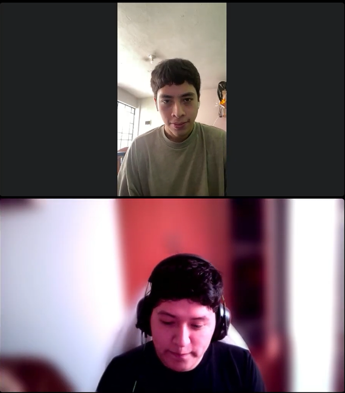  

---

#### Entrevista N°2  

- **Nombre:** Xin Yu Shi Lin  
- **Sexo:** Masculino  
- **Edad:** 25  
- **Estado Civil:** Soltero
- **Link:** [Entrevista Xin](https://upcedupe-my.sharepoint.com/:v:/g/personal/u202320442_upc_edu_pe/EVgqZffZGQtFmtniG8D9sCMBK5K39T_bMbQSLhM_WlAlsg?nav=eyJyZWZlcnJhbEluZm8iOnsicmVmZXJyYWxBcHAiOiJTdHJlYW1XZWJBcHAiLCJyZWZlcnJhbFZpZXciOiJTaGFyZURpYWxvZy1MaW5rIiwicmVmZXJyYWxBcHBQbGF0Zm9ybSI6IldlYiIsInJlZmVycmFsTW9kZSI6InZpZXcifX0%3D&e=h8BhtU)
- **Condición:** Paciente diagnosticado con epilepsia  

**Detalles de la entrevista:**  
Xin Yu Shi Lin es un joven de 25 años que reside en Lima y trabaja como mesero en un chifa. Durante la entrevista compartió que una de sus principales preocupaciones es la posibilidad de sufrir una crisis en el trabajo y no poder avisar a tiempo a alguien. Para su familia también es un reto, ya que viven con la preocupación constante de que pueda pasarle algo de forma repentina.  

Actualmente lleva un control limitado de su condición, anotando a veces en papeles o recordando los episodios de memoria, lo que reconoce como un método poco confiable. Señala que le cuesta recordar detalles importantes como la hora, la duración o los síntomas de cada crisis, lo que genera un seguimiento incompleto y dificulta la labor de sus médicos.  

Considera que un sistema de alertas tempranas sería muy útil, ya que le permitiría tomar precauciones antes de que la crisis empeore y daría tranquilidad tanto a él como a su familia y compañeros de trabajo. También le gustaría contar con una aplicación móvil que registre de forma clara y confiable la frecuencia y duración de sus crisis, factores desencadenantes y recordatorios de medicación, presentados en gráficos y estadísticas fáciles de consultar.  

En cuanto al uso de dispositivos IoT, señala que estaría dispuesto a emplear relojes inteligentes o sensores que registren datos y los compartan directamente con su médico. Menciona que conoce dispositivos como los **Fitbit Ionic**, que pueden monitorear la salud, y cree que serían útiles para su caso. No obstante, expresa preocupaciones respecto a la seguridad de sus datos y la posibilidad de fallas en momentos críticos, por lo que para él la **confianza en la tecnología** es fundamental.  

Además, Xin comenta que participa en comunidades de apoyo, como grupos de Facebook y la **Asociación Peruana de Epilepsia**, lo cual le ha permitido compartir experiencias y recibir consejos útiles de otros pacientes. En cuanto a habilidades digitales, se describe con un nivel básico en smartphones y medio en el uso de laptops, destacando que está muy familiarizado con aplicaciones de mensajería como WhatsApp y SMS.  

- **Duración:** 4 minutos con 22 segundos  

---

### Resumen de los puntos clave en la entrevista  

- El entrevistado se llama Xin Yu Shi Lin, tiene 25 años, vive en Lima y está diagnosticado con epilepsia.  
- Su mayor preocupación es sufrir una crisis en el trabajo y no poder avisar a tiempo.  
- Actualmente lleva un control incompleto, anotando de manera poco confiable o recordando de memoria.  
- Considera muy útil contar con alertas tempranas que anticipen crisis y den seguridad a su familia.  
- Le gustaría usar una app móvil con registros claros, gráficos de evolución y recordatorios de medicación.  
- Está dispuesto a usar dispositivos IoT como relojes inteligentes (ej. Fitbit Ionic), siempre que sean seguros.  
- Sus principales preocupaciones son fallas técnicas y la protección de datos personales.  
- Participa en comunidades de apoyo como la Asociación Peruana de Epilepsia, lo que le ha dado orientación y acompañamiento.  
- Sus habilidades digitales son básicas en smartphones y medias en laptops, con uso frecuente de WhatsApp, Gmail y SMS.  

---

### Registro visual de la entrevista  

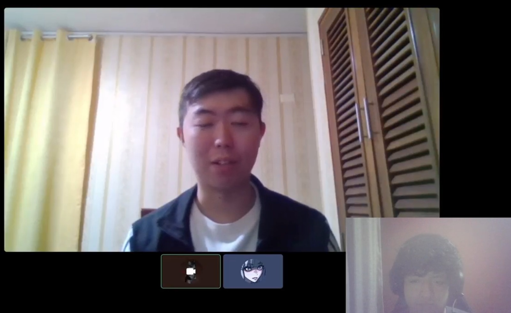  

---

**Segmento #2: Profesionales de la salud en neurología**  

### Entrevista N°1

- **Nombre:** Karen Guadalupe Villanueva Castillo  
- **Sexo:** Femenino  
- **Edad:** 27  
- **Estado Civil:** Soltera  
- **Profesión:** Neuróloga especialista  
- **Link:** [Entrevista Karen](https://upcedupe-my.sharepoint.com/:v:/g/personal/u202320574_upc_edu_pe/EQiEyBrJx-JGoHK_l4x45sYBAWGLVSJzu40JYMV2arNWBA?nav=eyJyZWZlcnJhbEluZm8iOnsicmVmZXJyYWxBcHAiOiJTdHJlYW1XZWJBcHAiLCJyZWZlcnJhbFZpZXciOiJTaGFyZURpYWxvZy1MaW5rIiwicmVmZXJyYWxBcHBQbGF0Zm9ybSI6IldlYiIsInJlZmVycmFsTW9kZSI6InZpZXcifX0%3D&e=dL6y9t)

---

#### Detalles de la entrevista:
Karen Guadalupe Villanueva Castillo es una neuróloga de 27 años que actualmente reside en Lima. Durante la entrevista explicó que el seguimiento de sus pacientes con epilepsia u otras condiciones neurológicas depende, en gran medida, de los registros que ellos mismos llevan en cuadernos o de la información que recuerdan en sus consultas. Aunque utiliza historias clínicas electrónicas, reconoce que la información no siempre es continua ni detallada, lo cual limita la precisión de los diagnósticos y la toma de decisiones clínicas.  

La doctora considera que una plataforma que integre registros de crisis, calidad de sueño y datos biométricos en tiempo real sería de gran valor, pues le permitiría contar con información objetiva y confiable. En cuanto a marcas y sistemas, confía en plataformas estandarizadas como **Epic** y **Cerner** para la gestión clínica, y en dispositivos de monitoreo como los desarrollados por **Medtronic** y **Empatica**, que cuentan con certificaciones médicas.  

Señaló que poder acceder a los datos de sus pacientes desde una aplicación web conectada a la nube sería muy útil, ya que le permitiría revisar información actualizada sin necesidad de visitas presenciales tan frecuentes. Además, destacó que es miembro de comunidades científicas como la **International League Against Epilepsy (ILAE)** y participa en congresos de la **American Academy of Neurology (AAN)**, donde se difunden los avances más recientes en neurotecnología.  

Respecto al impacto de estas herramientas digitales en el sistema de salud, considera que permitirían reducir costos, prevenir hospitalizaciones innecesarias y optimizar recursos en casos críticos. Finalmente, proyecta que el futuro de la neurología con IoT y plataformas digitales será **más preventivo y personalizado**, con monitoreo 24/7 que permita ajustar tratamientos en tiempo real.  

- **Duración:** 6 minutos con 58 segundos 

---

#### Resumen de los puntos clave en la entrevista
- La entrevistada es **Karen Guadalupe Villanueva Castillo**, neuróloga especialista de 27 años.  
- Señala que actualmente depende de registros manuales de los pacientes, lo que dificulta diagnósticos precisos.  
- Considera muy valiosa una plataforma que integre **datos de crisis, sueño y biometría en tiempo real**.  
- Confía en software clínico como **Epic** y **Cerner**, y en dispositivos de monitoreo de **Medtronic** y **Empatica**.  
- Valora el acceso remoto a datos de pacientes mediante aplicaciones web en la nube.  
- Forma parte de comunidades científicas como la **ILAE** y la **AAN**.  
- Opina que estas herramientas reducirán costos hospitalarios, mejorarán la prevención y harán más eficiente al sistema de salud.  
- Visualiza la neurología del futuro como **preventiva, personalizada y soportada por IoT**.  

---

#### Registro visual de la entrevista
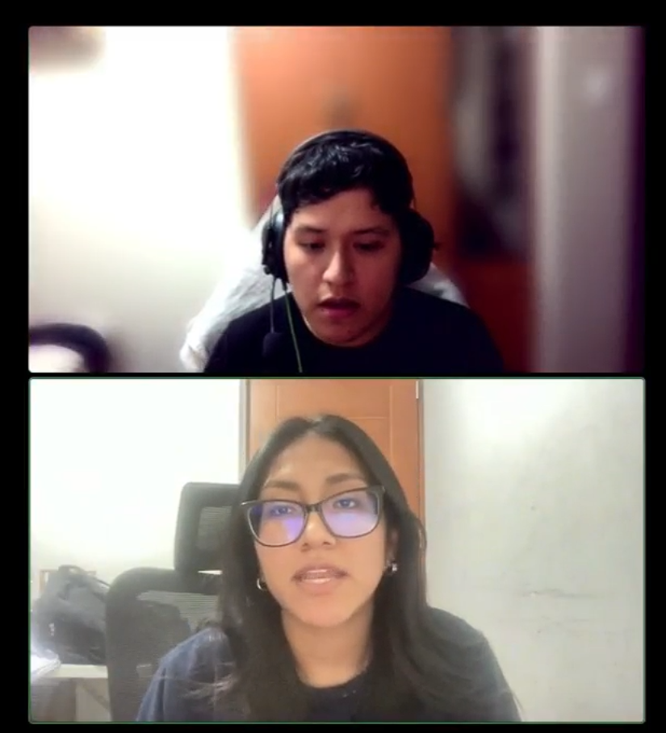

---

### Entrevista N°2

- **Nombre:** Nicol Buendía  
- **Sexo:** Femenino  
- **Edad:** 26  
- **Estado Civil:** No especificado  
- **Profesión:** Terapeuta en rehabilitación neurológica  
- **Link:** [Entrevista Nicol](https://upcedupe-my.sharepoint.com/:v:/g/personal/u202320574_upc_edu_pe/ERy66J4mXqlEjW4IcsmtsVwBdu-vmnMGzi9ZldbU61cQnQ?nav=eyJyZWZlcnJhbEluZm8iOnsicmVmZXJyYWxBcHAiOiJTdHJlYW1XZWJBcHAiLCJyZWZlcnJhbFZpZXciOiJTaGFyZURpYWxvZy1MaW5rIiwicmVmZXJyYWxBcHBQbGF0Zm9ybSI6IldlYiIsInJlZmVycmFsTW9kZSI6InZpZXcifX0%3D&e=YYQLlB)  

---

#### Detalles de la entrevista:
Nicol Buendía es una terapeuta de rehabilitación neurológica de 26 años que actualmente trabaja en una clínica especializada y en un centro comunitario. Durante la entrevista comentó que el seguimiento de pacientes depende principalmente de observaciones presenciales y reportes familiares, lo que limita la continuidad y precisión del tratamiento.

Explicó que, aunque utiliza historias clínicas electrónicas y algunas plataformas de telemedicina, estas no se integran con dispositivos IoT. Señaló que contar con una plataforma que registre datos de actividad motora, frecuencia de crisis y calidad del sueño en tiempo real sería de gran valor para personalizar sus terapias y mejorar los resultados.

Nicol confía en soluciones de rehabilitación como **Rehametrics** y **MindMotion**, así como en dispositivos de monitoreo neurológico de **Empatica** y **NeuroPace**. Además, considera clave disponer de un dashboard en la nube para acceder a datos en tiempo real y coordinar con neurólogos y familiares.

Mencionó que forma parte de comunidades científicas como la **World Federation for NeuroRehabilitation (WFNR)** y la **Sociedad Española de Neurorrehabilitación**, además de capacitarse en cursos y webinars sobre nuevas tecnologías aplicadas a la terapia. Finalmente, destacó que las herramientas digitales permitirían reducir tiempos de hospitalización, mejorar la rehabilitación en casa y avanzar hacia terapias más personalizadas y accesibles.

- **Duración:** 7 minutos con 50 segundos  

---

#### Resumen de los puntos clave en la entrevista
- La entrevistada es **Nicol Buendía**, terapeuta en rehabilitación neurológica de 26 años.  
- Señala que el seguimiento actual depende de observaciones presenciales y reportes familiares.  
- Considera muy útil una plataforma que integre **actividad motora, crisis y sueño en tiempo real**.  
- Confía en plataformas como **Rehametrics** y **MindMotion**, y en dispositivos de **Empatica** y **NeuroPace**.  
- Destaca la importancia de un **dashboard en la nube** para colaboración con neurólogos y familiares.  
- Forma parte de comunidades como la **WFNR** y la **Sociedad Española de Neurorrehabilitación**.  
- Opina que estas herramientas reducirían hospitalizaciones y facilitarían terapias en casa.  
- Visualiza la rehabilitación del futuro como **personalizada, digital e integrada con IoT**.  

---

#### Registro visual de la entrevista
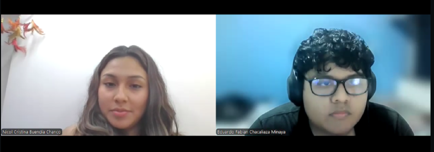

---

**Segmento #3: Terapeutas**   

### Entrevista N°1

- **Nombre:** Carlos Paredes  
- **Sexo:** Masculino  
- **Edad:** 32  
- **Estado Civil:** Soltero  
- **Profesión:** Ingeniero electrónico – Proveedor de soluciones IoT  
- **Link:** [Entrevista Carlos](https://upcedupe-my.sharepoint.com/:v:/g/personal/u202320574_upc_edu_pe/EabaC7sEU_9GrDDU69Xv9owBK49d_g1TTHwcW7RoBKtmZg?nav=eyJyZWZlcnJhbEluZm8iOnsicmVmZXJyYWxBcHAiOiJTdHJlYW1XZWJBcHAiLCJyZWZlcnJhbFZpZXciOiJTaGFyZURpYWxvZy1MaW5rIiwicmVmZXJyYWxBcHBQbGF0Zm9ybSI6IldlYiIsInJlZmVycmFsTW9kZSI6InZpZXcifX0%3D&e=CKbOGC)  

---

#### Detalles de la entrevista:
Carlos Paredes es un ingeniero electrónico de 32 años que trabaja como proveedor de soluciones IoT aplicadas a la salud. Durante la entrevista explicó que actualmente desarrolla proyectos de integración de **sensores biométricos**, pulseras de monitoreo y dispositivos EEG portátiles que generan datos en tiempo real. Estos dispositivos son utilizados por hospitales y clínicas para hacer seguimiento remoto de pacientes con enfermedades crónicas.  

Comentó que uno de los principales retos es la **interoperabilidad**: muchas veces los dispositivos generan información en distintos formatos, lo que dificulta integrarlos en plataformas médicas centralizadas. También subrayó que la **seguridad de los datos** es fundamental, ya que los clientes demandan protocolos robustos de encriptación y cumplimiento de normas como **HIPAA** o equivalentes locales.  

Carlos confía en marcas como **Empatica**, **Medtronic** y **NeuroSky**, ya que han demostrado respaldo clínico y certificaciones internacionales. Señaló que una colaboración con startups como **Mythicore** puede acelerar la innovación porque estas empresas suelen ser más ágiles para probar pilotos y personalizar soluciones.  

En cuanto a habilidades, dijo sentirse altamente competente en **protocolos IoT (MQTT, BLE, Wi-Fi seguro)**, en el uso de plataformas de nube como **AWS IoT Core** y en el manejo de dashboards analíticos con **Grafana** y **Power BI**. Reconoce que una de sus principales **frustraciones** es que muchas instituciones médicas aún son reacias a adoptar estas tecnologías por falta de presupuesto o desconocimiento.  

Su **objetivo principal** es lograr que las soluciones IoT se integren de forma fluida con historias clínicas electrónicas y plataformas de telemedicina, para que los médicos tengan información confiable y continua sin sobrecargar al paciente.  

- **Duración:** 8 minutos con 15 segundos  

---

#### Resumen de los puntos clave en la entrevista
- El entrevistado es **Carlos Paredes**, ingeniero electrónico de 32 años, proveedor de soluciones IoT.  
- Explica que desarrolla proyectos con **sensores biométricos, wearables y EEG portátiles**.  
- Señala como reto principal la **interoperabilidad** de datos y la **seguridad** bajo normas como HIPAA.  
- Confía en dispositivos de **Empatica, Medtronic y NeuroSky**.  
- Domina **protocolos IoT (MQTT, BLE, Wi-Fi seguro)** y plataformas como **AWS IoT, Grafana y Power BI**.  
- Considera que una alianza con startups como **Mythicore** puede agilizar pilotos y soluciones personalizadas.  
- Menciona como **frustración** la resistencia institucional por falta de presupuesto o desconocimiento.  
- Su **objetivo** es integrar IoT con historias clínicas electrónicas y telemedicina para dar soporte en tiempo real a médicos y pacientes.  

---

#### Registro visual de la entrevista
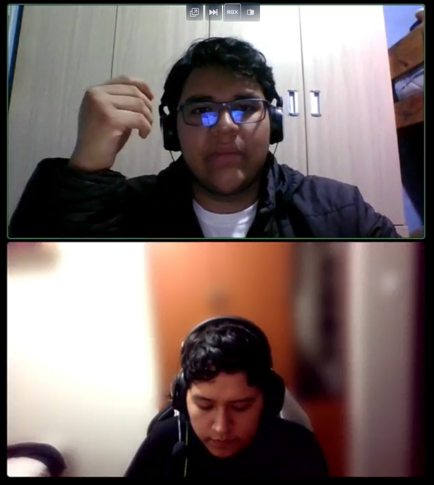

- 2.2.3 Análisis de entrevistas  

**Segmento #1: Pacientes con enfermedades neurológicas crónicas**  

Las entrevistas con Cesar Aaron Cornejo y Xin Yu Shi Lin revelan que los pacientes y cuidadores de personas con enfermedades neurológicas enfrentan desafíos importantes relacionados con la imprevisibilidad de las crisis, la dificultad de transmitir con precisión los síntomas a los profesionales de la salud y la falta de herramientas que registren datos objetivos en la vida diaria. Ambos entrevistados coincidieron en que los controles médicos periódicos resultan insuficientes para reflejar la realidad cotidiana de los pacientes, lo que genera sentimientos de inseguridad, frustración y ansiedad tanto en ellos como en sus familias.  

Cesar señaló que la imposibilidad de anticipar sus crisis epilépticas genera miedo y limita su independencia, mientras que Xin Yu Shi Lin compartió que la preocupación constante por posibles caídas o episodios de rigidez de su hermana impacta directamente en su calidad de vida como cuidador. Ambos destacaron que los registros manuales o verbales actuales no son efectivos para apoyar decisiones clínicas.  

Entre las mejoras propuestas, se resaltan:  

- **Implementar plataformas digitales con recolección de datos en tiempo real** sobre episodios, calidad del sueño y niveles de actividad, que permitan anticipar crisis o detectar anomalías.  
- **Alertas automáticas para familiares y cuidadores**, que brinden tranquilidad y apoyo inmediato en caso de emergencias.  
- **Reportes visuales claros y confidenciales para médicos**, que faciliten el ajuste de tratamientos y mejoren la comunicación entre pacientes, cuidadores y profesionales de la salud.  

Los desafíos para implementar estas soluciones incluyen la aceptación de dispositivos IoT por parte de los pacientes, quienes priorizan la comodidad, la no invasividad y la facilidad de uso. También se destacó la importancia de garantizar la confidencialidad de los datos y de que la información recopilada se utilice exclusivamente con fines médicos.  

En conclusión, los entrevistados coincidieron en que contar con una plataforma IoT integrada y confiable podría marcar una diferencia significativa en sus vidas, al brindar seguridad, apoyo continuo y una mejor comunicación con el equipo médico. Este tipo de solución no solo reduciría la ansiedad y la incertidumbre en la vida diaria, sino que también mejoraría la calidad del tratamiento y la prevención de complicaciones.  

## 2.3 Needfinding
- 2.3.1 User Personas  
En esta parte del informe presentamos a los User Personas construidos a partir de entrevistas y análisis de los segmentos objetivo de Mythicore. Estas representaciones ficticias, pero basadas en datos reales, nos permiten comprender mejor cómo piensan, qué esperan y qué problemas enfrentan nuestros usuarios. Con esta información, el equipo puede diseñar una solución alineada a necesidades auténticas y no solo a supuestos.

User Persona – Segmento 1: Paciente(epilepsia crónica):

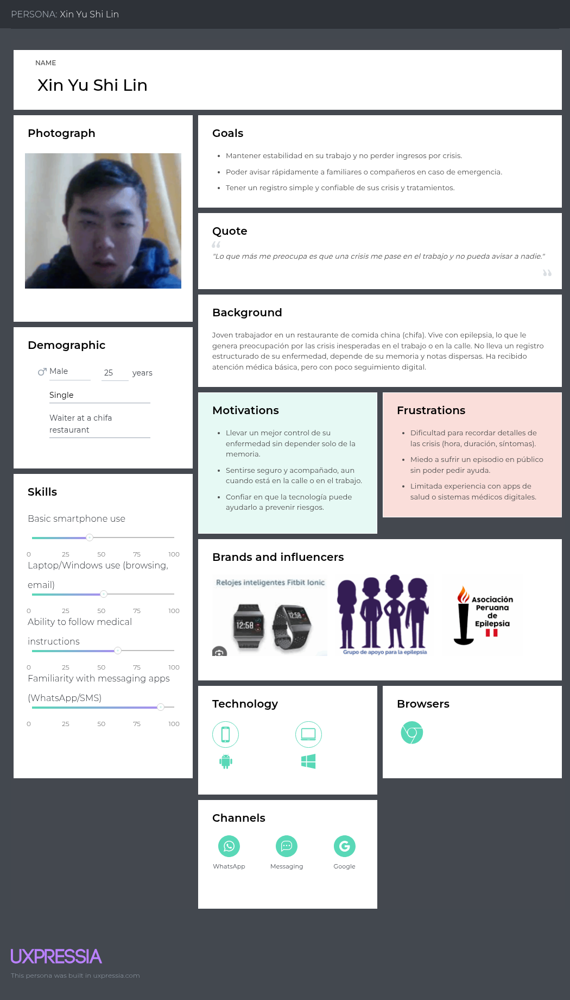

User Persona - Segmento 2: Profesionales de la salud(neurólogos):

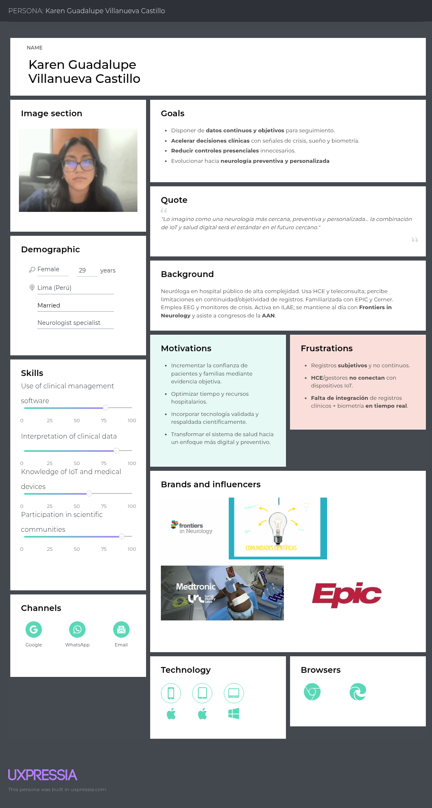

User Persona - Segmento 3: Proveedores IoT:

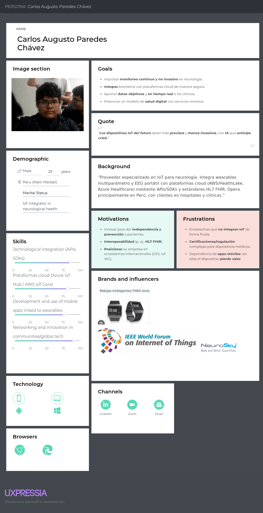

- 2.3.2 User Task Matrix  

La siguiente matriz relaciona a los roles de usuario de la plataforma **Mythicore** con las principales tareas que realizan.  
Cada tarea está asociada a una **prioridad** (Alta, Media, Baja) y una **frecuencia de uso** (Alta, Media, Baja).  
Esto permite identificar qué funciones son críticas para cada segmento objetivo.

| Rol / Usuario | Tarea | Descripción | Prioridad | Frecuencia |
|---------------|-------|-------------|-----------|------------|
| **Paciente** | Usar dispositivo IoT | El paciente utiliza los sensores para registrar datos neurológicos. | Alta | Alta |
| **Paciente** | Revisar reportes de adherencia | El paciente consulta sus métricas de uso y evolución. | Media | Media |
| **Paciente** | Recibir recordatorios | El paciente recibe notificaciones para mantener la adherencia al tratamiento. | Alta | Alta |
| **Paciente** | Participar en teleconsulta | El paciente asiste a consultas virtuales con su médico desde la plataforma. | Alta | Media |
| **Paciente** | Consultar ensayos clínicos | El paciente revisa información sobre estudios relevantes a su condición. | Media | Baja |
| **Médico** | Visualizar datos IoT | El médico consulta las señales neurológicas capturadas en tiempo real. | Alta | Alta |
| **Médico** | Recibir alertas predictivas | El médico recibe notificaciones de crisis o riesgos detectados por la IA. | Alta | Alta |
| **Médico** | Consultar dashboard de riesgos | El médico revisa el estado de riesgo de todos sus pacientes. | Alta | Media |
| **Médico** | Atender teleconsultas | El médico realiza consultas virtuales con pacientes integrando datos IoT. | Alta | Media |
| **Médico** | Exportar reportes a EHR | El médico genera exportaciones en formato FHIR para integrarlas al sistema clínico. | Media | Baja |
| **Visitante (Landing Page)** | Revisar información general | El visitante accede al sitio para conocer misión, visión y beneficios de la plataforma. | Alta | Alta |
| **Visitante (Landing Page)** | Explorar servicios | El visitante consulta la sección de telemedicina y farmacia/dispositivos. | Media | Media |
| **Visitante (Landing Page)** | Revisar sección “Quiénes somos / Qué hacemos” | El visitante comprende la identidad y propuesta de valor del proyecto. | Media | Baja |
| **Visitante (Landing Page)** | Usar formulario de contacto | El visitante envía sus datos para recibir más información. | Alta | Media |
| **Developer (API)** | Registrar pacientes vía API | El developer usa el endpoint para crear pacientes en la plataforma. | Alta | Alta |
| **Developer (API)** | Consultar datos de monitoreo | El developer obtiene información neurológica desde la API en formato JSON. | Alta | Alta |
| **Developer (API)** | Manejar errores de la API | El developer recibe mensajes de error descriptivos en caso de requests inválidos. | Alta | Media |

- 2.3.3 User Journey Mapping  

User Journey Mapping – Segmento 1: Paciente(epilepsia crónica):

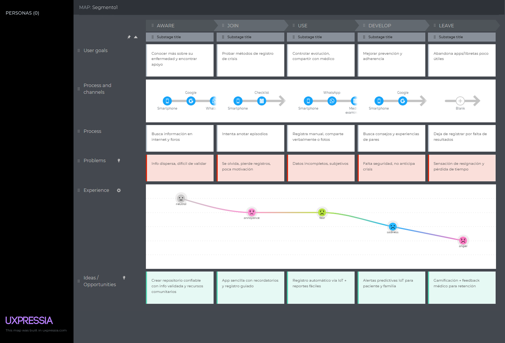

User Journey Mapping - Segmento 2: Profesionales de la salud(neurólogos):

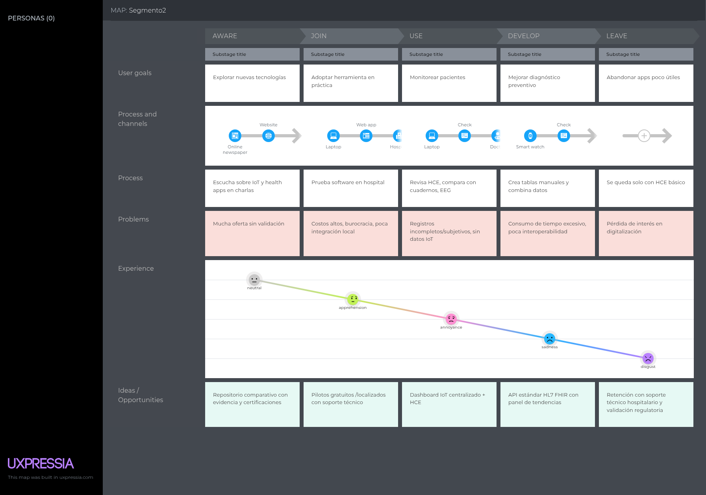

User Journey Mappinga - Segmento 3: Proveedores IoT:

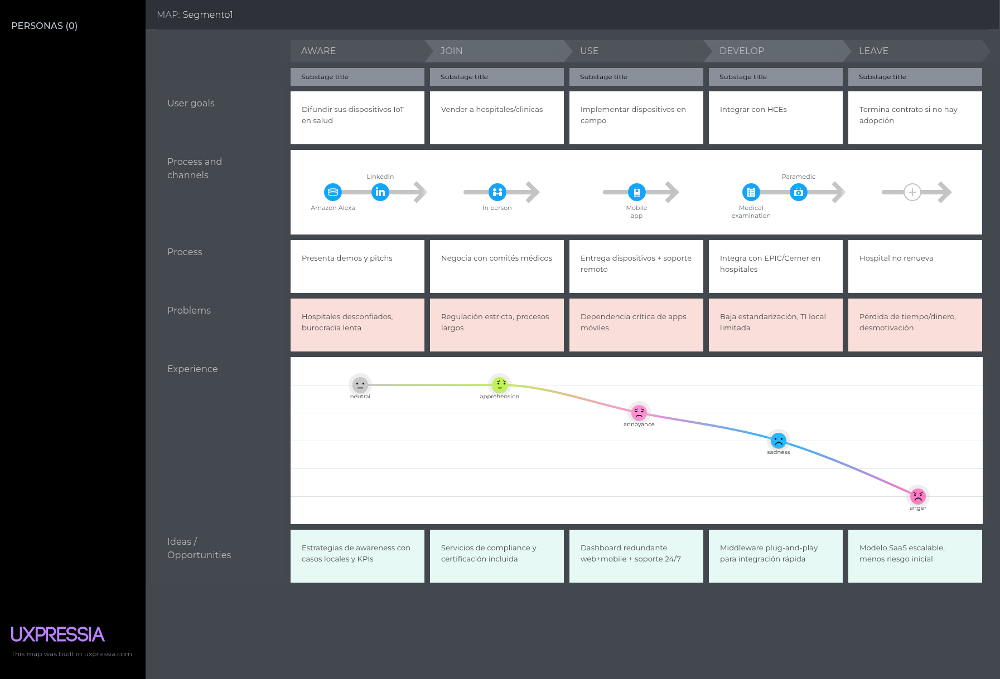

- 2.3.4 Empathy Mapping  

PACIENTES:

Empathy Mapping – Segmento 1: Paciente(epilepsia crónica):

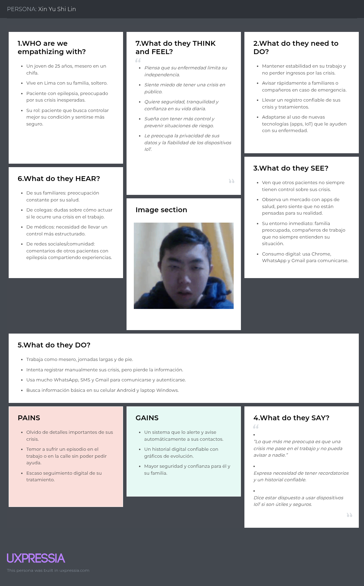

Empathy Mapping - Segmento 2: Profesionales de la salud(neurólogos):

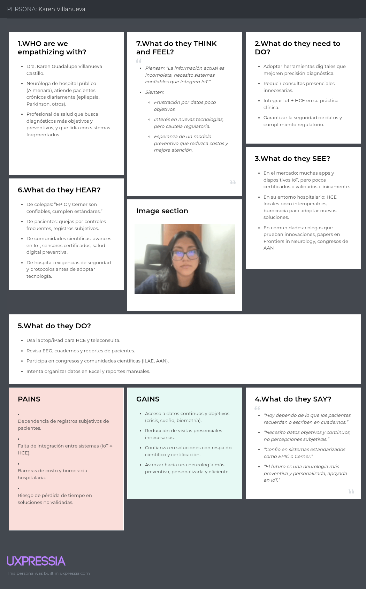

Empathy Mapping - Segmento 3: Proveedores IoT:

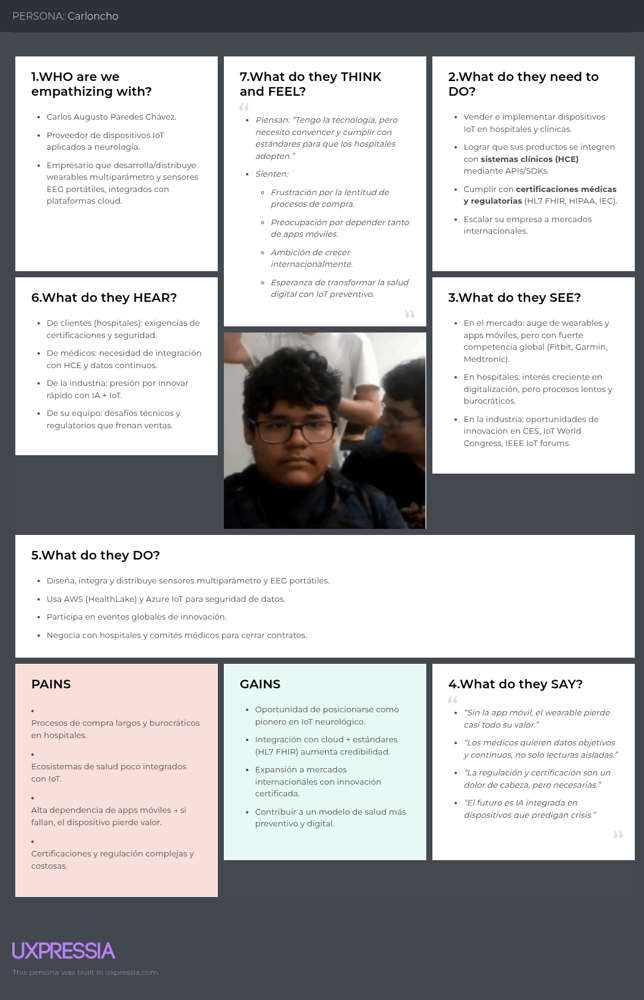

## 2.4 Big Picture EventStorming  

El Big Picture Event Storming es una técnica colaborativa que nos permitió visualizar el dominio completo de nuestra solución, identificando actores, eventos clave, problemas, dudas, sistemas externos y oportunidades. A través de esta dinámica, el equipo logró comprender de manera compartida el flujo de procesos en la atención neurológica digital y cómo nuestra plataforma Mythicore puede integrarse para resolver brechas críticas.  

### Big Picture Event Storming - Leyenda de Colores    
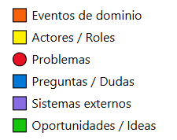 

### Big Picture Event Storming - Mapa General    
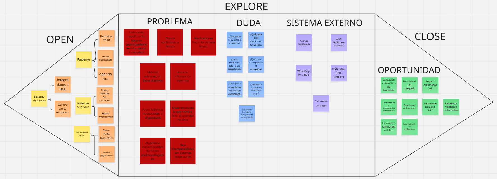 

## 2.5 Ubiquitous Language  

Este glosario define los términos clave que usamos en el proyecto para mantener un **lenguaje común** entre el equipo de desarrollo, los médicos especialistas y los demás stakeholders.    

| Term (English) | Definición (Español) |
|----------------|-----------------------|
| **Patient (Paciente)** | Persona diagnosticada con una enfermedad neurológica crónica, como epilepsia o Parkinson, que utiliza la plataforma para registrar, monitorear y compartir información de su condición. |
| **Neurologist (Neurólogo/a)** | Médico especialista en el diagnóstico y tratamiento de enfermedades neurológicas, encargado de revisar la información registrada por los pacientes y ajustar tratamientos. |
| **Caregiver (Cuidador/Familiar)** | Persona cercana al paciente que brinda apoyo en el manejo diario de la enfermedad y puede recibir alertas tempranas en situaciones de crisis. |
| **Seizure (Crisis epiléptica)** | Episodio súbito generado por actividad eléctrica anormal en el cerebro, caracterizado por convulsiones, pérdida de conciencia u otros síntomas neurológicos. |
| **Crisis log (Registro de crisis)** | Historial digital donde el paciente documenta la fecha, hora, duración y características de cada crisis. |
| **Biometric data (Datos biométricos)** | Señales fisiológicas obtenidas mediante dispositivos IoT (ej. ritmo cardíaco, actividad cerebral, calidad del sueño) que permiten un seguimiento objetivo de la salud del paciente. |
| **Wearable device (Dispositivo vestible/IoT)** | Tecnología portátil (reloj inteligente, sensor EEG, pulsera médica) que mide y transmite datos biométricos del paciente. |
| **EEG – Electroencephalogram (Electroencefalograma)** | Examen que registra la actividad eléctrica cerebral a través de sensores en el cuero cabelludo; utilizado para diagnosticar y monitorear epilepsia y otras condiciones neurológicas. |
| **Health Record (Historia clínica electrónica)** | Documento digital que almacena la información médica del paciente, accesible por el neurólogo para evaluar evolución y tratamientos. |
| **Alert (Alerta temprana)** | Notificación automática que advierte al paciente, familiares o médicos sobre una crisis inminente o anomalía detectada por los sensores. |
| **Medication adherence (Adherencia al tratamiento)** | Grado en el que el paciente sigue correctamente la toma de medicamentos prescritos por el neurólogo. |
| **Sleep quality (Calidad de sueño)** | Indicador de descanso del paciente, medido por dispositivos IoT, que influye directamente en la frecuencia de crisis. |
| **Dashboard (Panel de control clínico)** | Interfaz visual que muestra estadísticas, gráficos y tendencias de la evolución del paciente, accesible para médicos y pacientes. |
| **Scientific community (Comunidad científica)** | Organismos y grupos de investigación internacionales (ej. ILAE, AAN) que validan y difunden prácticas y tecnologías para el tratamiento de enfermedades neurológicas. |
| **Support group (Grupo de apoyo)** | Comunidad de pacientes que comparte experiencias, consejos y acompañamiento sobre el manejo de su condición neurológica. |
| **Data privacy (Privacidad de datos)** | Principio que garantiza la protección de la información médica y biométrica del paciente frente a accesos no autorizados. |
  
---

# Capítulo III: Requirements Specification

## 3.1 User Stories  
---

## User Stories y Epics basadas en entrevistas

| Epic / Story ID | Título | Descripción | Criterios de Aceptación | Relacionado con (Epic ID) |
|-----------------|--------|-------------|--------------------------|---------------------------|
| **EP01** | Monitoreo IoT de pacientes | Implementar sensores IoT (EEG, EMG, acelerometría) para capturar datos neurológicos en tiempo real. | - DADO QUE un paciente usa un dispositivo IoT, CUANDO genera datos, ENTONCES se almacenan en la nube.   - DADO QUE ocurre una desconexión, CUANDO se restablece, ENTONCES los datos se reenvían automáticamente. | - |
| US01.1 | Registro de episodios | Como paciente quiero que mis crisis se registren automáticamente para evitar llevar un registro manual. | - DADO QUE un paciente experimenta una crisis, CUANDO el sensor la detecta, ENTONCES se guarda en su historial.   - DADO QUE ocurren varias crisis, CUANDO se consultan, ENTONCES aparecen ordenadas cronológicamente. | EP01 |
| US01.2 | Envío seguro de datos | Como sistema necesito transmitir datos encriptados para garantizar confidencialidad. | - DADO QUE un sensor genera datos, CUANDO se transmiten, ENTONCES viajan cifrados.   - DADO QUE se detecta un error, CUANDO los datos están corruptos, ENTONCES se rechazan. | EP01 |
| US01.3 | Integración con dispositivos cómodos | Como paciente quiero que el sistema sea compatible con wearables no invasivos para poder usarlos a diario. | - DADO QUE un paciente conecta un wearable, CUANDO inicia la sesión, ENTONCES el dispositivo se sincroniza. | EP01 |
| **EP02** | Analítica con IA y alertas | Desarrollar algoritmos que detecten patrones de riesgo y generen notificaciones preventivas. | - DADO QUE existen datos, CUANDO la IA procesa señales, ENTONCES identifica patrones anómalos.   - DADO QUE el riesgo es crítico, CUANDO se supera un umbral, ENTONCES se genera una alerta inmediata. | - |
| US02.1 | Alerta de crisis epiléptica | Como paciente quiero recibir alertas preventivas para sentirme más seguro. | - DADO QUE el sensor detecta riesgo, CUANDO la IA lo confirma, ENTONCES se envía notificación al paciente y familiares. | EP02 |
| US02.2 | Dashboard de riesgo | Como médico quiero ver un panel de riesgo para priorizar intervenciones. | - DADO QUE un médico consulta el dashboard, CUANDO hay un cambio, ENTONCES se actualiza en tiempo real. | EP02 |
| US02.3 | Notificación a familiares | Como familiar quiero recibir alertas cuando el paciente está en riesgo para apoyarlo de inmediato. | - DADO QUE el paciente sufre una anomalía, CUANDO se emite alerta, ENTONCES llega notificación al familiar registrado. | EP02 |
| **EP03** | Telemedicina segura | Habilitar consultas virtuales integradas con datos IoT. | - DADO QUE un paciente solicita cita, CUANDO se confirma, ENTONCES se guarda en agenda.   - DADO QUE inicia la teleconsulta, CUANDO se transmite audio/video, ENTONCES viajan cifrados. | - |
| US03.1 | Agenda de teleconsultas | Como paciente quiero programar consultas en línea para evitar traslados innecesarios. | - DADO QUE el paciente agenda cita, CUANDO se registra, ENTONCES aparece en el calendario compartido. | EP03 |
| US03.2 | Visualización en tiempo real | Como médico quiero ver datos IoT en la consulta para tomar mejores decisiones. | - DADO QUE se desarrolla la teleconsulta, CUANDO llegan lecturas IoT, ENTONCES se muestran en pantalla. | EP03 |
| **EP04** | Integración con EHR y servicios externos | Conectar la plataforma con historias clínicas electrónicas y bases de datos externas. | - DADO QUE se actualizan datos, CUANDO se sincronizan, ENTONCES aparecen en la historia clínica. | - |
| US04.1 | Exportación de datos FHIR | Como médico quiero exportar registros en formato FHIR para integrarlos al EHR. | - DADO QUE se genera un reporte, CUANDO se exporta, ENTONCES se valida que cumple con estándar FHIR. | EP04 |
| US04.2 | Ensayos clínicos | Como paciente quiero consultar ensayos clínicos relevantes para acceder a nuevas terapias. | - DADO QUE un paciente busca ensayos, CUANDO los filtra, ENTONCES el sistema devuelve resultados relevantes. | EP04 |
| **EP05** | Adherencia y feedback | Proveer recordatorios y reportes claros para motivar al paciente. | - DADO QUE existe historial, CUANDO el paciente lo consulta, ENTONCES visualiza porcentajes y evolución. | - |
| US05.1 | Recordatorios de uso | Como paciente quiero recibir notificaciones para no olvidar mis terapias. | - DADO QUE llega la hora, CUANDO el paciente no interactúa, ENTONCES el sistema registra falta de adherencia. | EP05 |
| US05.2 | Reporte de adherencia | Como paciente quiero ver un gráfico de mi adherencia para conocer mi evolución. | - DADO QUE accede a su perfil, CUANDO consulta adherencia, ENTONCES visualiza métricas y gráficas. | EP05 |
| **EP06** | Landing Page informativa | Diseñar un sitio web estático con información, servicios y contacto. | - DADO QUE un visitante accede, CUANDO navega, ENTONCES visualiza misión, visión y servicios. | - |
| US06.1 | Información general | Como visitante quiero leer misión y beneficios para conocer la propuesta. | - DADO QUE accede a landing, CUANDO revisa sección misión, ENTONCES ve información actualizada. | EP06 |
| US06.2 | Formulario de contacto | Como visitante quiero enviar mis datos para recibir más información. | - DADO QUE llena formulario, CUANDO lo envía, ENTONCES el sistema guarda sus datos. | EP06 |
| **EP07** | API RESTful | Construcción de endpoints para interoperabilidad y manejo de datos clínicos. | - DADO QUE un developer envía request válido, CUANDO la API procesa, ENTONCES responde con datos correctos. | - |
| US07.1 | Registro de pacientes vía API | Como developer quiero registrar pacientes mediante endpoint para integrarlos al sistema. | - DADO QUE se envía POST /patients válido, CUANDO la API procesa, ENTONCES responde con 201 y el ID. | EP07 |
| US07.2 | Consulta de datos vía API | Como developer quiero consultar datos de monitoreo para integrarlos a apps externas. | - DADO QUE se envía GET /monitoring/{id}, CUANDO existe paciente, ENTONCES responde con JSON válido. | EP07 |

## 3.2 Impact Mapping  

Impact Mapping – Segmento 1: Paciente(epilepsia crónica):

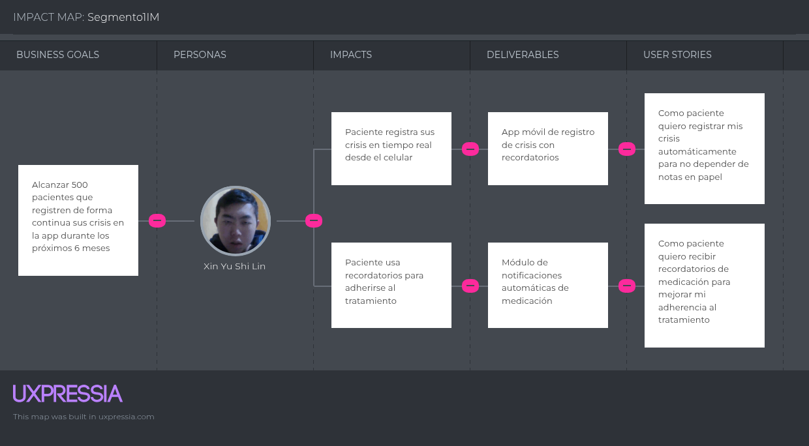

Impact Mapping - Segmento 2: Profesionales de la salud(neurólogos):

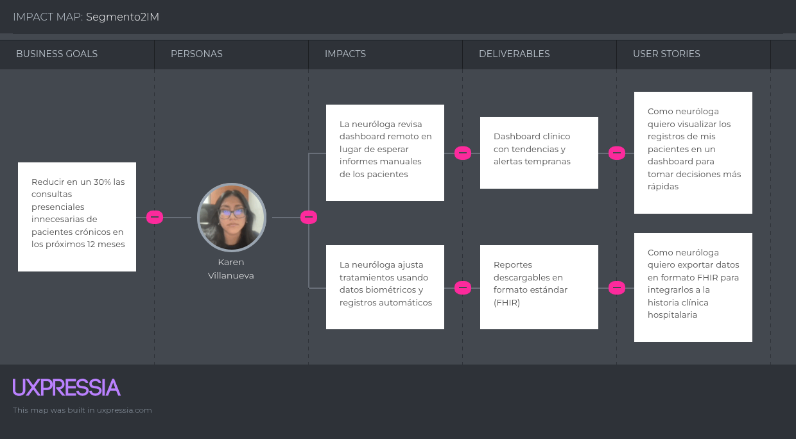

Impact Mapping - Segmento 3: Proveedores IoT:

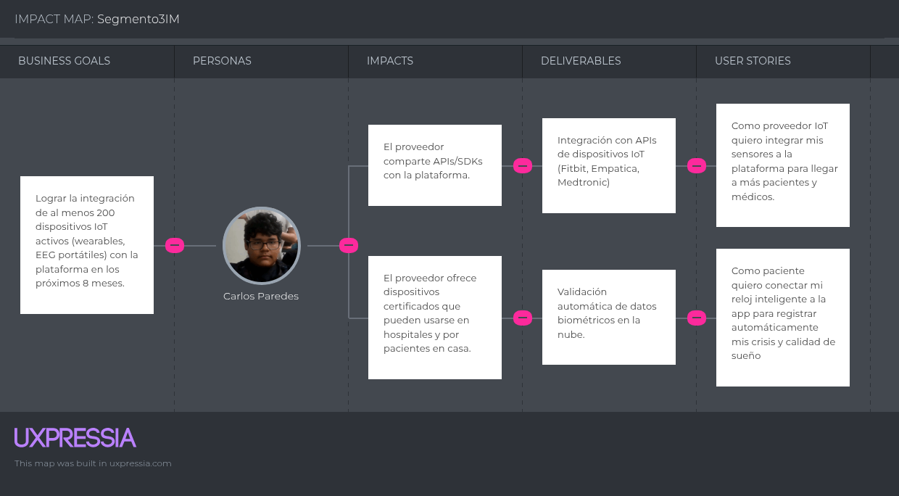

## 3.3 Product Backlog  

| Epic / Story ID | Título | Descripción | Criterios de Aceptación | Relacionado con (Epic ID) |
|-----------------|--------|-------------|--------------------------|---------------------------|
| EP01 | Monitoreo IoT | Permitir que los pacientes registren y consulten sus datos neurológicos en tiempo real mediante dispositivos IoT. | - | - |
| US01.1 | Registro de señales IoT | Como **paciente**, quiero que mis dispositivos envíen datos automáticos a la plataforma para que mi médico pueda monitorearlos. | DADO QUE el paciente tiene un dispositivo IoT conectado, CUANDO el dispositivo registra señales neurológicas, ENTONCES los datos deben almacenarse y estar disponibles en la plataforma. | EP01 |
| US01.2 | Visualización de métricas | Como **médico**, quiero visualizar en un dashboard los datos IoT de mis pacientes para identificar patrones de riesgo. | DADO QUE el médico accede al panel, CUANDO selecciona un paciente, ENTONCES debe ver sus métricas neurológicas recientes en gráficos y tablas. | EP01 |
| US01.3 | Reportes para pacientes | Como **paciente**, quiero consultar reportes simples de mis métricas para entender mi estado de salud. | DADO QUE el paciente accede al portal, CUANDO solicita un reporte, ENTONCES se le debe mostrar un resumen claro de su estado. | EP01 |
| EP02 | Inteligencia Artificial Predictiva | Implementar un modelo de IA que identifique riesgos de crisis neurológicas a partir de los datos capturados. | - | - |
| US02.1 | Generación de alertas | Como **médico**, quiero recibir alertas automáticas de riesgo alto en mis pacientes para actuar preventivamente. | DADO QUE la IA detecta un patrón de riesgo, CUANDO el valor supere un umbral configurado, ENTONCES el sistema debe generar una alerta en tiempo real. | EP02 |
| US02.2 | Notificaciones al paciente | Como **paciente**, quiero recibir notificaciones de riesgo para poder actuar antes de una crisis. | DADO QUE la IA genera una alerta, CUANDO el paciente esté registrado, ENTONCES se debe enviar una notificación a su aplicación. | EP02 |
| EP03 | Telemedicina | Ofrecer consultas virtuales entre pacientes y médicos con integración de datos neurológicos. | - | - |
| US03.1 | Agendamiento de teleconsulta | Como **paciente**, quiero agendar una teleconsulta con mi médico para recibir atención remota. | DADO QUE el paciente necesita una consulta, CUANDO selecciona fecha y hora disponibles, ENTONCES la plataforma debe registrar y confirmar la cita. | EP03 |
| US03.2 | Consulta con datos integrados | Como **médico**, quiero tener acceso a los datos IoT del paciente durante la teleconsulta para tomar mejores decisiones. | DADO QUE la teleconsulta está en curso, CUANDO el médico accede al panel, ENTONCES los datos neurológicos deben estar visibles en tiempo real. | EP03 |
| EP04 | Landing Page | Proveer un sitio estático para visitantes donde se presente información clara sobre el producto y servicios. | - | - |
| US04.1 | Información del producto | Como **visitante**, quiero conocer la propuesta de valor de Mythicore para entender cómo funciona. | DADO QUE el visitante accede al sitio, CUANDO entra a la sección principal, ENTONCES debe ver un resumen del producto y sus beneficios. | EP04 |
| US04.2 | Servicios y segmentos | Como **visitante**, quiero explorar los servicios disponibles según mi perfil (paciente, médico, institución). | DADO QUE el visitante navega en el sitio, CUANDO selecciona una sección, ENTONCES se le muestra la información adaptada a su perfil. | EP04 |
| US04.3 | Contacto | Como **visitante**, quiero enviar un mensaje de contacto para obtener más información. | DADO QUE el visitante ingresa al formulario, CUANDO completa sus datos, ENTONCES la plataforma debe registrar y enviar el mensaje al equipo. | EP04 |
| EP05 | RESTful API | Brindar una API para integradores externos (hospitales, aseguradoras, investigadores). | - | - |
| US05.1 | Registro vía API | Como **developer**, quiero registrar pacientes mediante un endpoint para integrarlos al sistema. | DADO QUE el developer hace un POST válido, CUANDO envía los datos correctos, ENTONCES el sistema debe registrar al paciente y devolver un código 201. | EP05 |
| US05.2 | Consulta de datos IoT | Como **developer**, quiero consultar las métricas de un paciente en formato JSON para integrarlas en otro sistema. | DADO QUE el developer hace un GET válido, CUANDO incluye la autorización correcta, ENTONCES la API debe devolver los datos en JSON estructurado. | EP05 |
| US05.3 | Manejo de errores | Como **developer**, quiero recibir mensajes claros de error para poder corregir mis requests. | DADO QUE el developer envía un request inválido, CUANDO el sistema lo procesa, ENTONCES la API debe devolver un error con código y mensaje descriptivo. | EP05 |

---

# Capítulo IV: Product Design

## 4.1 Style Guidelines
### 4.1.1 General Style Guidelines  

**Branding**

El logo de Aura Neuro sintetiza la esencia de innovación y confianza en el cuidado neurológico remoto. La tipografía moderna en verde vital y negro sólido refleja equilibrio entre salud, tecnología y profesionalismo.  

El concepto de “aura” transmite cercanía y bienestar, mientras que “neuro” refuerza el enfoque científico en el sistema nervioso.  
La simplicidad del diseño asegura legibilidad en cualquier soporte digital o físico, desde dispositivos móviles hasta presentaciones clínicas.  

El conjunto proyecta confianza médica, innovación tecnológica y humanización de la salud digital.  

  
  

**Variantes de logo**  

Logo original → Verde + negro sobre fondo blanco (uso principal en web).  
  

Logo invertido → Blanco sobre fondo negro/azul (para headers o footers oscuros).  
  

Logo minimal → Solo “Aura” o solo el ícono (para favicon y apps móviles).  

**Typography**  

La tipografía de Aura Neuro debe transmitir tecnología, claridad y accesibilidad.  
Se recomienda usar fuentes sans-serif limpias que comuniquen modernidad y precisión científica:  

- Fuente principal: Poppins o Inter (para títulos y subtítulos).  

- Poppins Bold en H1 (ej. “La neurología a distancia ya está aquí”).  

- Poppins Medium en H2.  

- Fuente secundaria: Roboto (para cuerpo de texto).  

- Roboto Regular en descripciones.  

- Roboto Light en textos secundarios.  

- El contraste de peso permite jerarquizar fácilmente la información sin saturar la interfaz.  

El lenguaje debe ser profesional pero cercano, evitando tecnicismos innecesarios y usando un tono tranquilo y confiable, ideal para pacientes y médicos.  

**Paleta de colores**  
La paleta de Aura Neuro combina la confianza médica con la innovación tecnológica:  
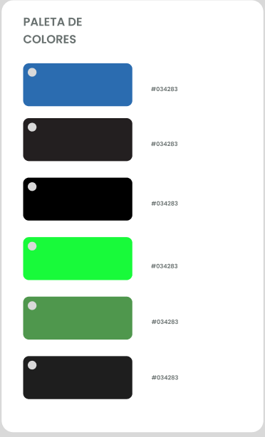  

### 4.1.2 Web Style Guidelines  

A continuación se presenta la sección 4.1.2 Web Style Guidelines preparada para incluir en el informe de Aura Neuro. Está redactada en formato Markdown y lista para pegar en tu documento. Contiene directrices de diseño visual, experiencia de usuario, accesibilidad, rendimiento y consideraciones de implementación web para mantener coherencia en la interfaz pública y en el área de usuarios autenticados.  

**Propósito**  

Las directrices de estilo web definen las normas visuales, de interacción y técnicas que deben seguirse en todo el sitio web y la aplicación web de Aura Neuro. El objetivo es asegurar una experiencia coherente, accesible, profesional y confiable para pacientes, médicos y administradores, preservando al mismo tiempo la privacidad y seguridad de los datos clínicos.  

**1. Tono y voz**  

El texto de la plataforma debe mantener un lenguaje profesional, claro y empático. En contenido público (landing, blog) el tono puede ser divulgativo y persuasivo; en áreas clínicas (dashboard, reportes) el lenguaje debe ser técnico, preciso y neutral. Evitar jergas innecesarias y siempre definir términos médicos la primera vez que aparecen.  

**2. Sistema de retícula y layout**  

- Retícula base: 12 columnas para desktop, con gutters de 24px y un contenedor máximo de 1200px.  

- Espaciado: usar una escala modular (ej. 4px, 8px, 16px, 24px, 32px, 48px).  

- Alineación: contenido principal centrado; sidebars sólo cuando aporten valor (p. ej. historial breve, acciones rápidas).  

- Hero / Landing: sección hero full-width con hero-image optimizada y CTA destacado.  

- Cards: tarjetas uniformes para dispositivos, reportes y profesionales; sombra suave y bordes redondeados (4–12px).  

**3. Logo y marca en la web**  

- Usar logo principal (verde+negro) en header claro; versión invertida en headers oscuros.  

- Espacio mínimo alrededor del logo: 16px o 2x altura del icono.  

- Usar favicon (32×32) y versión para Apple Touch.  

- No distorsionar, recolorear o añadir sombras al logo sin aprobación.  

**4. Imágenes, gráficos y multimedia**  

- Fotografía: estilo humano y cercano; evitar escenas clínicamente invasivas. Priorizar imágenes con diversidad de edad y género.  

- Gráficas: consistentes (mismos ejes, colores para métricas), incluir leyenda y alt descriptivo.  

- Formatos: WebP para imágenes, SVG para iconos e ilustraciones.  

- Tamaños: hero ≤ 500 KB optimizado, thumbnails ≤ 100 KB. Usar srcset para responsive images.  

- Vídeo: utilizar streaming / embed de player con reproducción segura; no autoload de cámaras en páginas públicas.  

**5. Iconografía**  

- Iconos simples, lineales (stroke) y con relleno cuando sea necesario.  

- Siempre acompañar icono con etiqueta textual (icon + label) para accesibilidad.  

- Mantener set consistente (ej. Heroicons, Material Icons) y usar cache de sprites/SVG.  

**6. Microinteracciones y animaciones**  

- Animaciones cortas (< 200ms para microinteracciones; < 400ms para transiciones de página).  

- Evitar animaciones que causen movimiento excesivo (respect prefers-reduced-motion).  
 
- Feedback inmediato para acciones del usuario (toasts, loaders).  

**7. Feedback, errores y mensajes**  

- Mensajes de error claros, no técnicos: explicar la causa y la acción recomendada.  

- Uso de toasts para acciones completadas (Guardado correctamente) y modales para confirmaciones críticas.  

- Logs para admins con trazas; para usuarios, mensajes simplificados.  

**8. Formularios críticos y consentimiento**  

- Formularios que recojan datos sensibles deben incluir consentimiento explícito y checkbox no preseleccionado.  

- Mostrar enlace a Política de Privacidad y Términos antes de enviar datos sensibles.  

- Almacenar solo el mínimo de datos necesarios y mostrar al usuario cómo serán usados.  

**9. Testing y calidad**  

- Tests visuales (regresión visual), pruebas de accesibilidad automatizadas (axe), pruebas E2E (Cypress/Playwright) para flujos críticos.  

- Revisiones de copy por experto clínico en páginas con contenido médico.  

- Checklist de lanzamiento: accesibilidad, privacidad (noindex en PHI), performance, tests E2E.  

**10. Versionado de UI y componentes**  

- Mantener una librería de componentes (component library) versionada (Storybook).  

- Documentar tokens (colores, tipografías, espaciados) y patrones (header, card, modal).  

- Usar naming convention CSS (BEM o utility-first con Tailwind) coherente en el proyecto.  
  

## 4.2 Information Architecture  
A continuación se describen las decisiones y directrices para la arquitectura de la información de Aura Neuro (plataforma de neurología digital con IoT y telemedicina). Cada apartado está orientado a que el informe quede listo para implementación: estructura de contenido, etiquetado, accesibilidad, y recomendaciones SEO/meta tags cuidando la privacidad médica.  

### 4.2.1 Organization Systems  
**Estructura jerárquica (sitemap lógico)**  

La plataforma se organiza en dos grandes dominios: Front (Landing / Marketing) y App (Usuarios autenticados: Pacientes / Médicos / Admins).  

**Landing / Marketing (index público)**  

- Home (Landing)  

- Cómo funciona  

- Tecnología / Dispositivos  

- Casos de uso / Beneficios  

- Equipo / Quiénes somos  

- Blog / Recursos  

- Contacto / Solicitar demo  

- Política de privacidad / Términos  

**App / Panel autenticado**  

- Dashboard (Inicio del usuario) — noindex por privacidad  

- Mis datos / Perfil  

- Dispositivos conectados  

- Monitor (datos en tiempo real) — noindex  

- Historial de episodios / Reportes — noindex  

- Teleconsulta / Agenda  

- Mensajería / Chats — noindex  

- Configuración / Preferencias  

- Admin: Gestión de dispositivos, usuarios, roles, integraciones (API, EHR)  

**Principios de organización**  

- Mobile-first: estructura priorizando navegación y pantallas móviles.  

- Progressive Disclosure: mostrar primero información esencial; opciones avanzadas bajo subsecciones.  

- Role-based Partitioning: vista y navegación adaptadas por rol (paciente, médico, admin).  

- Separación marketing / clínico: contenido público optimizado para SEO; contenido clínico restringido y protegido.  

- URLs limpias y semánticas: /, /como-funciona, /dispositivos/eeg-portatil, /app/dashboard.  

**Flujos y accesos**  

- Usuario no autenticado: landing → información → registro / solicitar demo.  

- Usuario autenticado (paciente): login → Dashboard → Monitor / Registrar síntoma → Teleconsulta.  

- Médico: login → Dashboard profesional → Panel de riesgo → Consultas.  

- Admin: panel con gestión de flota IoT, usuarios, logs y parámetros de IA.  

**Control de Indexación y Privacidad**  

- Todas las páginas que contienen PHI (Protected Health Information) deben llevar X-Robots-Tag: noindex y/o <meta name="robots" content="noindex, noarchive">.  

- Landing y páginas informativas públicas deben ser indexables y optimizadas para búsqueda.  
### 4.2.2 Labeling Systems  
**Principios de etiquetado**  

**Consistencia:** mismas etiquetas para la misma función en toda la app (ej. “Historial” = siempre “Historial de episodios”).  

**Claridad y brevedad:** etiquetas cortas y significativas (CTA: “Solicitar demo”, “Reservar dispositivo”).  

**Accesibilidad:** cada etiqueta visible debe tener su aria-label si es interactiva.  

Evitar jerga clínica en público; en espacios clínicos usar términos precisos.  

Convenciones de nomenclatura (UI)  

**Botones (CTA):** verbo + objetivo — Reservar dispositivo, Iniciar consulta, Compartir reporte.  

**Menú principal:** términos familiares y directos: Inicio, Mis Datos, Dispositivos, Monitor, Historial, Teleconsulta, Configuración, Contacto.  

**Iconografía:** icono + etiqueta textual para evitar ambigüedad (ej. icono de mapa + “Mapa”).  

**Mensajes de estado:** usar tonos: Éxito (“Guardado correctamente”), Advertencia (“Conexión inestable”), Error (“No se pudo sincronizar”).  

**Microcopy y ejemplos (texto pequeño que guía al usuario)**  

- **Login:** Ingrese su número celular o correo  

- **Conexión IoT:** Dispositivo conectado • Última sincronización: 5 min  

- **Alerta de crisis:** Alerta: Posible evento detectado. ¿Notificar a contactos de emergencia?  

- **Consentimiento:** Autorizo el procesamiento de datos para seguimiento médico.  

- **Internacionalización (i18n)**  

- Preparar etiquetas para traducción (es_ES, en_US).  

- Evitar concatenaciones en código; usar placeholders ({{nombre_paciente}}) para evitar problemas de orden gramatical.  

- Mantener guía terminológica para traductores (glosario).  

**Accesibilidad (WCAG)**  

- Todos los enlaces y botones deben tener aria-label descriptivo.  

- Contraste mínimo 4.5:1 para texto normal.  

- Textos alternativos (alt) para imágenes y gráficos (ej. alt="Gráfica de actividad cerebral: 7 días").  

- Formularios con mensajes de error descriptivos y foco en primer campo inválido.  
### 4.2.3 SEO Tags and Meta Tags  
A continuación se presenta la sección 4.2.3 SEO Tags and Meta Tags lista para incluir en el informe, en formato Markdown. Incluye explicación, recomendaciones, ejemplos de meta tags para la landing y otras páginas, JSON-LD (schema.org), robots.txt y notas de privacidad.  

**Objetivo**  

Definir los meta tags y las prácticas SEO mínimas para la parte pública de la plataforma (landing, páginas informativas y blog), al tiempo que se protege la privacidad y seguridad de las páginas privadas (dashboard, monitor, historial).  

**Recomendaciones generales**  

- Título (title): 50–60 caracteres. Incluir keyword principal y la marca si es apropiado.  

- Meta description: 140–160 caracteres. Texto persuasivo que resuma la propuesta de valor y llame a la acción.  

- Robots: usar index,follow en páginas públicas; noindex, noarchive en páginas que manejan PHI.  

- Canonical: declarar canonical en páginas que puedan generarse con parámetros para evitar contenido duplicado.  

- Open Graph / Twitter Card: proveer imagen (1200×630 px) y texto para compartir en redes.  

- Schema.org (JSON-LD): incluir marcado para MedicalOrganization, WebApplication y/o Article en el blog.  

- Performance & Accessibility: optimizar imágenes (WebP), usar alt descriptivos, y cumplir Core Web Vitals.  

- Consent Management: no cargar trackers de terceros hasta obtener consentimiento explícito para no enviar datos de uso sensibles.  

**Buenas prácticas técnicas y de privacidad**  

- No exponer PHI en URLs, meta tags, titles o descripciones.  

- Implementar consentimiento (CMP) previo a trackers/analytics que recopilen datos.  

- Optimizar performance: imágenes WebP, lazy loading, minificación de assets para mejorar Core Web Vitals.  

- Accesibilidad: usar etiquetas semánticas HTML y alt en imágenes; mantener contraste mínimo 4.5:1 en textos.  

- Control de caché y cabeceras: evitar cacheo público de páginas con datos sensibles.  

- Seguridad: CSP, HSTS, cabeceras que prevengan exposición accidental de datos.  

- Monitoring: auditar regularmente lo que aparece indexado (Search Console / Bing Webmaster) para detectar exposición accidental.  
### 4.2.4 Searching Systems 

El sistema integral de neurología digital incorporará un módulo de búsqueda y localización en tiempo real, cuya finalidad es permitir tanto a pacientes como a médicos identificar la disponibilidad de dispositivos médicos conectados y profesionales de la salud en la red. Este componente se constituye como un elemento esencial de la plataforma, ya que asegura la eficiencia en la localización de recursos médicos y optimiza el uso de la flota de dispositivos IoT disponibles.  

En primer lugar, la plataforma contará con un sistema de geolocalización en tiempo real. Cada dispositivo IoT, como sensores EEG portátiles, medidores de sueño o cascos de estimulación neurológica, transmitirá de manera constante su ubicación y los datos registrados hacia la plataforma central. De manera complementaria, los profesionales de la salud podrán habilitar su disponibilidad geolocalizada para consultas presenciales o híbridas, lo que garantiza un acceso más ágil y preciso a los servicios médicos.  

En la aplicación móvil, los usuarios dispondrán de un mapa interactivo que mostrará la ubicación de los dispositivos médicos disponibles para préstamo o uso clínico, así como la localización de centros de salud asociados y de profesionales cercanos diferenciados por especialidad. Este diseño asegura que la información sea presentada de forma clara, visual y accesible, facilitando la toma de decisiones en tiempo real.  

El sistema también integrará filtros de búsqueda avanzada que permitirán a los usuarios seleccionar según sus necesidades específicas. Entre estos criterios se incluirán el tipo de servicio requerido (consulta virtual, presencial o híbrida), la disponibilidad de dispositivos IoT como cascos EEG o wearables de monitoreo, la especialidad médica solicitada y la proximidad en relación con la ubicación actual del paciente. Estos filtros contribuyen a personalizar la experiencia de búsqueda y a agilizar el proceso de acceso a la atención.  

Una vez identificado el dispositivo o servicio, el usuario podrá seleccionarlo directamente en la aplicación y proceder a una reserva inmediata, recibiendo confirmación automática junto con las indicaciones necesarias para el uso del equipo o la consulta médica. Este mecanismo asegura rapidez y simplicidad en la interacción, factores determinantes para mejorar la experiencia de los pacientes.  

Finalmente, el sistema también contempla una optimización para empresas o instituciones educativas que adquieran suscripciones corporativas. En estos casos, el módulo de búsqueda permitirá a los empleados o estudiantes visualizar la disponibilidad de dispositivos médicos en oficinas o campus, acceder a médicos asociados en horarios de mayor demanda y garantizar la planificación de consultas grupales o chequeos preventivos.  

En conjunto, este enfoque convierte al módulo de búsqueda en un componente clave para la medicina personalizada y preventiva, ya que no solo facilita la localización de recursos en tiempo real, sino que también mejora la accesibilidad a especialistas y fomenta un uso más eficiente de la infraestructura tecnológica disponible.  

### 4.2.5 Navigation Systems  

El sistema integral de neurología digital contará con un módulo de navegación inteligente que permitirá a los usuarios desplazarse de manera eficiente dentro de la aplicación y gestionar sus procesos médicos de forma intuitiva. Este módulo ha sido diseñado para mejorar la experiencia de interacción con la plataforma, garantizando accesibilidad y simplicidad en el uso de las distintas funciones disponibles.

En primer lugar, la navegación proporcionará una guía personalizada hacia los servicios principales. Una vez que el usuario inicie sesión, el sistema mostrará de manera clara las secciones esenciales, como el acceso a datos médicos, recetas electrónicas, chats con especialistas y el mapa de localización de centros o dispositivos IoT disponibles. El diseño de menús intuitivos permitirá reducir la curva de aprendizaje y favorecer un uso autónomo por parte de pacientes de diferentes edades.

Durante el uso cotidiano de la aplicación, el módulo de navegación ofrecerá rutas rápidas hacia las funciones más utilizadas, como la consulta de historiales clínicos o el acceso inmediato a un chat con el especialista. Para ello, se prioriza la usabilidad, integrando iconografía simple y accesible, que permite al usuario identificar sin dificultad el servicio requerido.

El sistema también contempla la seguridad y la confianza en la navegación. Cada apartado estará claramente diferenciado y protegido, garantizando que datos sensibles como resultados clínicos o recetas médicas electrónicas se gestionen bajo altos estándares de privacidad. Además, se ofrecerán recomendaciones de uso dentro de la interfaz, tales como accesos directos a información crítica o recordatorios de consultas programadas.

De manera complementaria, el módulo incluirá la localización de recursos dentro de la aplicación, como la identificación de dispositivos IoT activos, médicos disponibles o centros de atención asociados. Este mapa digital estará integrado en la interfaz y permitirá visualizar, en tiempo real, las opciones de atención disponibles según la necesidad del paciente.

Finalmente, en el caso de suscripciones corporativas o institucionales, la navegación ofrecerá accesos especiales que faciliten la coordinación de consultas grupales, el seguimiento de múltiples pacientes y la optimización de los recursos médicos compartidos. De este modo, la navegación se convierte en un componente clave que no solo orienta al usuario en la interfaz, sino que también garantiza eficiencia, seguridad y accesibilidad en todo el proceso de atención médica digital.  

## 4.3 Landing Page UI Design
### 4.3.1 Landing Page Wireframe  

- Navbar Section  
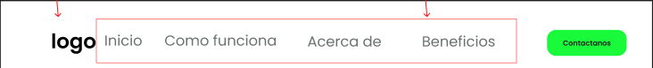

- Hero Section  
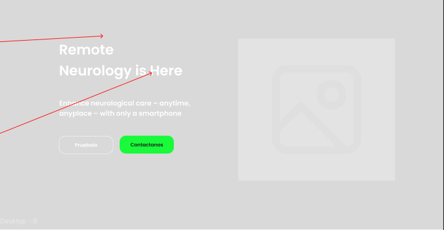

- Functions Cards Section  
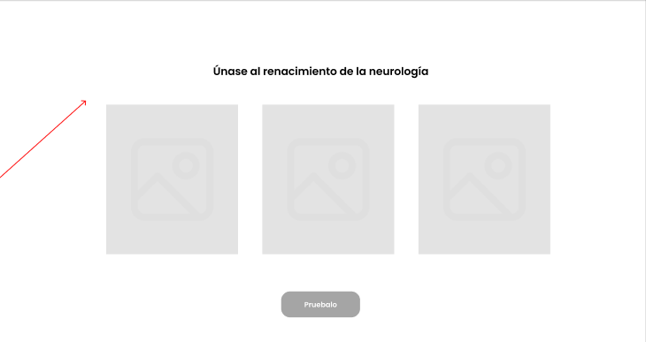

- Manual Section  
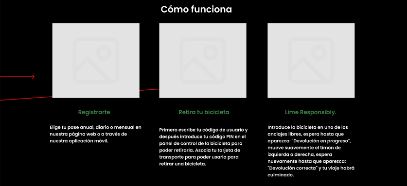

- About Section  
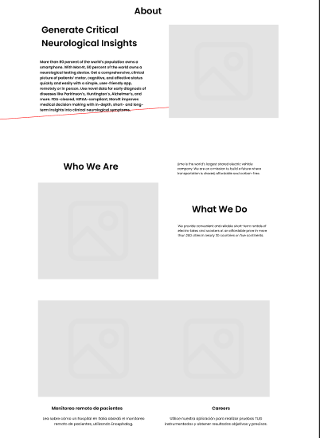

- Benefits Section  
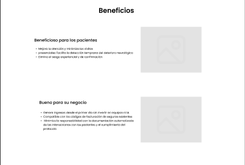

- Contact Section  
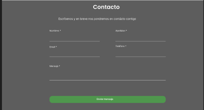

- Footer Section  
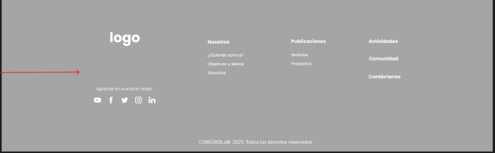  

### 4.3.2 Landing Page Mock-up  

## 4.4 Web Applications UX/UI Design
### 4.4.1 Wireframes  
- Login Page  
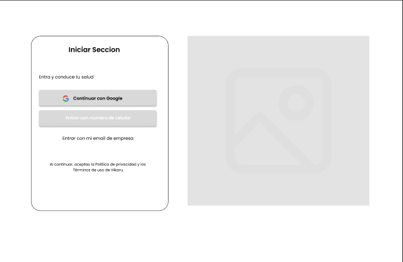  
- Insert Number Page  
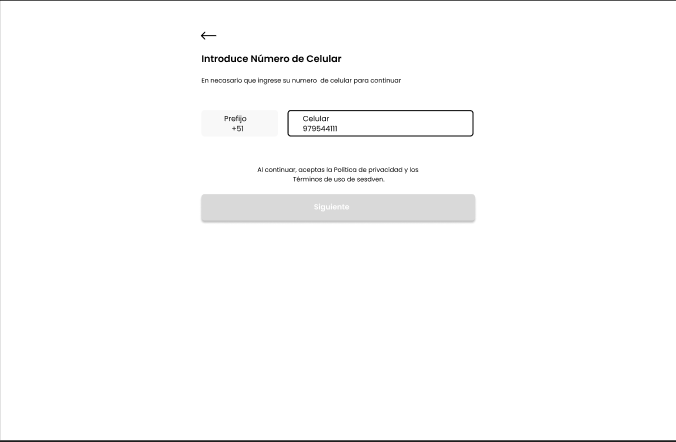   
- Verify Otp Page  
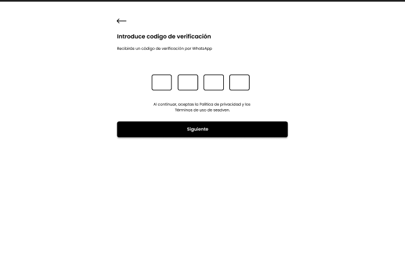   
- Insert Data User Page  
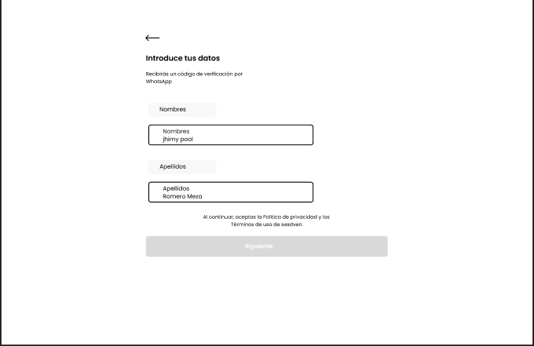  
- Inicio Page  
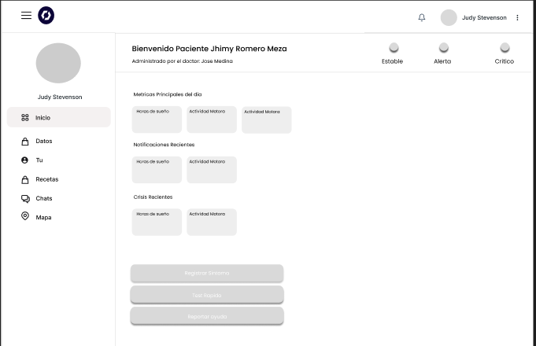  
- Data Page  
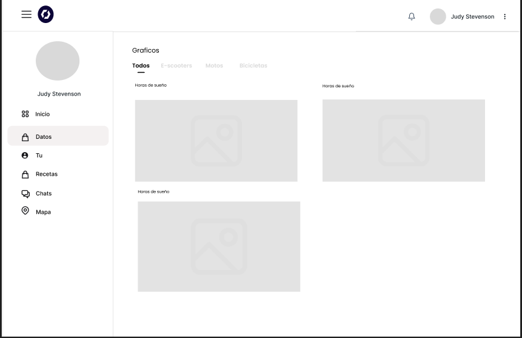  
- User Page  
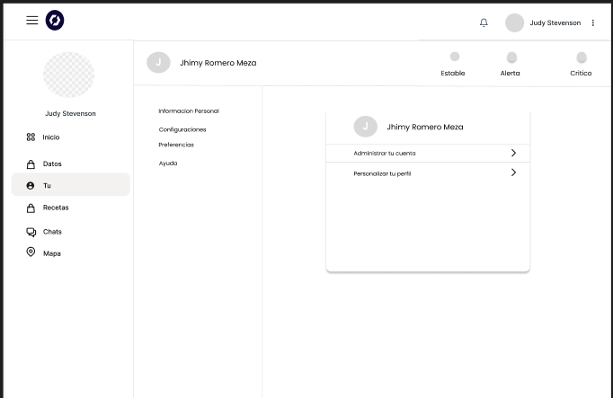  
- Recetas Page  
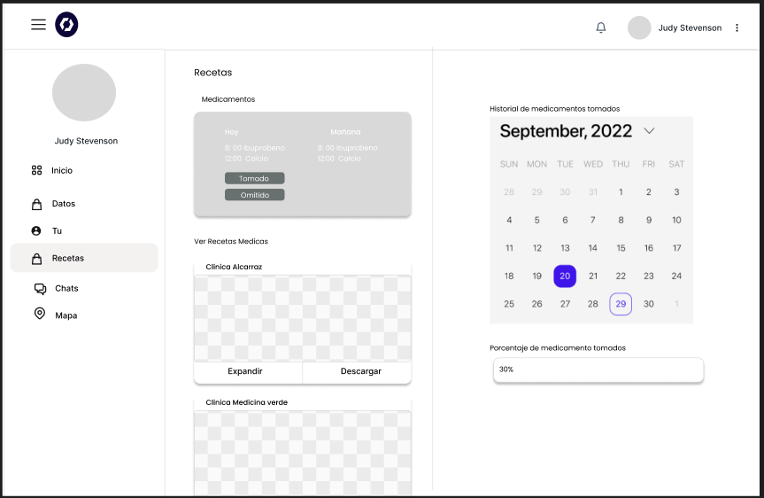  
- Chats Page  
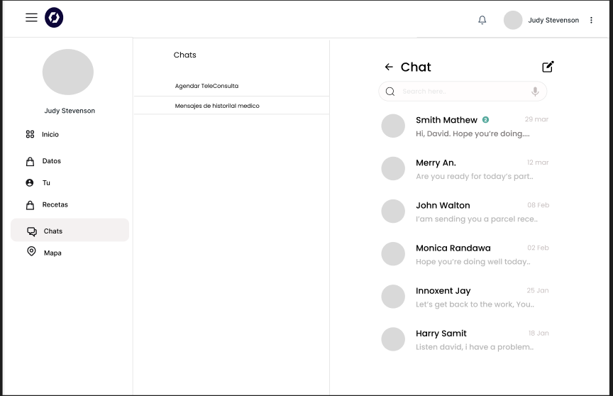  
- Map Page  
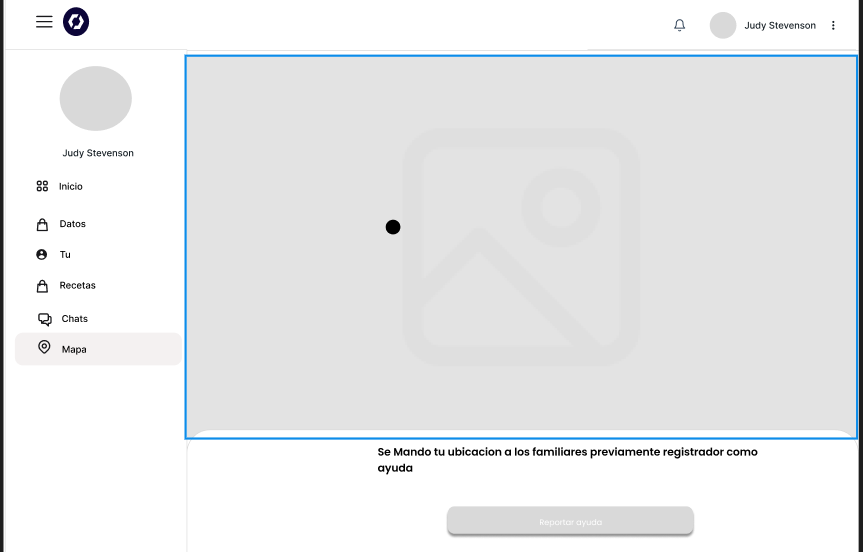  

### 4.4.2 Wireflow Diagrams  
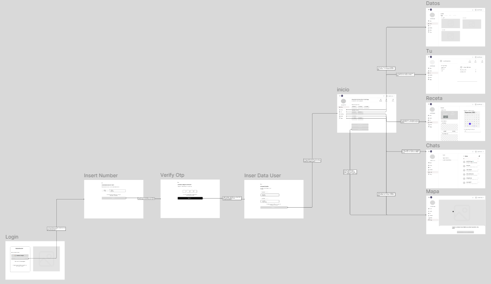  
### 4.4.3 Mock-ups  
- Login Page  
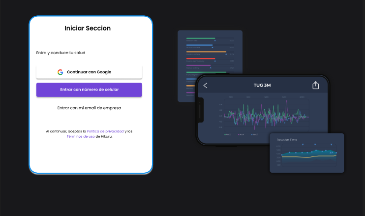  
- Insert Number Page  
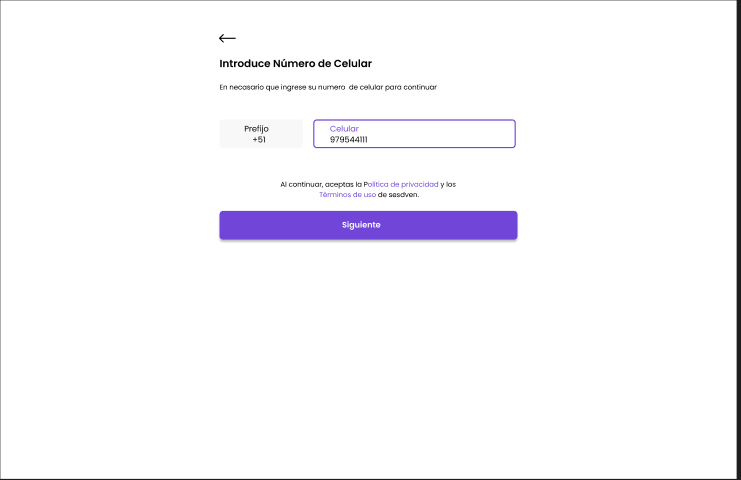   
- Verify Otp Page  
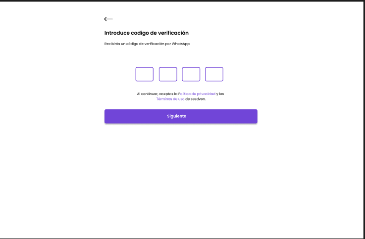   
- Insert Data User Page  
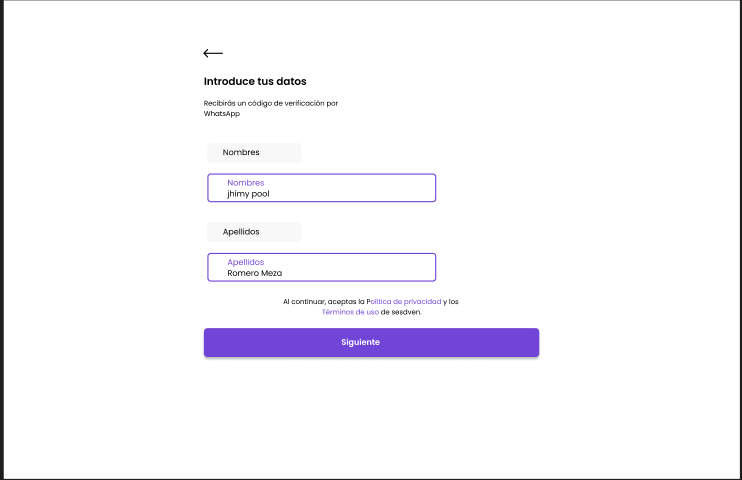  
- Inicio Page  
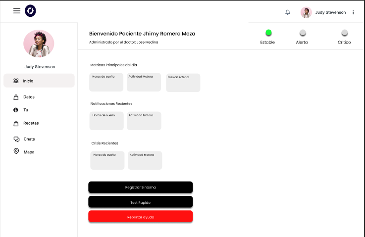  
- Data Page  
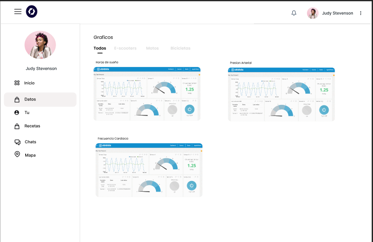  
- User Page  
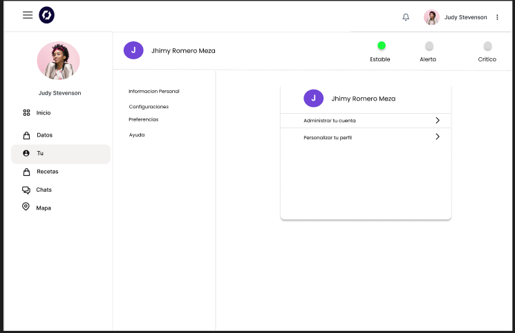  
- Recetas Page  
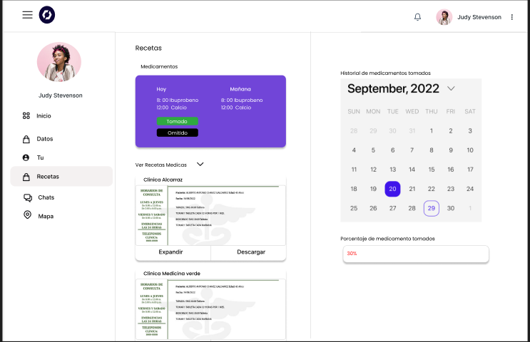  
- Chats Page  
  
- Map Page  
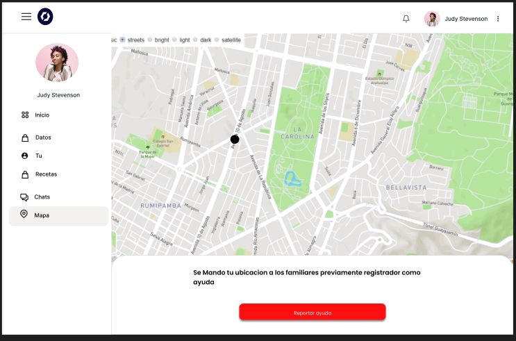  
### 4.4.4 User Flow Diagrams  
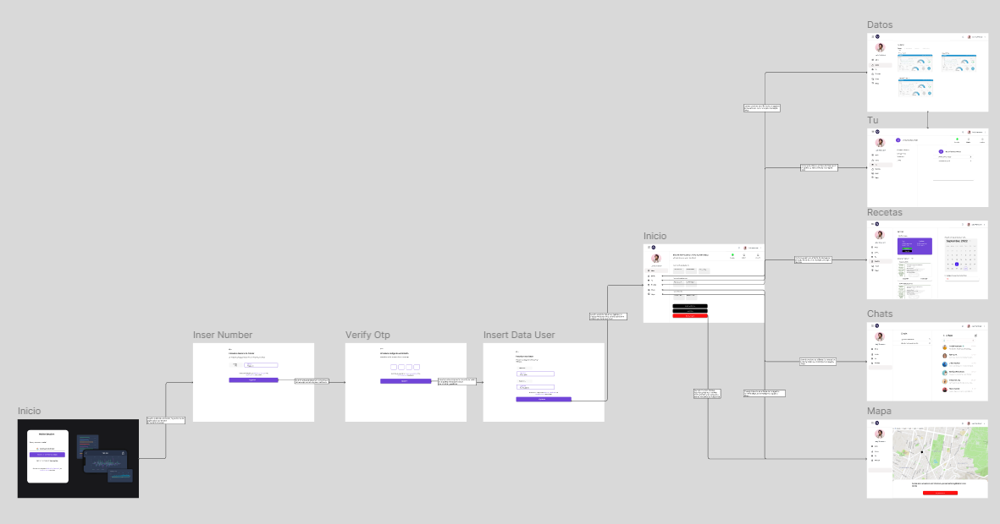  
## 4.5 Web Applications Prototyping  

## 4.6 Domain-Driven Software Architecture
- 4.6.1 Design-Level EventStorming  
- 4.6.2 Context Diagram  
- 4.6.3 Container Diagrams  
- 4.6.4 Component Diagrams  

## 4.7 Software Object-Oriented Design
- 4.7.1 Class Diagrams  

## 4.8 Database Design
- 4.8.1 Database Diagrams  

---

# Capítulo V: Product Implementation, Validation & Deployment

## 5.1 Software Configuration Management
- 5.1.1 Development Environment Configuration  
- 5.1.2 Source Code Management  
- 5.1.3 Style Guide & Coding Conventions  
- 5.1.4 Deployment Configuration  

## 5.2 Landing Page, Services & Applications Implementation

### 5.2.1 Sprint 1
- 5.2.1.1 Sprint Planning 1  
- 5.2.1.2 Aspect Leaders and Collaborators  
- 5.2.1.3 Sprint Backlog 1  
- 5.2.1.4 Development Evidence for Sprint Review  
- 5.2.1.5 Execution Evidence for Sprint Review  
- 5.2.1.6 Services Documentation Evidence for Sprint Review  
- 5.2.1.7 Software Deployment Evidence for Sprint Review  
- 5.2.1.8 Team Collaboration Insights during Sprint  

---

# Conclusiones
- El proyecto responde a una necesidad clara: mejorar la atención neurológica mediante monitorización remota, detección temprana y seguimiento continuo apoyado en dispositivos IoT, analítica con IA y telemedicina. La propuesta combina prevención, personalización y reducción de hospitalizaciones, por lo que su impacto clínico y social es relevante.  

- Aura Neuro (nombre propuesto) articula tres ejes: dispositivos IoT para recolección de señales neurológicas, análisis en la nube con modelos de IA para detección y priorización de riesgos, y un ecosistema de interacción (app móvil + dashboard médico + teleconsultas). Esto facilita decisiones clínicas basadas en datos objetivos y continuidad del cuidado.  

- Existen soluciones consolidadas (Mon4t, BioSerenity, Empatica, PDMonitor, etc.) que validan la viabilidad técnica y clínica del enfoque. Estas referencias permiten aprender sobre diseño hardware-software, validación clínica y cumplimiento normativo; también evidencian áreas de oportunidad (integración multi-sensor, tests cognitivos remotos, mayor cobertura de enfermedades).  

- El backlog inicial es adecuado como primer MVP, pero requiere ampliación: se estimó un backlog realista de 40–50 historias para cubrir casos de conexión, errores, usabilidad, seguridad, roles adicionales y pruebas técnicas (logging, escalabilidad, rate limits, i18n). Se recomendó aplicar INVEST y priorizar con MoSCoW.  

---

# Bibliografía  

- Ceribell. (2024). Evaluating the impact of point-of-care electroencephalography on length of stay in the ICU: SAFER-EEG trial sub-analysis. Neurocritical Care. [Enlace](https://link.springer.com/article/10.1007/s12028-024-02039-6)  

- Claassen, J., Hirsch, L. J., Foreman, B., Mayer, S. A., & Vespa, P. M. (2024). Utility and rationale for continuous EEG monitoring: A primer for the general intensivist. *Critical Care, 28*(1), 45. [Enlace](https://ccforum.biomedcentral.com/articles/10.1186/s13054-024-04986-0)  

- Rodriguez Ruiz, A., et al. (2025). Survey on neurological monitoring practices and clinician perspectives. *Journal of Clinical Neurophysiology, 42*(1), 56–65. [Enlace](https://www.sciencedirect.com/science/article/pii/S1052305725000266)  

- *Frontiers in Neurology*. (2023). Multimodal monitoring: Practical recommendations in neurocritical care. [Enlace](https://www.frontiersin.org/journals/neurology/articles/10.3389/fneur.2023.1135406/full)  

- Michigan Medicine. (2023). At-home monitoring cuts hospital admissions by nearly 60%. *Medical Economics*. [Enlace](https://www.medicaleconomics.com/view/at-home-monitoring-cuts-hospital-admissions-by-nearly-60-study-finds)  

- Ceribell. (2022). Reduction in length of ICU stays with point-of-care EEG. *Ceribell Press Release*. [Enlace](https://ceribell.com/press_releases/reduction-in-length-of-icu-stays)  

# Anexos
- Videos de exposición.  
- Documentos complementarios.  
