

  

<h2 align="center">Universidad Peruana de Ciencias Aplicadas</h2>  
<h3 align="center">Carrera de Ingeniería de Sistemas</h3>  
<h3 align="center">Ciclo 2025-2</h3>  

<strong>Código del curso:</strong> 1ASI0730
  

<strong>Nombre del curso:</strong> Aplicaciones Web
  

<strong>NRC:</strong> 7468
  

<strong>Profesor:</strong> Angel Augusto Velasquez Nuñez
  

<h1 align="center">Informe de Trabajo Final</h1>  

<strong>Startup:</strong> Mithycore
  

<strong>Producto:</strong> AuraNeuro
  

---

## Integrantes  

- U202118152 – Gutierrez Tume, Stanley Jeremy – Team Leader  
- U202320574 – Meza Huanacune, Juan José – Backend Engineer  
- U202324129 – Chacaliaza Minaya, Eduardo Fabián – Frontend & UX/UI Engineer  
- U202320442 – Quispe Barzola, Fabricio Fabián – Data & IoT Integration Engineer  
- U202321510 – Meza Jhimy Pool, Romero – Frontend & UX/UI Engineer  

---

<strong>Septiembre 2025</strong>

---

## Registro de Versiones del Informe
| Versión | Fecha       | Autor            | Descripción                                   |
|---------|-------------|------------------|-----------------------------------------------|
| 0.1.0   | 2025-09-13  | Juan Meza        | Creación del diseño de entrevistas            |
| 0.2.0   | 2025-09-13  | Juan Meza        | Creación del registro de entrevistas          |
| 0.3.0   | 2025-09-13  | Juan Meza        | Creación del analisis de entrevistas          |
| 0.1.0   | 2025-09-14  | Juan Meza        | Information Architecture                      |
| 0.1.0   | 2025-09-  |         | Creación de entrevistas                       |
| 0.1.0   | 2025-09-  |         | Creación de entrevistas                       |
| 0.1.0   | 2025-09-  |         | Creación de entrevistas                       |
| 0.1.0   | 2025-09-  |         | Creación de entrevistas                       |

---

## Project Report Collaboration Insights  

El equipo ha trabajado de manera colaborativa en el repositorio de GitHub, registrando avances constantes en la construcción del informe.  
Repositorio del informe: [https://github.com/upc-2025-1asi0730-MithyCore/project-report](https://github.com/upc-2025-1asi0730-MithyCore/project-report)  

A continuación, se presentan las evidencias de participación y colaboración de los integrantes:  

- Cada integrante del grupo realizó commits, modificaciones y carga de archivos en distintas secciones del informe.  
- Se refleja la división de tareas entre redacción, correcciones de estilo, incorporación de imágenes y ajustes técnicos en Markdown.  
- Todos los miembros participaron en mayor o menor medida, garantizando que el documento evolucionara de forma colaborativa y transparente.  
- La evidencia gráfica incluye la vista de contribuciones, así como el historial de actividad donde se observa el detalle de commits y cambios en el repositorio.  

### Contribuciones por integrante  

  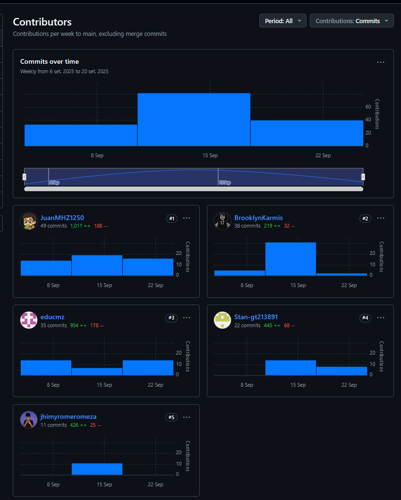

  

En esta vista se observa la cantidad de commits realizados, junto con el balance de líneas añadidas y eliminadas.  

### Historial de actividad del repositorio  

  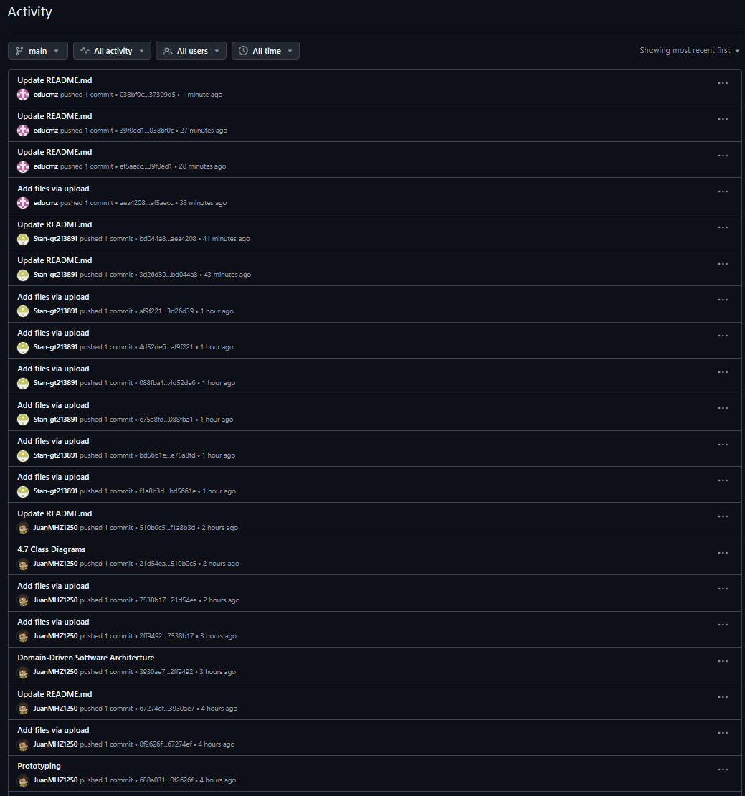

 

  

  

---

En conjunto, las capturas reflejan el cumplimiento de los objetivos de colaboración: **participación activa de todos los integrantes**, registro claro de los aportes y una evolución continua y transparente del informe del proyecto.  

# Student Outcome

El curso contribuye al cumplimiento del **ABET – EAC – Student Outcome 5**:  
*“La capacidad de funcionar efectivamente en un equipo cuyos miembros juntos proporcionan liderazgo, crean un entorno de colaboración e inclusivo, establecen objetivos, planifican tareas y cumplen objetivos.”*

En la siguiente tabla se describen las **acciones realizadas** y las **conclusiones del equipo** en relación con este resultado.  
La información se ampliará en cada entrega (**TB1**, **TP1**, **TB2**, **TF1**) según los avances del equipo.

| Criterio específico | Acciones realizadas | Conclusiones grupales (acumulativas) |
|----------------------|---------------------|--------------------------------------|
| **Trabaja en equipo para proporcionar liderazgo en forma conjunta** | **Stanley Jeremy Gutiérrez Tume** — **TB1:** facilitó acuerdos de trabajo (roles, DoD), dirigió las ceremonias iniciales, creó el repositorio en GitHub y promovió liderazgo distribuido por frentes (UX, backend, LP). **Juan José Meza Huanacune** — **TB1:** co-lideró la definición de **GitFlow** y de las **convenciones de commits**, supervisó la configuración del backend y guió el proceso de *pull requests*. **Eduardo Fabián Chacaliaza Minaya** — **TB1:** lideró el frente **UX/UI**, coordinó revisiones de diseño y mantuvo la coherencia visual basada en **Material Design** y **PrimeVue**. **Fabricio Fabián Quispe Barzola** — **TB1:** lideró la **definición del problema** mediante el método **5W2H**, alineando el alcance del proyecto con la visión del equipo. **Romero Meza Jhimy Pool** — **TB1:** diseñó la **estructura y contenido del Landing Page**, articulando comunicación entre los frentes de UX y backend. | **TB1:** El liderazgo fue **distribuido** entre los integrantes, favoreciendo la toma de decisiones conjunta. Se definieron responsabilidades, flujos de trabajo (GitFlow) y lineamientos técnicos que establecieron una base sólida para el trabajo colaborativo. En los siguientes hitos (**TP1**, **TB2**, **TF1**) se agregará evidencia adicional sobre el liderazgo compartido. |
| **Crea un entorno colaborativo e inclusivo, establece metas, planifica tareas y cumple objetivos** | **Stanley Jeremy Gutiérrez Tume** — **TB1:** definió los objetivos del sprint, estableció un cronograma de reuniones y promovió la participación equitativa. **Juan José Meza Huanacune** — **TB1:** configuró **issues, labels y tablero**, estableció los criterios **DoR/DoD** y normalizó las pautas de colaboración. **Eduardo Fabián Chacaliaza Minaya** — **TB1:** definió criterios visuales y de accesibilidad (**a11y/i18n**) y los aplicó en el diseño del Landing Page. **Fabricio Fabián Quispe Barzola** — **TB1:** propuso herramientas colaborativas para documentación y entrevistas, estandarizando las plantillas de registro. **Romero Meza Jhimy Pool** — **TB1:** implementó componentes del Landing Page y organizó los recursos visuales compartidos para optimizar el trabajo conjunto. | **TB1:** El equipo creó un entorno **colaborativo e inclusivo**, con reglas claras (**DoD/DoR**) y un backlog visible. Se cumplieron los objetivos del sprint: creación del repositorio, desarrollo del Capítulo I y despliegue inicial del Landing Page. En próximas entregas se incluirán los avances y resultados de las metas planificadas. |

## Contenido

1. [Capítulo I: Introducción](#capítulo-i-introducción)  
   1.1. [Startup Profile](#11-startup-profile)  
       1.1.1. [Descripción de la Startup](#111-descripción-de-la-startup)  
       1.1.2. [Perfiles de integrantes del equipo](#112-perfiles-de-integrantes-del-equipo)  
   1.2. [Solution Profile](#12-solution-profile)  
       1.2.1. [Antecedentes y problemática](#121-antecedentes-y-problemática)  
       1.2.2. [Lean UX Process](#122-lean-ux-process)  
           1.2.2.1. [Lean UX Problem Statements](#1221-lean-ux-problem-statements)  
           1.2.2.2. [Lean UX Assumptions](#1222-lean-ux-assumptions)  
           1.2.2.3. [Lean UX Hypothesis Statements](#1223-lean-ux-hypothesis-statements)  
           1.2.2.4. [Lean UX Canvas](#1224-lean-ux-canvas)  
   1.3. [Segmentos objetivo](#13-segmentos-objetivo)  

2. [Capítulo II: Requirements Elicitation & Analysis](#capítulo-ii-requirements-elicitation--analysis)  
   2.1. [Competidores](#21-competidores)  
       2.1.1. [Análisis competitivo](#211-análisis-competitivo)  
       2.1.2. [Estrategias y tácticas frente a competidores](#212-estrategias-y-tácticas-frente-a-competidores)  
   2.2. [Entrevistas](#22-entrevistas)  
       2.2.1. [Diseño de entrevistas](#221-diseño-de-entrevistas)  
       2.2.2. [Registro de entrevistas](#222-registro-de-entrevistas)  
       2.2.3. [Análisis de entrevistas](#223-análisis-de-entrevistas)  
   2.3. [Needfinding](#23-needfinding)  
       2.3.1. [User Personas](#231-user-personas)  
       2.3.2. [User Task Matrix](#232-user-task-matrix)  
       2.3.3. [User Journey Mapping](#233-user-journey-mapping)  
       2.3.4. [Empathy Mapping](#234-empathy-mapping)  
   2.4. [Big Picture EventStorming](#24-big-picture-eventstorming)  
   2.5. [Ubiquitous Language](#25-ubiquitous-language)  

3. [Capítulo III: Requirements Specification](#capítulo-iii-requirements-specification)  
   3.1. [User Stories](#31-user-stories)  
   3.2. [Impact Mapping](#32-impact-mapping)  
   3.3. [Product Backlog](#33-product-backlog)  

4. [Capítulo IV: Product Design](#capítulo-iv-product-design)  
   4.1. [Style Guidelines](#41-style-guidelines)  
       4.1.1. [General Style Guidelines](#411-general-style-guidelines)  
       4.1.2. [Web Style Guidelines](#412-web-style-guidelines)  
   4.2. [Information Architecture](#42-information-architecture)  
       4.2.1. [Organization Systems](#421-organization-systems)  
       4.2.2. [Labeling Systems](#422-labeling-systems)  
       4.2.3. [SEO Tags and Meta Tags](#423-seo-tags-and-meta-tags)  
       4.2.4. [Searching Systems](#424-searching-systems)  
       4.2.5. [Navigation Systems](#425-navigation-systems)  
   4.3. [Landing Page UI Design](#43-landing-page-ui-design)  
       4.3.1. [Landing Page Wireframe](#431-landing-page-wireframe)  
       4.3.2. [Landing Page Mock-up](#432-landing-page-mock-up)  
   4.4. [Web Applications UX/UI Design](#44-web-applications-uxui-design)  
       4.4.1. [Web Applications Wireframes](#441-web-applications-wireframes)  
       4.4.2. [Web Applications Wireflow Diagrams](#442-web-applications-wireflow-diagrams)  
       4.4.3. [Web Applications Mock-ups](#443-web-applications-mock-ups)  
       4.4.4. [Web Applications User Flow Diagrams](#444-web-applications-user-flow-diagrams)  
   4.5. [Web Applications Prototyping](#45-web-applications-prototyping)  
   4.6. [Domain-Driven Software Architecture](#46-domain-driven-software-architecture)  
       4.6.1. [Design-Level EventStorming](#461-design-level-eventstorming)  
       4.6.2. [Software Architecture Context Diagram](#462-software-architecture-context-diagram)  
       4.6.3. [Software Architecture Container Diagrams](#463-software-architecture-container-diagrams)  
       4.6.4. [Software Architecture Components Diagrams](#464-software-architecture-components-diagrams)  
   4.7. [Software Object-Oriented Design](#47-software-object-oriented-design)  
       4.7.1. [Class Diagrams](#471-class-diagrams)  
   4.8. [Database Design](#48-database-design)  
       4.8.1. [Database Diagrams](#481-database-diagrams)  

5. [Capítulo V: Product Implementation, Validation & Deployment](#capítulo-v-product-implementation-validation--deployment)  
   5.1. [Software Configuration Management](#51-software-configuration-management)  
       5.1.1. [Software Development Environment Configuration](#511-software-development-environment-configuration)  
       5.1.2. [Source Code Management](#512-source-code-management)  
       5.1.3. [Source Code Style Guide & Conventions](#513-source-code-style-guide--conventions)  
       5.1.4. [Software Deployment Configuration](#514-software-deployment-configuration)  
   5.2. [Landing Page, Services & Applications Implementation](#52-landing-page-services--applications-implementation)  
       5.2.1. [Sprint 1](#521-sprint-1)  
           5.2.1.1. [Sprint Planning 1](#5211-sprint-planning-1)  
           5.2.1.2. [Aspect Leaders and Collaborators](#5212-aspect-leaders-and-collaborators)  
           5.2.1.3. [Sprint Backlog 1](#5213-sprint-backlog-1)  
           5.2.1.4. [Development Evidence for Sprint Review](#5214-development-evidence-for-sprint-review)  
           5.2.1.5. [Execution Evidence for Sprint Review](#5215-execution-evidence-for-sprint-review)  
           5.2.1.6. [Services Documentation Evidence for Sprint Review](#5216-services-documentation-evidence-for-sprint-review)  
           5.2.1.7. [Software Deployment Evidence for Sprint Review](#5217-software-deployment-evidence-for-sprint-review)  
           5.2.1.8. [Team Collaboration Insights during Sprint](#5218-team-collaboration-insights-during-sprint)  

6. [Conclusiones](#conclusiones)  
7. [Bibliografía](#bibliografía)  
8. [Anexos](#anexos)  

## Capítulo I: Introducción  

### 1.1.1. Descripción de la Startup

**Startup:** Mithycore  
**Producto:** AuraNeuro

**Elevator pitch:**  
AuraNeuro transforma datos obtenidos de dispositivos IoT y wearables en información clínica útil para pacientes neurológicos y sus neurólogos. Permite registrar crisis, hábitos y eventos relevantes, analizando tendencias que facilitan decisiones médicas con foco en adherencia y bienestar.

**Misión**  
Conectar a pacientes neurológicos, profesionales de la salud y dispositivos IoT a través de una plataforma accesible y segura que convierta los datos biométricos en decisiones clínicas útiles, mejorando la adherencia terapéutica y la calidad de vida.

**Visión**  
Ser la referencia latinoamericana en soluciones digitales de neuro-salud basadas en datos, integrando IoT, análisis inteligente y diseño inclusivo para transformar la relación entre paciente y médico en un proceso continuo y colaborativo.

**Propuesta de valor por actor**
- **Pacientes y cuidadores:** registro digital de crisis y síntomas, recordatorios de medicación y visualización de avances en su tratamiento.  
- **Profesionales de salud:** panel web con métricas de evolución (tendencias de sueño, frecuencia de crisis, adherencia a tratamientos) para optimizar decisiones clínicas.  
- **Proveedores IoT:** integración mediante API para envío seguro de señales biométricas (EEG, PPG, HRV) con documentación y entorno de pruebas.

**Diferenciadores**
- Enfoque en **outcomes de salud** (reducción de episodios, mejora en adherencia terapéutica) más que en funcionalidades.  
- Diseño centrado en la accesibilidad y facilidad de uso para pacientes con limitaciones motoras o cognitivas.  
- Integración transparente con dispositivos IoT, priorizando seguridad y privacidad de los datos.

**Privacidad y ética**  
AuraNeuro maneja información biomédica con criterios éticos y de privacidad basados en HIPAA e ISO 27001. Todos los registros son tratados con consentimiento informado y cifrado en tránsito y almacenamiento. 

#### 1.1.2. Perfiles de integrantes del equipo  

| Foto | Nombre y Código | Rol | Descripción |
|------|-----------------|-----|-------------|
|  | **Stanley Jeremy Gutierrez Tume (U202118152)** | **Product Lead & Scrum Facilitator** | Estudiante de Ingeniería de Software y **líder general del equipo Mithycore**. Facilita las ceremonias Scrum, gestiona el roadmap del proyecto y coordina la integración de entregables. Lidera la definición de **GitFlow**, **Convencional Commits** y **SemVer**. Supervisa la documentación del Capítulo I y la creación del repositorio inicial.  **Evidencia TB1:** coordinación de tareas y despliegue base de la Landing Page. |
|  | **Juan José Meza Huanacune (U202320574)** | **Backend Engineer & API Owner (.NET Core)** | Responsable del diseño e implementación de **servicios web en ASP.NET Core**, aplicando principios de arquitectura limpia, seguridad y documentación con **Swagger/OpenAPI**. Lidera la estructura técnica del backend y colabora con la integración IoT.  **Evidencia TB1:** diseño de la estructura inicial del backend, lineamientos de versionado y configuración del repositorio técnico. |
|  | **Eduardo Fabián Chacaliaza Minaya (U202324129)** | **Frontend & UX/UI Engineer (PrimeVue / Figma)** | Dirige el diseño de la interfaz y la experiencia de usuario. Responsable de la creación del **design system**, la accesibilidad (**a11y**) y la internacionalización (**i18n**, en_US/es_419). Utiliza **Figma** y **PrimeVue** para garantizar consistencia visual.  **Evidencia TB1:** diseño inicial del Landing Page y lineamientos visuales aplicados al prototipo. |
|  | **Fabricio Fabián Quispe Barzola (U202320442)** | **Data & IoT Integration Engineer** | Especialista en procesamiento de datos y conexión de sensores IoT. Lidera la construcción de artefactos de investigación (**5W2H**, benchmark, entrevistas y análisis). Colabora en la integración entre hardware y servicios cloud.  **Evidencia TB1:** diagnóstico de la problemática inicial y documentación del entorno IoT con fuentes referenciadas. |
|  | **Romero Meza Jhimy Pool (U202321510)** | **Frontend Developer & Landing Owner (Vue + PrimeVue)** | Encargado de la maquetación responsive de la **Landing Page** y del frontend principal. Asegura el cumplimiento de buenas prácticas **RWD**, optimización de rendimiento y soporte **i18n**. Implementa los componentes base de **PrimeVue**.  **Evidencia TB1:** despliegue funcional de la Landing Page y organización del repositorio de assets. |

**Champions transversales del equipo Mithycore**
- **a11y/i18n:** Eduardo & Jhimy  
- **Seguridad y privacidad:** Stanley & Juan José  
- **Gestión de artefactos Lean UX:** Fabricio (UXPressia) & Eduardo (Figma)

### 1.2. Solution Profile  
### 1.2.1. Antecedentes y problemática

Las enfermedades neurológicas como la epilepsia, el Parkinson y el Alzheimer representan un reto creciente para los sistemas de salud.  
En América Latina, la atención continúa siendo fragmentada: los diagnósticos suelen realizarse en fases avanzadas y los pacientes carecen de seguimiento continuo.  
Aunque la OMS estima más de **50 millones de personas con epilepsia** a nivel mundial (OMS, 2020), cerca del **70 % podría controlar sus crisis** con detección temprana y adherencia adecuada.  

Actualmente, los pacientes dependen de anotaciones manuales o consultas esporádicas. Los especialistas reciben información incompleta, y los dispositivos de monitoreo existentes son **costosos o poco accesibles**, lo que genera **falta de continuidad en la atención** y **decisiones clínicas basadas en datos insuficientes**.

**AuraNeuro**, iniciativa de la startup **Mithycore**, surge para **facilitar el seguimiento neurológico de manera continua, accesible y segura**, aprovechando el potencial de los dispositivos IoT y la analítica avanzada de datos.  
A continuación, se presenta el análisis **5W+2H** que sustenta la problemática identificada.

---

#### Análisis 5W + 2H  

| **Pregunta** | **Descripción (AuraNeuro – Mithycore)** |
|---------------|------------------------------------------|
| **What (Qué)** | En la atención neurológica ambulatoria **no existe un registro continuo y centralizado** de crisis, sueño, adherencia y eventos relevantes. La información llega **tardía, fragmentada y subjetiva**, lo que dificulta **ajustar tratamientos de forma oportuna**. |
| **When (Cuándo)** | El problema se presenta **entre consultas médicas** (semanas o meses), durante **episodios críticos** (crisis epilépticas o alteraciones cognitivas) y en **rutinas diarias** donde se requieren datos continuos para observar tendencias. |
| **Where (Dónde)** | Ocurre en el **hogar del paciente** (uso de wearables o sensores), en **consultorios, hospitales y teleconsultas**, principalmente en **Latinoamérica urbana**, donde la conectividad y la digitalización son parciales. |
| **Who (Quién)** | **Pacientes adultos (20–65 años)** con diagnóstico o sospecha de epilepsia (segmento inicial) y, en fases posteriores, Parkinson o deterioro cognitivo. Involucra también a **neurólogos, terapeutas, cuidadores, instituciones de salud** y **proveedores IoT** (EEG, EMG, PPG, HRV). |
| **Why (Por qué)** | 1) **Dependencia de registros subjetivos** y poco confiables.  2) **Baja interoperabilidad** entre dispositivos IoT y sistemas clínicos (**EHR/HL7-FHIR**).  3) **Ausencia de analítica en tiempo real** para emitir alertas útiles.  4) **Limitaciones de acceso y usabilidad** para pacientes con discapacidad motora o cognitiva. |
| **How (Cómo)** | **AuraNeuro** propone:  • Una **aplicación móvil** para registrar síntomas y recibir alertas.  • **Sensores IoT** que transmiten datos biométricos (EEG, HRV, sueño) hacia la nube.  • Un **dashboard clínico** con métricas y exportación a EHR (**FHIR/PDF**).  • Seguridad basada en **cifrado en tránsito y almacenamiento**, control de acceso y **consentimiento informado**. |
| **How much (Cuánto)** | **Metas del piloto (6–9 meses):**  • ≥ **4 registros por semana** por usuario activo.  • Reducción ≥ **15 %** en reingresos hospitalarios.  • ≥ **60 %** de consultas con historial digital exportado.  • **Latencia P95 < 500 ms** y **> 99 %** de mensajes IoT sin pérdida.  • ≥ **2 integraciones IoT** y **1 FHIR** activas. |

---

#### Declaración de Problema de Negocio (Box 1 – Lean UX Canvas)

> **AuraNeuro**, producto de **Mithycore**, busca resolver la brecha en el seguimiento neurológico ambulatorio.  
> Los pacientes carecen de una plataforma accesible para registrar sus crisis y hábitos, y los médicos no pueden analizar datos de forma integrada ni oportuna.  
> Esta situación conduce a **diagnósticos tardíos** y **baja adherencia terapéutica**.  
> **¿Cómo podríamos mejorar la recolección y visualización de datos neurológicos para facilitar decisiones médicas basadas en evidencia**, **medido por una mayor frecuencia de registro y una reducción en hospitalizaciones evitables?**

---

#### Métricas de éxito (Impact → Outcome)

| **Tipo de métrica** | **Indicador** | **Objetivo esperado** |
|----------------------|---------------|------------------------|
| **Impact metric** | Reducción de hospitalizaciones evitables por pacientes neurológicos | Disminuir ≥ 20 % en 6 meses. |
| **Outcome metric** | Frecuencia de registro de crisis y síntomas en la app | ≥ 4 registros por semana por usuario activo. |
| **Outcome metric** | Porcentaje de consultas médicas con datos digitales completos | ≥ 60 % de consultas con historial exportado. |
| **Leading metric** | Número de proveedores IoT integrados (SDK/API) | ≥ 2 integraciones validadas en 3 meses. |

### 1.2.2. Lean UX Process  

> En esta sección aplicamos el **Lean UX Process** según *Lean UX 3rd Edition*, estructurado en los siguientes componentes: **Problem Statements, Assumptions, Hypothesis Statements** y **Lean UX Canvas**.  
> Se utiliza el formato oficial recomendado en el curso y en el libro (*Gothelf & Seiden, 2021*).

---

#### 1.2.2.1. Lean UX Problem Statement  

El **Problem Statement** describe el contexto actual, las limitaciones y la oportunidad que busca resolver la solución digital.  
Se formula respondiendo a los cuatro elementos clave indicados en *Lean UX (3rd Edition)*: **context**, **problem**, **impact**, y **measure of success**.

---

**Lean UX Problem Statement (English):**

> The current state of **neurological health monitoring** depends on **occasional clinical evaluations** and **manual symptom reports**.  
> This leads to **delayed diagnoses**, **fragmented information**, and **low treatment adherence** among patients with neurological disorders.  
> We believe that by providing a **continuous, data-driven monitoring experience** that connects patients and neurologists through IoT devices and analytics, we can **improve diagnostic accuracy and patient engagement**.  
> We’ll know this is true when we observe **a measurable reduction in hospital readmissions**, **an increase in weekly patient activity**, and **greater clinical data completeness**.

---

**Traducción (referencial):**

> El estado actual del **monitoreo neurológico** depende de **evaluaciones clínicas ocasionales** y **reportes manuales de síntomas**.  
> Esto genera **diagnósticos tardíos**, **información fragmentada** y **baja adherencia terapéutica** entre los pacientes con trastornos neurológicos.  
> Creemos que al ofrecer una **experiencia de monitoreo continuo basada en datos**, que conecte a pacientes y neurólogos mediante dispositivos IoT y analítica, podremos **mejorar la precisión diagnóstica y la participación del paciente**.  
> Sabremos que esto es cierto cuando observemos **una reducción medible en reingresos hospitalarios**, **un aumento en la actividad semanal de los usuarios** y **una mayor completitud de datos clínicos**.

---

#### 1.2.2.2. Lean UX Assumptions  

Según *Lean UX (3rd Edition)*, las **assumptions** se agrupan en cuatro tipos:

1. **Business Assumptions** — sobre la viabilidad y objetivos del negocio.  
2. **User Assumptions** — sobre quiénes son los usuarios y qué necesitan.  
3. **Value Assumptions** — sobre el valor que la solución les genera.  
4. **Feature Assumptions** — sobre qué características permitirán entregar ese valor.

---

**Lean UX Assumptions (English):**

**a) Business Assumptions**  
- Healthcare institutions need digital solutions that reduce hospital readmissions and monitoring costs.  
- A subscription-based or SaaS model can be sustainable in the Latin American health sector.  
- Demonstrable clinical improvement (adherence, fewer crises) will drive adoption by doctors and institutions.

**b) User Assumptions**  
- Patients with neurological disorders find it difficult to consistently log symptoms without digital support.  
- Neurologists require continuous and visual data to make informed decisions.  
- Caregivers are motivated to help patients track and share relevant information if the process is simple and reliable.

**c) Value Assumptions**  
- Real-time insights increase trust and engagement among patients and clinicians.  
- Continuous monitoring enables early detection and better adherence to treatment.  
- Data-driven reports save time for medical professionals and reduce uncertainty for patients.

**d) Feature Assumptions**  
- Dashboards with visual trends help neurologists understand patient progress quickly.  
- Notifications and alerts encourage patients to maintain adherence.  
- Easy-to-use logging interfaces promote frequent interaction and data accuracy.

---

**Traducción (referencial):**

**a) Supuestos de Negocio**  
- Las instituciones de salud necesitan soluciones digitales que reduzcan los reingresos hospitalarios y los costos de monitoreo.  
- Un modelo de suscripción o SaaS puede ser sostenible en el sector salud latinoamericano.  
- Las mejoras clínicas demostrables (adherencia, reducción de crisis) impulsarán la adopción por parte de médicos e instituciones.

**b) Supuestos de Usuario**  
- Los pacientes con trastornos neurológicos tienen dificultades para registrar sus síntomas de forma constante sin apoyo digital.  
- Los neurólogos requieren datos continuos y visuales para tomar decisiones informadas.  
- Los cuidadores están motivados a apoyar el seguimiento si el proceso es simple y confiable.

**c) Supuestos de Valor**  
- Las visualizaciones en tiempo real aumentan la confianza y el compromiso entre pacientes y clínicos.  
- El monitoreo continuo permite una detección temprana y una mejor adherencia al tratamiento.  
- Los reportes basados en datos ahorran tiempo a los profesionales de salud y reducen la incertidumbre en los pacientes.

**d) Supuestos de Funcionalidad**  
- Los tableros con tendencias visuales ayudan a los neurólogos a entender rápidamente la evolución del paciente.  
- Las notificaciones y alertas fomentan la adherencia terapéutica.  
- Las interfaces simples promueven la interacción frecuente y la precisión en el registro.

---

#### 1.2.2.3. Lean UX Hypothesis Statements  

Cada hipótesis se formula conforme al patrón estándar del libro:

> **We believe that [this outcome] will be achieved if [these users] attain [this benefit].**  
> We will know this is true when we observe [this measurable result].

---

**Lean UX Hypothesis Statements (English):**

**a) Business Hypothesis**  
> We believe that **hospitals and neurologists** will adopt AuraNeuro if it **reduces patient readmissions and saves monitoring costs**.  
> We’ll know this is true when we see **pilot programs or institutional partnerships** with measurable cost reductions.

**b) User Hypothesis**  
> We believe that **patients with neurological disorders** will use AuraNeuro regularly **if it helps them visualize progress and receive useful alerts**.  
> We’ll know this is true when we see **consistent weekly usage (≥4 sessions)** and **positive feedback on alert relevance**.

**c) Value Hypothesis**  
> We believe that **continuous IoT monitoring and data-driven insights** will lead to **fewer emergency visits and better treatment adherence**.  
> We’ll know this is true when we observe a **decrease in readmission rates (≥15%)** and **increased patient adherence metrics**.

**d) Feature Hypothesis**  
> We believe that **simple symptom logging, alert notifications, and clinician dashboards** will enable **better collaboration and decision-making**.  
> We’ll know this is true when we observe **more complete patient records** and **active clinician dashboard usage**.

---

**Traducción (referencial):**

**a) Hipótesis de Negocio**  
> Creemos que los **hospitales y neurólogos** adoptarán AuraNeuro si **reduce los reingresos hospitalarios y los costos de monitoreo**.  
> Sabremos que esto es cierto cuando veamos **programas piloto o alianzas institucionales** con reducciones de costos medibles.

**b) Hipótesis de Usuario**  
> Creemos que los **pacientes con trastornos neurológicos** usarán AuraNeuro regularmente **si les ayuda a visualizar su progreso y recibir alertas útiles**.  
> Sabremos que esto es cierto cuando observemos **uso semanal constante (≥4 sesiones)** y **retroalimentación positiva sobre la relevancia de las alertas**.

**c) Hipótesis de Valor**  
> Creemos que el **monitoreo IoT continuo y los reportes basados en datos** conducirán a **menos visitas de emergencia y mejor adherencia al tratamiento**.  
> Sabremos que esto es cierto cuando observemos **una disminución en los reingresos (≥15%)** y **mayores métricas de adherencia**.

**d) Hipótesis de Funcionalidad**  
> Creemos que el **registro simple de síntomas, las alertas y el panel clínico** permitirán **una mejor colaboración y toma de decisiones**.  
> Sabremos que esto es cierto cuando veamos **registros de pacientes más completos** y **uso activo del panel por parte de los médicos**.

---

#### 1.2.2.4. Lean UX Canvas – AuraNeuro  

El siguiente cuadro resume los principales componentes del **Lean UX Canvas (v2)** aplicados a AuraNeuro, conforme al formato de *Lean UX 3rd Edition*.

| **Box** | **Component** | **Summary (English)** | **Traducción (Español)** |
|----------|----------------|------------------------|----------------------------|
| **1** | **Business Problem** | Neurological monitoring depends on occasional checkups and manual reports. Existing solutions are expensive and disconnected. | El monitoreo neurológico depende de evaluaciones esporádicas y reportes manuales. Las soluciones actuales son costosas y poco integradas. |
| **2** | **Business Outcomes** | Reduce hospital readmissions and monitoring costs; increase clinical efficiency and patient engagement. | Reducir reingresos y costos; aumentar eficiencia clínica y compromiso del paciente. |
| **3** | **Users & Customers** | Adult patients (20–65) with neurological disorders, neurologists, and caregivers. | Pacientes adultos (20–65), neurólogos y cuidadores. |
| **4** | **User Outcomes & Benefits** | Patients detect anomalies early; doctors access continuous data for informed decisions. | Los pacientes detectan anomalías tempranas; los médicos acceden a datos continuos para decisiones informadas. |
| **5** | **Solutions** | IoT-based sensors connected to an app and clinician dashboard for alerts, trends, and reports. | Sensores IoT conectados a una app y un panel clínico para alertas, tendencias y reportes. |
| **6** | **Assumptions** | Business, User, Value, and Feature assumptions guiding MVP validation. | Supuestos de negocio, usuario, valor y funcionalidad que guían la validación del MVP. |
| **7** | **Hypotheses** | See Section 1.2.2.3 — measurable hypotheses for validation. | Ver sección 1.2.2.3 — hipótesis medibles para validar valor, adopción y efectividad. |
| **8** | **Experiments** | Conduct MVP pilot with 20 patients and 5 doctors over 8 weeks; measure usage frequency, alert accuracy, and satisfaction. | Ejecutar piloto MVP con 20 pacientes y 5 médicos durante 8 semanas; medir frecuencia de uso, precisión de alertas y satisfacción. |

---

**Conclusión:**  
El *Lean UX Process* aplicado a **AuraNeuro** permite conectar las necesidades reales de los usuarios con los objetivos del negocio mediante hipótesis medibles y experimentos iterativos.  
El equipo **Mithycore** usará estos artefactos como guía para las fases de validación y desarrollo incremental.

---

## 1.3. Segmentos Objetivo

El proyecto **AuraNeuro**, desarrollado por **Mithycore**, se centra en tres segmentos principales de usuarios identificados a través de investigación exploratoria y entrevistas iniciales.

---

### 1.3.1. Segmentos Objetivo #1 — Pacientes neurológicos  

- **Perfil:** Adultos de 20 a 65 años con diagnóstico o riesgo de epilepsia, Parkinson o deterioro cognitivo.  
- **Necesidades / Problemas:** Falta de monitoreo continuo, dificultad para registrar síntomas, baja adherencia al tratamiento y ansiedad por la imprevisibilidad de los eventos neurológicos.  
- **Contexto de Uso:** Entorno doméstico y sesiones de telemedicina, donde los pacientes necesitan registrar síntomas y recibir alertas de forma sencilla y confiable.  
- **Hallazgo Clave:** Los pacientes dependen de anotaciones manuales o la memoria, lo que genera información incompleta durante las consultas médicas.  
- **Beneficio con AuraNeuro:** Monitoreo en tiempo real mediante biosensores IoT, alertas automáticas para detección temprana y reportes accesibles que mejoran la adherencia y la confianza del paciente.

---

### 1.3.2. Segmentos Objetivo #2 — Profesionales de la salud  
 
- **Perfil:** Neurólogos, psicólogos y fisioterapeutas que trabajan en hospitales o clínicas privadas, de entre 25 y 55 años.  
- **Necesidades / Problemas:** Fuentes de datos fragmentadas, dificultad para evaluar la evolución del paciente y sobrecarga de información sin métricas estandarizadas.  
- **Contexto de Uso:** Entornos clínicos y plataformas de teleconsulta donde se requiere información visual, precisa y actualizada para apoyar la toma de decisiones.  
- **Hallazgo Clave:** Los especialistas buscan tableros integrados que consoliden la evolución del paciente y permitan exportar reportes médicos estandarizados.  
- **Beneficio con AuraNeuro:** Un panel clínico con datos biométricos y de comportamiento en tiempo real (sueño, frecuencia de crisis, adherencia), interoperable con sistemas clínicos (**HL7–FHIR**).

---

### 1.3.3. Segmentos Objetivo #3 — Proveedores de dispositivos IoT 
 
- **Perfil:** Empresas que desarrollan wearables médicos, sensores EEG/EMG y plataformas de datos biométricos interesadas en integrarse al sector salud.  
- **Necesidades / Problemas:** Falta de interoperabilidad, baja visibilidad en el mercado clínico y necesidad de canales seguros para transmisión de datos.  
- **Contexto de Uso:** Ecosistemas B2B orientados al desarrollo y la integración mediante APIs o SDKs.  
- **Hallazgo Clave:** Muchos proveedores IoT en Latinoamérica carecen de una plataforma de referencia para validar las aplicaciones clínicas de sus dispositivos.  
- **Beneficio con AuraNeuro:** Un marco de colaboración que permite la integración segura mediante API, amplía su alcance comercial y garantiza compatibilidad con estándares médicos (**HL7–FHIR**, **ISO 27001**).

---

**Conclusión:**   
Estos tres segmentos conforman un ecosistema digital conectado donde cada actor genera y recibe valor.  
Con este enfoque, **Mithycore** posiciona a **AuraNeuro** como una plataforma colaborativa **B2B2C (Business–to–Business–to–Consumer)** que fortalece la continuidad del cuidado neurológico en Latinoamérica.

---

## Capítulo II: Requirements Elicitation & Analysis  
  
La recolección y análisis de requisitos es una etapa fundamental en el desarrollo de cualquier proyecto. Este proceso implica identificar, comprender y documentar las necesidades y expectativas de los stakeholders, así como los objetivos y restricciones del proyecto.  

A través de entrevistas, encuestas y estudios de mercado, se busca obtener una comprensión clara de los requerimientos de la solución. En este capítulo se incluyen los competidores directos e indirectos de la plataforma, para entender el estado del arte y definir nuestras fortalezas frente a ellos.  

---

### 2.1. Competidores  

En esta sección se presentan algunos competidores relevantes en el ámbito del monitoreo neurológico y la telemedicina, así como un análisis de las características que nuestra plataforma IoT busca superar.

---

  

Ceribell: Es una empresa especializada en electroencefalografía portátil para cuidados intensivos. Su sistema permite obtener resultados de EEG en minutos, facilitando diagnósticos rápidos en emergencias neurológicas. Sin embargo, su enfoque está limitado al ámbito hospitalario y no ofrece un ecosistema integral de seguimiento remoto para pacientes crónicos.  

---

  

Empatica: Fabricante de dispositivos wearables biomédicos como el EmbracePlus, que mide actividad eléctrica de la piel, frecuencia cardíaca y patrones de sueño. Sus soluciones están dirigidas principalmente a investigación clínica y monitoreo de epilepsia, pero carecen de una plataforma analítica avanzada para predicción personalizada de crisis en pacientes.  

---

  

NeuroPace: Ofrece el RNS System, un dispositivo implantable que detecta y responde a actividad cerebral anormal en pacientes con epilepsia. Es una solución pionera en estimulación cerebral, aunque presenta un alto costo y está limitado a casos muy específicos, sin opciones de integración con telemedicina ni con monitoreo cotidiano de calidad de vida.  

---

## Fortalezas de Nuestra Plataforma IoT  
- Combina **sensores portátiles e implantables** en un mismo ecosistema.  
- Permite un **monitoreo continuo y remoto**, más allá del entorno hospitalario.  
- Integra **inteligencia artificial** para predicción de crisis y episodios neurológicos.  
- Ofrece una **interfaz multiplataforma** (app móvil para pacientes, dashboard web para médicos).  
- Incluye un **módulo de investigación** con exportación de datos anonimizados para ensayos clínicos.  

---
#### 2.1.1. Análisis competitivo  

El análisis competitivo nos brinda una visión clara de cómo nos comparamos con nuestros competidores en el mercado. Nos ayuda a identificar áreas en las que podemos mejorar, así como oportunidades para diferenciarnos y destacar. Esta comprensión nos permite desarrollar estrategias más efectivas como grupo, lo que nos ayuda a alcanzar nuestros objetivos y mantenernos competitivos en el mercado.  

---

#### Competitive Analysis Landscape  

| ¿Por qué llevar a cabo este análisis? | Llevar a cabo este análisis nos brindará información crítica que nos permitirá tomar decisiones más informadas y estratégicas para el desarrollo, comercialización y crecimiento de nuestra plataforma. |
|---------------------------------------|-----------------------------------------------------------------------------------------------------------------------------------------------------------------------------------|

| Perfil | Nuestro Proyecto (Plataforma IoT) | Ceribell | Empatica | NeuroPace |
|--------|------------------------------------|----------|----------|-----------|
| **Overview** | Plataforma IoT y de telemedicina para monitoreo neurológico continuo, integración de datos en la nube y analítica avanzada con IA. | EEG portátil para emergencias hospitalarias, diagnóstico rápido en UCI. | Wearables biomédicos para investigación clínica y monitoreo de epilepsia. | Dispositivo implantable (RNS System) para epilepsia resistente, con estimulación cerebral adaptativa. |
| **Ventaja competitiva / Valor al cliente** | Seguimiento remoto 24/7, alertas predictivas y telemedicina integrada. | Diagnóstico rápido y portátil. | Datos fisiológicos continuos y validados para investigación. | Detección y respuesta automática a actividad cerebral anómala. |
| **Mercado objetivo** | Pacientes con enfermedades neurológicas crónicas, hospitales, clínicas e investigadores. | Hospitales y UCIs. | Centros de investigación y pacientes con epilepsia. | Pacientes con epilepsia severa, candidatos a implantes. |
| **Estrategias de marketing** | Posicionamiento como plataforma integral de prevención y personalización médica. | Marketing B2B enfocado en hospitales. | Alianzas con universidades e instituciones médicas. | Difusión clínica en epileptología y neurocirugía. |
| **Productos y Servicios** | App móvil para pacientes y familiares, dashboard web para médicos, integración con EHR, módulo de investigación. | Dispositivo EEG portátil y software de análisis. | Pulsera *EmbracePlus* y plataforma de datos biomédicos. | RNS System (implante cerebral y software). |
| **Precios y Costos** | Modelo de suscripción mensual/anual para pacientes e instituciones. | Venta directa de hardware y licencias. | Venta de dispositivos + servicios de análisis. | Alto costo quirúrgico + mantenimiento de hardware. |
| **Canales de distribución** | Plataforma web y móvil, integración con hospitales, clínicas y aseguradoras. | Venta hospitalaria y distribuidores médicos. | Online y a través de centros de investigación. | Cirugías especializadas en hospitales de referencia. |

---

#### Análisis SWOT  

| Factor | Nuestro Proyecto | Ceribell | Empatica | NeuroPace |
|--------|------------------|----------|----------|-----------|
| **Fortalezas** | Integración completa IoT + IA + telemedicina; multiplataforma; datos anonimizados para investigación. | Resultados de EEG inmediatos en UCI. | Wearables validados científicamente. | Estimulación cerebral adaptativa altamente innovadora. |
| **Debilidades** | Proyecto en fase inicial, necesidad de certificaciones médicas y financiamiento. | Limitado a entornos hospitalarios, no es continuo ni remoto. | Carece de analítica avanzada predictiva. | Alto costo y aplicable solo a pacientes con epilepsia refractaria. |
| **Oportunidades** | Creciente demanda de telemedicina, prevención y salud digital; alianzas con hospitales y aseguradoras. | Expansión a hospitales de menor escala. | Expansión en mercados de salud digital y bienestar. | Integración con sistemas de monitoreo remoto en el futuro. |
| **Amenazas** | Competencia de grandes empresas tecnológicas y dispositivos médicos consolidados. | Aparición de nuevas soluciones de EEG portátiles. | Competidores en el área de wearables de salud. | Nuevas técnicas no invasivas que reduzcan su uso. |

#### 2.1.2. Estrategias y tácticas frente a competidores  

**Objetivo.** Definir cómo competiremos y ganaremos tracción frente a soluciones existentes (hospitalarias, wearables clínicos e implantes), priorizando diferenciadores de **monitoreo continuo remoto**, **IA predictiva** e **integración clínica**. (Según plantilla se debe incluir esta sección). 

#### a) Estrategias por competidor

| Competidor | Fortalezas clave | Debilidades / brechas | Nuestra estrategia | Tácticas concretas | Métricas/KPI |
|---|---|---|---|---|---|
| **Ceribell** (EEG portátil UCI) | EEG rápido en emergencias; validación clínica hospitalaria | Enfoque intra-hospitalario; sin seguimiento remoto longitudinal | **Extender el cuidado post-alta** con **RPM** (Remote Patient Monitoring) y alertas en casa | • Kits de alta con sensores + app  • Integración **EHR/HL7-FHIR** para continuidad de cuidados  • Protocolos de alerta temprana a neurología | Adopción post-alta (% pacientes activos a 30/90 días)  Tiempo respuesta ante alerta  # de hospitales integrados |
| **Empatica** (wearables biomédicos) | Wearables validados; datos fisiológicos continuos | Foco investigación; analítica predictiva limitada al usuario | **Diferenciación en IA clínica**: predicción de crisis y episodios motores con panel médico | • Modelos ML multiseñal (EEG/EMG/actigrafía/sueño)  • Panel clínico con riesgo minuto-a-minuto  • Programa de “co-desarrollo” con centros de epilepsia | AUC/Se/Sp en predicción de crisis  Reducción de eventos no detectados  # acuerdos de investigación |
| **NeuroPace** (RNS implantable) | Respuesta adaptativa a actividad anómala; resultados en epilepsia refractaria | Invasivo y costoso; nicho de pacientes | **Alternativa no invasiva** en etapas tempranas y triage pre-implante | • Protocolos de triage: usar nuestra plataforma antes de implante  • Reportes de evolución para comités de epilepsia  • Detección de patrones pre-ictales para evitar progresión | % pacientes que evitan implante  Reducción de crisis/mes  Satisfacción de comité (NPS clínico) |

#### b) Estrategias transversales (producto, GTM y cumplimiento)

| Frente | Tácticas | Métricas/KPI |
|---|---|---|
| **Producto & IA** | Algoritmos de detección temprana (convulsiones, bradicinesia/temblor, alteraciones de sueño), explicación de modelos para uso clínico | AUC/Se/Sp por patología; tiempo de inferencia; % explicaciones aceptadas por médicos |
| **Integración clínica** | APIs **FHIR/HL7**, interoperabilidad con EHR y PACS; flujos de telemedicina con historial en contexto | # integraciones activas; tiempo de onboarding hospital; % consultas con datos embebidos |
| **Seguridad & cumplimiento** | Cifrado E2E; anonimización para investigación; roadmap HIPAA/GDPR/ISO 27001 | Incidentes de seguridad (0); auditorías aprobadas; % datasets anonimizados |
| **GTM (go-to-market)** | Pilotos con hospitales neurológicos y aseguradoras (RPM); casos de uso por línea (Epilepsia, Parkinson, EM) | # pilotos activos; tasa de conversión piloto→contrato; costo de adquisición por institución |
| **Modelo de negocio** | Suscripción por paciente/mes (RPM) y licencias B2B para instituciones; tier de investigación | ARPU por segmento; churn; margen por institución |
| **Evidencia clínica** | Estudios observacionales + publicaciones conjuntas con centros; dataset abierto anonimizado | # publicaciones; # citaciones; # descargas de dataset |
| **Soporte al paciente** | Educación y adherencia (recordatorios, coaching), canal para cuidadores con alertas graduadas | Adherencia al uso (>80%/90 días); tiempo de respuesta cuidador; NPS paciente/caregiver |

#### c) Tácticas de corto plazo (TB1 → TP1)

1. **Piloto de telemetría** con 10–20 pacientes de epilepsia y Parkinson (app + sensores, dashboard mínimo).  
2. **Primeras reglas de alerta** (umbral + tendencia) mientras se entrena el modelo predictivo.  
3. **Integración EHR “light”** (exportación FHIR y resúmenes PDF) para consulta médica.  
4. **Acuerdo de investigación** con 1 centro de neurociencias (data-sharing anonimizado).  
5. **MVP de panel clínico**: lista de pacientes, alertas, evolución de crisis/temblor y “riesgo próximo” básico.

### 2.2. Entrevistas  
#### 2.2.1. Diseño de entrevistas  

Muy buenos días/tardes/noches, estamos contentos de que haya aceptado esta entrevista. Somos estudiantes de la carrera de Ingeniería de Software e Informática de la UPC. A nombre del grupo desarrollador de la Plataforma IoT para la Optimización de la Atención Neurológica, queremos conversar con usted sobre las dificultades y necesidades que enfrentan los pacientes con enfermedades neurológicas y los profesionales de la salud que los atienden.  

Nuestro objetivo es conocer su experiencia y su perspectiva, ya que buscamos validar y mejorar nuestro producto. Esta plataforma integra dispositivos IoT que recolectan datos neurológicos en tiempo real (EEG, EMG, actividad motora, calidad del sueño, etc.) con inteligencia artificial para generar reportes, alertas predictivas y facilitar el seguimiento remoto por parte de los médicos. Sus respuestas serán muy valiosas para construir una solución útil, accesible y empática.  

---

### Segmento #1: Pacientes con enfermedades neurológicas crónicas  

**Preguntas complementarias:**  
- ¿Cuál es tu nombre completo?  
- ¿Cuántos años tienes?  
- ¿Dónde resides actualmente?  
- ¿Vives solo o acompañado?  
- ¿Tienes algún diagnóstico neurológico específico?  
- ¿Has recibido tratamiento o seguimiento médico especializado anteriormente?  
- ¿Qué dispositivos tecnológicos usas con mayor frecuencia? 
- ¿Qué navegador web utilizas normalmente? 
- ¿Cuáles son los métodos que utilizas más para autenticarte o logearte en plataformas?  

**Preguntas principales:** *Obtener información sobre el impacto de la enfermedad, necesidades, expectativas y aceptación de nuevas tecnologías*  
- ¿Cómo ha impactado tu condición en tu vida diaria o en la de tus familiares?  
- ¿Qué dificultades enfrentas actualmente para llevar un control de tu enfermedad?  
- ¿Qué tan útil consideras que sería contar con un sistema que envíe alertas tempranas sobre crisis o anomalías?  
- ¿Qué información te gustaría poder consultar en una aplicación?  
- ¿Qué tan dispuesto estarías a usar dispositivos IoT para mejorar tu seguimiento médico?  
- ¿Cuáles serían tus principales preocupaciones respecto al uso de esta tecnología?  

### Segmento #2: Psicólogos clínicos / Neuropsicólogos  

**Preguntas complementarias:**  
- ¿Cuál es su nombre completo?  
- ¿Cuántos años tiene?  
- ¿Dónde ejerce actualmente su profesión? (clínica, hospital, consultorio privado, universidad, etc.)  
- ¿Cuántos años de experiencia tiene en el área de neurología / salud mental?  
- ¿Cuál es su especialidad o campo principal de trabajo? (neurología, neuropsicología, psicología clínica, terapia de rehabilitación, etc.)  
- ¿Con qué frecuencia atiende a pacientes con enfermedades neurológicas crónicas?  
- ¿Qué dispositivos tecnológicos utiliza con mayor frecuencia en su práctica profesional? (ejemplo: laptop, tablet, smartphone, dispositivos médicos digitales)  
- ¿Qué software o plataformas médicas emplea habitualmente? (ejemplo: historias clínicas electrónicas, Epic, Cerner, otros)  
- ¿Qué navegador web utiliza normalmente para su trabajo? (ejemplo: Chrome, Safari, Edge, Opera)  
- ¿Cuáles son los métodos que utiliza más para autenticarse en sistemas o plataformas profesionales? (ejemplo: correo institucional, Gmail, SMS, autenticación en dos pasos, otros)  

**Preguntas principales (Segmento 2 – Profesionales de la salud):**  
- ¿Cómo realiza actualmente el seguimiento de sus pacientes con epilepsia u otras condiciones neurológicas?  
- ¿Qué tan útil considera contar con una plataforma que integre registros de crisis, calidad de sueño y datos biométricos en tiempo real?  
- ¿Qué marcas o sistemas le generan más confianza para trabajar con este tipo de soluciones?  
- ¿Le sería útil acceder a los registros de sus pacientes desde una aplicación web conectada a la nube?  
- ¿Qué comunidades científicas sigue para mantenerse actualizado en este tema?  
- ¿Cómo cree que estas herramientas digitales impactarían en el sistema de salud en general?  
- ¿Cómo visualiza el futuro de la neurología con IoT y plataformas digitales integradas?  

### Segmento #3: Proveedores IoT

**Preguntas complementarias:**  
- ¿Cuál es el nombre de su empresa o marca?  
- ¿Cuál es su nombre completo y cargo dentro de la empresa?  
- ¿Cuántos años de experiencia tiene su empresa en el desarrollo de dispositivos IoT para el sector salud?  
- ¿Qué tipo de dispositivos IoT produce o distribuye actualmente? (ejemplo: bandas EEG, wearables, relojes inteligentes, sensores implantables, otros)  
- ¿En qué mercados o regiones tienen mayor presencia?  
- ¿Cuáles son los principales clientes a los que venden sus soluciones? (hospitales, clínicas, investigadores, aseguradoras, pacientes directamente)  
- ¿Qué dispositivos tecnológicos utilizan con mayor frecuencia en su operación diaria? (ejemplo: servidores, plataformas cloud, aplicaciones de monitoreo)  
- ¿Qué software o plataformas emplean para la gestión y seguridad de datos recolectados por sus dispositivos?  
- ¿Qué navegador web utilizan normalmente para el trabajo administrativo o de integración de plataformas?  
- ¿Cuáles son los métodos más utilizados para autenticar usuarios en sus dispositivos o plataformas? (ejemplo: correo institucional, Gmail, SMS, autenticación en dos pasos, biometría)  

**Preguntas principales:**  
- ¿Cómo desarrollan actualmente sus dispositivos IoT aplicados a la salud neurológica y cuáles son sus principales funcionalidades?  
- ¿Qué tan capacitado considera que está su equipo en la integración de dispositivos IoT con plataformas digitales de salud, como historias clínicas electrónicas o dashboards médicos?  
- ¿Qué marcas, certificaciones o estándares internacionales considera fundamentales para que los profesionales de la salud confíen en sus dispositivos? 
- ¿Le sería útil contar con alianzas estratégicas que permitan acceder a los datos de sus dispositivos desde aplicaciones web o plataformas en la nube utilizadas por médicos y hospitales?  
- ¿En qué comunidades profesionales o foros online participa su empresa para mantenerse actualizada sobre tendencias y regulaciones de IoT en el sector salud?  
- ¿Cómo cree que la adopción de dispositivos IoT impactará en hospitales, clínicas y aseguradoras que atienden a pacientes neurológicos?  
- ¿Cómo visualiza el futuro de los dispositivos IoT aplicados a la neurología en los próximos 5 a 10 años?  

---  

**Despedida:** 
Muchas gracias por tu tiempo hoy. Tu opinión y las ideas que compartiste nos ayudarán mucho a mejorar nuestro producto. Apreciamos tu sinceridad y disposición para participar. Si necesitas más información, no dudes en contactarnos. ¡Gracias!

#### 2.2.2. Registro de entrevistas  

## Segmento 1: Pacientes con enfermedades neurológicas crónicas  

### Entrevista N°1  

- **Nombre:** Cesar Aaron Cornejo  
- **Sexo:** Masculino  
- **Edad:** 21  
- **Estado Civil:** Soltero
- **Residencia:** Lima - San Juan de Lurigancho  
- **Link:** [Entrevista Aaron](https://upcedupe-my.sharepoint.com/:v:/g/personal/u202320574_upc_edu_pe/EZxZ3WlYjT1Cp7yqP_OKdSIBRR0IFKAnrzwQjBEJNXY9YQ?nav=eyJyZWZlcnJhbEluZm8iOnsicmVmZXJyYWxBcHAiOiJTdHJlYW1XZWJBcHAiLCJyZWZlcnJhbFZpZXciOiJTaGFyZURpYWxvZy1MaW5rIiwicmVmZXJyYWxBcHBQbGF0Zm9ybSI6IldlYiIsInJlZmVycmFsTW9kZSI6InZpZXcifX0%3D&e=j1Yf0B)
- **Condición:** Paciente diagnosticado con epilepsia  

**Detalles de la entrevista:**  
Cesar Aaron Cornejo es un joven de 21 años que reside en Lima. Durante la conversación compartió que una de las principales dificultades que enfrenta es la imprevisibilidad de sus crisis, las cuales generan ansiedad y preocupación, tanto en él como en su familia.  

Actualmente lleva un registro manual de sus episodios en un cuaderno, aunque reconoce que este método no siempre es preciso, ya que puede olvidar anotar detalles importantes. Señala que esta limitación dificulta que su neuróloga tenga información completa para ajustar su tratamiento.  

Aaron considera que recibir alertas tempranas sobre posibles crisis en tiempo real sería muy útil, pues le permitiría tomar precauciones inmediatas y dar mayor tranquilidad a su familia. Le interesaría consultar en una aplicación móvil datos como la frecuencia y duración de las crisis, la calidad de su sueño y los factores desencadenantes, presentados en gráficos y estadísticas fáciles de entender.  

En cuanto a tecnologías de monitoreo, se muestra abierto al uso de **wearables** como relojes inteligentes de marcas confiables (Garmin, Fitbit), y señala que aceptaría sensores implantables siempre que fueran seguros y validados médicamente. Para él, la posibilidad de que su neuróloga pueda acceder a sus datos a través de una aplicación web conectada a su historia clínica representaría un gran avance, reduciendo la necesidad de visitas presenciales.  

Finalmente, menciona que ha participado en comunidades online como foros de la **Epilepsy Foundation** o grupos de Facebook sobre epilepsia, los cuales le han ayudado a sentirse acompañado. Afirma que el uso de estas herramientas digitales le daría mayor independencia y mejoraría la calidad de vida tanto para él como para su familia.  

- **Inicio de la entrevista:** 0:10
- **Fin de la entrevista:** 4:21 

---

### Resumen de los puntos clave en la entrevista  

- El entrevistado se llama **Cesar Aaron Cornejo**, tiene 21 años, vive en Lima y está diagnosticado con epilepsia.  
- Su principal dificultad es la **imprevisibilidad de las crisis**, lo que genera ansiedad en él y preocupación en su familia.  
- Actualmente lleva un **registro manual** de sus episodios, pero reconoce que es incompleto y poco confiable.  
- Considera muy útil contar con **alertas tempranas** que detecten anomalías en tiempo real, para actuar con mayor seguridad.  
- Le gustaría consultar en una app móvil registros de crisis, calidad del sueño y factores desencadenantes, con **gráficos y estadísticas claras**.  
- Tiene **confianza en wearables** como Garmin y Fitbit, y aceptaría sensores implantables si son seguros y certificados.  
- Valora que su neuróloga pueda **acceder a sus datos desde una plataforma web** conectada a la historia clínica.  
- Ha participado en **comunidades online** de pacientes, lo que le ha dado apoyo emocional.  
- Cree que estas herramientas digitales le darían **independencia, seguridad y tranquilidad familiar**.  

---

### Registro visual de la entrevista  
  

---

#### Entrevista N°2  

- **Nombre:** Xin Yu Shi Lin  
- **Sexo:** Masculino  
- **Edad:** 25  
- **Estado Civil:** Soltero
- **Residencia:** Lima - Perú
- **Link:** [Entrevista Xin](https://upcedupe-my.sharepoint.com/:v:/g/personal/u202320442_upc_edu_pe/EVgqZffZGQtFmtniG8D9sCMBK5K39T_bMbQSLhM_WlAlsg?nav=eyJyZWZlcnJhbEluZm8iOnsicmVmZXJyYWxBcHAiOiJTdHJlYW1XZWJBcHAiLCJyZWZlcnJhbFZpZXciOiJTaGFyZURpYWxvZy1MaW5rIiwicmVmZXJyYWxBcHBQbGF0Zm9ybSI6IldlYiIsInJlZmVycmFsTW9kZSI6InZpZXcifX0%3D&e=h8BhtU)
- **Condición:** Paciente diagnosticado con epilepsia  

**Detalles de la entrevista:**  
Xin Yu Shi Lin es un joven de 25 años que reside en Lima y trabaja como mesero en un chifa. Durante la entrevista compartió que una de sus principales preocupaciones es la posibilidad de sufrir una crisis en el trabajo y no poder avisar a tiempo a alguien. Para su familia también es un reto, ya que viven con la preocupación constante de que pueda pasarle algo de forma repentina.  

Actualmente lleva un control limitado de su condición, anotando a veces en papeles o recordando los episodios de memoria, lo que reconoce como un método poco confiable. Señala que le cuesta recordar detalles importantes como la hora, la duración o los síntomas de cada crisis, lo que genera un seguimiento incompleto y dificulta la labor de sus médicos.  

Considera que un sistema de alertas tempranas sería muy útil, ya que le permitiría tomar precauciones antes de que la crisis empeore y daría tranquilidad tanto a él como a su familia y compañeros de trabajo. También le gustaría contar con una aplicación móvil que registre de forma clara y confiable la frecuencia y duración de sus crisis, factores desencadenantes y recordatorios de medicación, presentados en gráficos y estadísticas fáciles de consultar.  

En cuanto al uso de dispositivos IoT, señala que estaría dispuesto a emplear relojes inteligentes o sensores que registren datos y los compartan directamente con su médico. Menciona que conoce dispositivos como los **Fitbit Ionic**, que pueden monitorear la salud, y cree que serían útiles para su caso. No obstante, expresa preocupaciones respecto a la seguridad de sus datos y la posibilidad de fallas en momentos críticos, por lo que para él la **confianza en la tecnología** es fundamental.  

Además, Xin comenta que participa en comunidades de apoyo, como grupos de Facebook y la **Asociación Peruana de Epilepsia**, lo cual le ha permitido compartir experiencias y recibir consejos útiles de otros pacientes. En cuanto a habilidades digitales, se describe con un nivel básico en smartphones y medio en el uso de laptops, destacando que está muy familiarizado con aplicaciones de mensajería como WhatsApp y SMS.  

- **Inicio de la entrevista:** 0:05
- **Fin de la entrevista:** 4:22 

---

### Resumen de los puntos clave en la entrevista  

- El entrevistado se llama Xin Yu Shi Lin, tiene 25 años, vive en Lima y está diagnosticado con epilepsia.  
- Su mayor preocupación es sufrir una crisis en el trabajo y no poder avisar a tiempo.  
- Actualmente lleva un control incompleto, anotando de manera poco confiable o recordando de memoria.  
- Considera muy útil contar con alertas tempranas que anticipen crisis y den seguridad a su familia.  
- Le gustaría usar una app móvil con registros claros, gráficos de evolución y recordatorios de medicación.  
- Está dispuesto a usar dispositivos IoT como relojes inteligentes (ej. Fitbit Ionic), siempre que sean seguros.  
- Sus principales preocupaciones son fallas técnicas y la protección de datos personales.  
- Participa en comunidades de apoyo como la Asociación Peruana de Epilepsia, lo que le ha dado orientación y acompañamiento.  
- Sus habilidades digitales son básicas en smartphones y medias en laptops, con uso frecuente de WhatsApp, Gmail y SMS.  

---

### Registro visual de la entrevista  

  

---

**Segmento #2: Profesionales de la salud en neurología**  

### Entrevista N°1

- **Nombre:** Karen Guadalupe Villanueva Castillo  
- **Sexo:** Femenino  
- **Edad:** 27  
- **Estado Civil:** Soltera  
- **Profesión:** Neuróloga especialista  
- **Link:** [Entrevista Karen](https://upcedupe-my.sharepoint.com/:v:/g/personal/u202320574_upc_edu_pe/EQiEyBrJx-JGoHK_l4x45sYBAWGLVSJzu40JYMV2arNWBA?nav=eyJyZWZlcnJhbEluZm8iOnsicmVmZXJyYWxBcHAiOiJTdHJlYW1XZWJBcHAiLCJyZWZlcnJhbFZpZXciOiJTaGFyZURpYWxvZy1MaW5rIiwicmVmZXJyYWxBcHBQbGF0Zm9ybSI6IldlYiIsInJlZmVycmFsTW9kZSI6InZpZXcifX0%3D&e=dL6y9t)

---

#### Detalles de la entrevista:
Karen Guadalupe Villanueva Castillo es una neuróloga de 27 años que actualmente reside en Lima. Durante la entrevista explicó que el seguimiento de sus pacientes con epilepsia u otras condiciones neurológicas depende, en gran medida, de los registros que ellos mismos llevan en cuadernos o de la información que recuerdan en sus consultas. Aunque utiliza historias clínicas electrónicas, reconoce que la información no siempre es continua ni detallada, lo cual limita la precisión de los diagnósticos y la toma de decisiones clínicas.  

La doctora considera que una plataforma que integre registros de crisis, calidad de sueño y datos biométricos en tiempo real sería de gran valor, pues le permitiría contar con información objetiva y confiable. En cuanto a marcas y sistemas, confía en plataformas estandarizadas como **Epic** y **Cerner** para la gestión clínica, y en dispositivos de monitoreo como los desarrollados por **Medtronic** y **Empatica**, que cuentan con certificaciones médicas.  

Señaló que poder acceder a los datos de sus pacientes desde una aplicación web conectada a la nube sería muy útil, ya que le permitiría revisar información actualizada sin necesidad de visitas presenciales tan frecuentes. Además, destacó que es miembro de comunidades científicas como la **International League Against Epilepsy (ILAE)** y participa en congresos de la **American Academy of Neurology (AAN)**, donde se difunden los avances más recientes en neurotecnología.  

Respecto al impacto de estas herramientas digitales en el sistema de salud, considera que permitirían reducir costos, prevenir hospitalizaciones innecesarias y optimizar recursos en casos críticos. Finalmente, proyecta que el futuro de la neurología con IoT y plataformas digitales será **más preventivo y personalizado**, con monitoreo 24/7 que permita ajustar tratamientos en tiempo real.  

- **Inicio de la entrevista:** 0:04
- **Fin de la entrevista:** 6:58

---

#### Resumen de los puntos clave en la entrevista
- La entrevistada es **Karen Guadalupe Villanueva Castillo**, neuróloga especialista de 27 años.  
- Señala que actualmente depende de registros manuales de los pacientes, lo que dificulta diagnósticos precisos.  
- Considera muy valiosa una plataforma que integre **datos de crisis, sueño y biometría en tiempo real**.  
- Confía en software clínico como **Epic** y **Cerner**, y en dispositivos de monitoreo de **Medtronic** y **Empatica**.  
- Valora el acceso remoto a datos de pacientes mediante aplicaciones web en la nube.  
- Forma parte de comunidades científicas como la **ILAE** y la **AAN**.  
- Opina que estas herramientas reducirán costos hospitalarios, mejorarán la prevención y harán más eficiente al sistema de salud.  
- Visualiza la neurología del futuro como **preventiva, personalizada y soportada por IoT**.  

---

#### Registro visual de la entrevista

---

### Entrevista N°2

- **Nombre:** Nicol Buendía  
- **Sexo:** Femenino  
- **Edad:** 26  
- **Estado Civil:** No especificado  
- **Profesión:** Terapeuta en rehabilitación neurológica
- **Residencia:** Lima - Perú     
- **Link:** [Entrevista Nicol](https://upcedupe-my.sharepoint.com/:v:/g/personal/u202320574_upc_edu_pe/ERy66J4mXqlEjW4IcsmtsVwBdu-vmnMGzi9ZldbU61cQnQ?nav=eyJyZWZlcnJhbEluZm8iOnsicmVmZXJyYWxBcHAiOiJTdHJlYW1XZWJBcHAiLCJyZWZlcnJhbFZpZXciOiJTaGFyZURpYWxvZy1MaW5rIiwicmVmZXJyYWxBcHBQbGF0Zm9ybSI6IldlYiIsInJlZmVycmFsTW9kZSI6InZpZXcifX0%3D&e=YYQLlB)  

---

#### Detalles de la entrevista:
Nicol Buendía es una terapeuta de rehabilitación neurológica de 26 años que actualmente trabaja en una clínica especializada y en un centro comunitario. Durante la entrevista comentó que el seguimiento de pacientes depende principalmente de observaciones presenciales y reportes familiares, lo que limita la continuidad y precisión del tratamiento.

Explicó que, aunque utiliza historias clínicas electrónicas y algunas plataformas de telemedicina, estas no se integran con dispositivos IoT. Señaló que contar con una plataforma que registre datos de actividad motora, frecuencia de crisis y calidad del sueño en tiempo real sería de gran valor para personalizar sus terapias y mejorar los resultados.

Nicol confía en soluciones de rehabilitación como **Rehametrics** y **MindMotion**, así como en dispositivos de monitoreo neurológico de **Empatica** y **NeuroPace**. Además, considera clave disponer de un dashboard en la nube para acceder a datos en tiempo real y coordinar con neurólogos y familiares.

Mencionó que forma parte de comunidades científicas como la **World Federation for NeuroRehabilitation (WFNR)** y la **Sociedad Española de Neurorrehabilitación**, además de capacitarse en cursos y webinars sobre nuevas tecnologías aplicadas a la terapia. Finalmente, destacó que las herramientas digitales permitirían reducir tiempos de hospitalización, mejorar la rehabilitación en casa y avanzar hacia terapias más personalizadas y accesibles.

- **Inicio de la entrevista:** 0:33
- **Fin de la entrevista:** 7:50 

---

#### Resumen de los puntos clave en la entrevista
- La entrevistada es **Nicol Buendía**, terapeuta en rehabilitación neurológica de 26 años.  
- Señala que el seguimiento actual depende de observaciones presenciales y reportes familiares.  
- Considera muy útil una plataforma que integre **actividad motora, crisis y sueño en tiempo real**.  
- Confía en plataformas como **Rehametrics** y **MindMotion**, y en dispositivos de **Empatica** y **NeuroPace**.  
- Destaca la importancia de un **dashboard en la nube** para colaboración con neurólogos y familiares.  
- Forma parte de comunidades como la **WFNR** y la **Sociedad Española de Neurorrehabilitación**.  
- Opina que estas herramientas reducirían hospitalizaciones y facilitarían terapias en casa.  
- Visualiza la rehabilitación del futuro como **personalizada, digital e integrada con IoT**.  

---

#### Registro visual de la entrevista

---

**Segmento #3: Terapeutas**   

### Entrevista N°1

- **Nombre:** Carlos Paredes  
- **Sexo:** Masculino  
- **Edad:** 32  
- **Estado Civil:** Soltero  
- **Profesión:** Ingeniero electrónico – Proveedor de soluciones IoT
- **Residencia:** Lima - Perú     
- **Link:** [Entrevista Carlos](https://upcedupe-my.sharepoint.com/:v:/g/personal/u202320574_upc_edu_pe/EabaC7sEU_9GrDDU69Xv9owBK49d_g1TTHwcW7RoBKtmZg?nav=eyJyZWZlcnJhbEluZm8iOnsicmVmZXJyYWxBcHAiOiJTdHJlYW1XZWJBcHAiLCJyZWZlcnJhbFZpZXciOiJTaGFyZURpYWxvZy1MaW5rIiwicmVmZXJyYWxBcHBQbGF0Zm9ybSI6IldlYiIsInJlZmVycmFsTW9kZSI6InZpZXcifX0%3D&e=CKbOGC)  

---

#### Detalles de la entrevista:
Carlos Paredes es un ingeniero electrónico de 32 años que trabaja como proveedor de soluciones IoT aplicadas a la salud. Durante la entrevista explicó que actualmente desarrolla proyectos de integración de **sensores biométricos**, pulseras de monitoreo y dispositivos EEG portátiles que generan datos en tiempo real. Estos dispositivos son utilizados por hospitales y clínicas para hacer seguimiento remoto de pacientes con enfermedades crónicas.  

Comentó que uno de los principales retos es la **interoperabilidad**: muchas veces los dispositivos generan información en distintos formatos, lo que dificulta integrarlos en plataformas médicas centralizadas. También subrayó que la **seguridad de los datos** es fundamental, ya que los clientes demandan protocolos robustos de encriptación y cumplimiento de normas como **HIPAA** o equivalentes locales.  

Carlos confía en marcas como **Empatica**, **Medtronic** y **NeuroSky**, ya que han demostrado respaldo clínico y certificaciones internacionales. Señaló que una colaboración con startups como **Mithycore** puede acelerar la innovación porque estas empresas suelen ser más ágiles para probar pilotos y personalizar soluciones.  

En cuanto a habilidades, dijo sentirse altamente competente en **protocolos IoT (MQTT, BLE, Wi-Fi seguro)**, en el uso de plataformas de nube como **AWS IoT Core** y en el manejo de dashboards analíticos con **Grafana** y **Power BI**. Reconoce que una de sus principales **frustraciones** es que muchas instituciones médicas aún son reacias a adoptar estas tecnologías por falta de presupuesto o desconocimiento.  

Su **objetivo principal** es lograr que las soluciones IoT se integren de forma fluida con historias clínicas electrónicas y plataformas de telemedicina, para que los médicos tengan información confiable y continua sin sobrecargar al paciente.  

- **Inicio de la entrevista:** 0:09
- **Fin de la entrevista:** 13:09 

---

#### Resumen de los puntos clave en la entrevista
- El entrevistado es **Carlos Paredes**, ingeniero electrónico de 32 años, proveedor de soluciones IoT.  
- Explica que desarrolla proyectos con **sensores biométricos, wearables y EEG portátiles**.  
- Señala como reto principal la **interoperabilidad** de datos y la **seguridad** bajo normas como HIPAA.  
- Confía en dispositivos de **Empatica, Medtronic y NeuroSky**.  
- Domina **protocolos IoT (MQTT, BLE, Wi-Fi seguro)** y plataformas como **AWS IoT, Grafana y Power BI**.  
- Considera que una alianza con startups como **Mithycore** puede agilizar pilotos y soluciones personalizadas.  
- Menciona como **frustración** la resistencia institucional por falta de presupuesto o desconocimiento.  
- Su **objetivo** es integrar IoT con historias clínicas electrónicas y telemedicina para dar soporte en tiempo real a médicos y pacientes.  

---

#### Registro visual de la entrevista

---

### Entrevista N°2

- **Nombre:** Eduardo Gabriel Díaz Veliz  
- **Sexo:** Masculino  
- **Edad:** 27  
- **Estado Civil:** Soltero  
- **Profesión:** Ingeniero de telecomunicaciones – Desarrollador de soluciones IoT para salud
- **Residencia:** Lima - San Borja    
- **Link:** [Entrevista Eduardo](https://upcedupe-my.sharepoint.com/:v:/g/personal/u202320574_upc_edu_pe/EYkNwKwupDNBubgFbxYToRcBjpdK5VuueGVGPPJ4TGq2NA?nav=eyJyZWZlcnJhbEluZm8iOnsicmVmZXJyYWxBcHAiOiJTdHJlYW1XZWJBcHAiLCJyZWZlcnJhbFZpZXciOiJTaGFyZURpYWxvZy1MaW5rIiwicmVmZXJyYWxBcHBQbGF0Zm9ybSI6IldlYiIsInJlZmVycmFsTW9kZSI6InZpZXcifX0%3D&e=eZbHLJ)  

---

#### Detalles de la entrevista:
Eduardo Gabriel Díaz Veliz es un ingeniero de telecomunicaciones de 27 años, especializado en el desarrollo de **infraestructura IoT aplicada a la salud neurológica**. Actualmente trabaja como consultor independiente colaborando con startups y hospitales que buscan implementar dispositivos de monitoreo continuo.  

Durante la entrevista mencionó que ha participado en proyectos con **pulseras biométricas** y **dispositivos EEG portátiles**, destacando la importancia de que los datos puedan transmitirse en tiempo real a plataformas seguras en la nube. Sin embargo, identificó como reto principal la **conectividad inestable en hospitales de provincia** y la **falta de estandarización** entre dispositivos.  

Eduardo confía en dispositivos como los de **Empatica** y los desarrollos de **NeuroSky**, y también ha seguido de cerca los avances de **Fitbit Health Solutions** en el campo clínico. Señaló que la seguridad de los datos y la **confidencialidad bajo protocolos de encriptación** son requisitos indispensables para que los médicos confíen en la tecnología.  

En cuanto a **skills**, Eduardo domina el diseño de redes IoT con **LoRaWAN, 4G/5G y Wi-Fi industrial**, además de tener experiencia en **cloud computing con Azure IoT Hub y AWS**. Maneja herramientas de análisis de datos con **Python** y **Grafana**. Su **frustración principal** es que muchos proyectos pilotos no escalan porque las instituciones de salud no cuentan con presupuestos sostenibles o personal técnico capacitado.  

Su **objetivo** es lograr que las soluciones IoT puedan ser implementadas en hospitales públicos de bajo presupuesto, garantizando accesibilidad y escalabilidad sin perder calidad en la información recolectada.  

- **Inicio de la entrevista:** 0:10
- **Fin de la entrevista:** 4:47   

---

#### Resumen de los puntos clave en la entrevista
- El entrevistado es **Eduardo Gabriel Díaz Veliz**, ingeniero de telecomunicaciones de 27 años.  
- Se especializa en **infraestructura IoT aplicada a la salud neurológica**.  
- Ha trabajado con **pulseras biométricas y EEG portátiles**.  
- Identifica como retos la **conectividad deficiente en provincias** y la **falta de estandarización** de dispositivos.  
- Confía en **Empatica, NeuroSky** y **Fitbit Health Solutions**.  
- Domina **LoRaWAN, 4G/5G, Wi-Fi industrial, Azure IoT, AWS, Python y Grafana**.  
- Su **frustración** es la falta de presupuesto y personal capacitado para escalar pilotos en hospitales.  
- Su **objetivo** es implementar soluciones IoT accesibles en hospitales públicos sin comprometer la seguridad y calidad de los datos.  

---

#### Registro visual de la entrevista

---

### Entrevista N°3

- **Nombre:** Jesús Antonio Manrique Meza  
- **Sexo:** Masculino  
- **Edad:** 30  
- **Estado Civil:** Soltero  
- **Profesión:** Ingeniero electrónico – Especialista en desarrollo de hardware IoT para salud
- **Residencia:** Lima - San Borja   
- **Link:** [Entrevista Jesús](https://upcedupe-my.sharepoint.com/:v:/g/personal/u202320574_upc_edu_pe/Ed8tDkB2EAZDvApUbhk1InsB0V6tVOvnhvWsGZ-6EWsAQQ?nav=eyJyZWZlcnJhbEluZm8iOnsicmVmZXJyYWxBcHAiOiJTdHJlYW1XZWJBcHAiLCJyZWZlcnJhbFZpZXciOiJTaGFyZURpYWxvZy1MaW5rIiwicmVmZXJyYWxBcHBQbGF0Zm9ybSI6IldlYiIsInJlZmVycmFsTW9kZSI6InZpZXcifX0%3D&e=Kh4w0E)  

---

#### Detalles de la entrevista:
Jesús Antonio Manrique Meza es un ingeniero electrónico de 30 años que trabaja en el desarrollo de **hardware IoT médico especializado en monitoreo neurológico**. Actualmente colabora con empresas que diseñan sensores portátiles y dispositivos implantables orientados al diagnóstico temprano y a la telemedicina.  

Durante la entrevista, mencionó que su experiencia está centrada en el diseño de **placas electrónicas, integración de biosensores y protocolos de comunicación segura**. Señaló que el principal reto es lograr un **equilibrio entre precisión clínica y usabilidad del dispositivo**, ya que muchos productos no logran ser aceptados por los pacientes por su incomodidad o falta de fiabilidad en los datos.  

Jesús comentó que confía en dispositivos desarrollados por **Medtronic y NeuroPace**, además de seguir de cerca proyectos open-source que promueven la interoperabilidad de sensores médicos. Destacó que la **certificación regulatoria** es uno de los mayores obstáculos para que los prototipos lleguen al mercado, pues los procesos suelen ser largos y costosos.  

En cuanto a **skills**, domina el diseño de PCBs, programación en **C/C++ y Python**, además de manejar herramientas de **simulación electrónica (MATLAB, Proteus, Altium Designer)**. También tiene experiencia en **protocolos de comunicación BLE y Zigbee**. Sus **frustraciones** principales son que muchos proyectos quedan en fase de investigación y que existe poca inversión local para escalar innovaciones.  

Su objetivo es contribuir al desarrollo de dispositivos IoT accesibles y validados clínicamente, que puedan integrarse a plataformas como **Mithycore** para apoyar el seguimiento de pacientes neurológicos en tiempo real y reducir las hospitalizaciones.  

- **Inicio de la entrevista:** 0:04
- **Fin de la entrevista:** 6:36 

---

#### Resumen de los puntos clave en la entrevista
- El entrevistado es **Jesús Antonio Manrique Meza**, ingeniero electrónico de 30 años.  
- Trabaja en el **desarrollo de hardware IoT para monitoreo neurológico**.  
- Experiencia en **placas electrónicas, biosensores e integración de protocolos seguros**.  
- Señala como reto principal el **balance entre precisión clínica y usabilidad**.  
- Confía en Medtronic y NeuroPace, además de proyectos open-source.  
- Destaca la dificultad de la certificación regulatoria como barrera de entrada.  
- Domina C/C++, Python, MATLAB, Proteus, Altium Designer, BLE y Zigbee.  
- Sus **frustraciones**: proyectos que no escalan y falta de inversión local.  
- Su **objetivo**: desarrollar dispositivos IoT accesibles y clínicamente validados que se integren con **Mithycore**.  

---

#### Registro visual de la entrevista

#### 2.2.3. Análisis de entrevistas  

### Segmento #1: Pacientes con enfermedades neurológicas crónicas

Las entrevistas con César Aaron Cornejo (21 años) y Xin Yu Shi Lin (25 años) muestran que la imprevisibilidad de las crisis epilépticas es la principal preocupación, generando ansiedad en el 100% de los pacientes entrevistados y afectando también a sus familias.

El 100% de los pacientes indicó que actualmente depende de registros manuales en cuadernos o apuntes, los cuales consideran incompletos e inexactos, ya que olvidan registrar información importante (hora, duración, síntomas o desencadenantes de las crisis). Esto limita la calidad de la información que los médicos reciben.

El 100% manifestó interés en una aplicación móvil confiable que permita consultar:  
- Registros digitales de crisis.  
- Estadísticas y gráficos claros.  
- Recordatorios de medicación.  

Asimismo, el 100% resaltó la utilidad de alertas tempranas basadas en IoT para anticipar crisis o anomalías fisiológicas.  

Respecto a dispositivos, el 100% expresó confianza en wearables como Garmin y Fitbit. Además, el 50% (Xin) estaría dispuesto a probar sensores implantables, siempre que sean seguros y validados médicamente.  

En cuanto a habilidades digitales, el 100% se considera con competencias básicas o intermedias en el uso de smartphones y laptops, lo que exige que la interfaz de la solución sea simple y accesible.  

Un 50% de los entrevistados mencionó haber buscado apoyo en **comunidades online** (Asociación Peruana de Epilepsia, grupos de Facebook), destacando la importancia de la interacción social y emocional además del control médico.

**Patrones comunes identificados:**
- Necesidad de **registros automáticos** que reemplacen los manuales.  
- Demanda de **alertas tempranas** de crisis.  
- Preocupación por la seguridad de los datos personales.  

**Conclusión:**  
Este segmento evidencia que **Mithycore** puede mejorar la calidad de vida de los pacientes al ofrecer un sistema de monitoreo confiable, accesible y conectado con la historia clínica, brindando independencia y tranquilidad tanto al paciente como a su familia.  

---

### Segmento #2: Profesionales de la salud

Las entrevistas con Karen Guadalupe Villanueva Castillo (27 años, neuróloga) y Nicol Buendía (26 años, terapeuta) reflejan que los profesionales de la salud enfrentan limitaciones en el seguimiento de sus pacientes, debido a la falta de registros continuos y objetivos.  

El 100% de los entrevistados señaló que actualmente depende de **información proporcionada por el paciente** (cuadernos, recuerdos, comentarios familiares), lo que no siempre es confiable ni suficiente para un diagnóstico certero.  

El 100% considera muy útil una plataforma que integre registros de crisis, calidad del sueño y datos biométricos en tiempo real. Además, el 100% señaló que el acceso a esta información mediante una aplicación web conectada a la nube agilizaría la toma de decisiones y reduciría la necesidad de visitas presenciales.  

En cuanto a confianza en herramientas, el **100%** coincidió en que los softwares clínicos como **Epic y Cerner** son estándares confiables. Mientras que para dispositivos IoT, mencionaron marcas como **Medtronic, Empatica, Rehametrics y NeuroPace**, que cuentan con respaldo científico.  

Respecto a **comunidades profesionales**, el **100%** indicó seguir organizaciones internacionales como la **ILAE**, la **American Academy of Neurology (AAN)** y la **WFNR**.  

El **100%** visualiza que la integración de IoT y plataformas digitales permitirá una neurología **más preventiva, personalizada y eficiente**.  

**Patrones comunes identificados:**
- Limitaciones en el seguimiento por falta de datos continuos.  
- Alta valoración de plataformas digitales integradas con IoT.  
- Confianza en software clínico y dispositivos con certificación médica.  
- Necesidad de acceso remoto a la información.  

**Conclusión:**  
Este segmento muestra que **Mithycore** responde a una necesidad real del sector salud: ofrecer **datos continuos y objetivos** que mejoren diagnósticos, optimicen tratamientos y reduzcan hospitalizaciones, impactando positivamente en la eficiencia del sistema sanitario.  

---

### Segmento #3: Proveedores de dispositivos IoT

Las entrevistas con **Carlos Paredes (32 años, ingeniero en telecomunicaciones)**, **Eduardo Gabriel Díaz Veliz (27 años, ingeniero electrónico)** y **Jesús Antonio Manrique Meza (30 años, ingeniero biomédico)** muestran que los proveedores IoT enfrentan retos de **interoperabilidad, seguridad de datos y usabilidad** en la integración de sus soluciones con plataformas médicas.  

El **100% de los entrevistados** utiliza software especializado para la gestión de datos recolectados por sus dispositivos, aunque el **67%** señaló que la integración con plataformas hospitalarias sigue siendo limitada.  

Respecto a navegadores y acceso administrativo, el **100%** trabaja principalmente con **Google Chrome** por su compatibilidad.  

En cuanto a métodos de autenticación, el **100%** afirmó usar **correo institucional y autenticación en dos pasos**, y el **67%** también emplea **biometría** en sistemas avanzados.  

En marcas y dispositivos, el **100%** coincidió en confiar en **Empatica y NeuroSky** para EEG portátiles, y mencionaron avances de **Fitbit Health Solutions** aplicados a la neurología.  

El **100%** destacó que el futuro de las soluciones IoT está en la integración con plataformas digitales que permitan **monitoreo continuo, análisis en la nube y reportes en tiempo real**, siempre garantizando la **seguridad y privacidad de los datos**.  

**Patrones comunes identificados:**
- Necesidad de **estándares de interoperabilidad** entre IoT y software médico.  
- Alta preocupación por la **seguridad de datos sensibles**.  
- Valoración de **dispositivos certificados y validados** para uso clínico.  
- Interés en la expansión hacia un modelo de **monitoreo remoto global**.  

**Conclusión:**  
Este segmento confirma que **Mithycore** puede posicionarse como una plataforma que une a proveedores IoT con profesionales de la salud, ofreciendo un entorno **seguro, interoperable y escalable**, clave para la adopción global de soluciones digitales en neurología.  

---

### 2.3. Needfinding  
#### 2.3.1. User Personas  
En esta parte del informe presentamos a los User Personas construidos a partir de entrevistas y análisis de los segmentos objetivo de Mithycore. Estas representaciones ficticias, pero basadas en datos reales, nos permiten comprender mejor cómo piensan, qué esperan y qué problemas enfrentan nuestros usuarios. Con esta información, el equipo puede diseñar una solución alineada a necesidades auténticas y no solo a supuestos.

User Persona – Segmento 1: Paciente(epilepsia crónica):

User Persona - Segmento 2: Profesionales de la salud(neurólogos):

User Persona - Segmento 3: Proveedores IoT:

#### 2.3.2. User Task Matrix  

La siguiente matriz relaciona a los roles de usuario de la plataforma **Mithycore** con las principales tareas que realizan.  
Cada tarea está asociada a una **prioridad** (Alta, Media, Baja) y una **frecuencia de uso** (Alta, Media, Baja).  
Esto permite identificar qué funciones son críticas para cada segmento objetivo.

| Rol / Usuario | Tarea | Descripción | Prioridad | Frecuencia |
|---------------|-------|-------------|-----------|------------|
| **Paciente** | Usar dispositivo IoT | El paciente utiliza los sensores para registrar datos neurológicos. | Alta | Alta |
| **Paciente** | Revisar reportes de adherencia | El paciente consulta sus métricas de uso y evolución. | Media | Media |
| **Paciente** | Recibir recordatorios | El paciente recibe notificaciones para mantener la adherencia al tratamiento. | Alta | Alta |
| **Paciente** | Participar en teleconsulta | El paciente asiste a consultas virtuales con su médico desde la plataforma. | Alta | Media |
| **Paciente** | Consultar ensayos clínicos | El paciente revisa información sobre estudios relevantes a su condición. | Media | Baja |
| **Médico** | Visualizar datos IoT | El médico consulta las señales neurológicas capturadas en tiempo real. | Alta | Alta |
| **Médico** | Recibir alertas predictivas | El médico recibe notificaciones de crisis o riesgos detectados por la IA. | Alta | Alta |
| **Médico** | Consultar dashboard de riesgos | El médico revisa el estado de riesgo de todos sus pacientes. | Alta | Media |
| **Médico** | Atender teleconsultas | El médico realiza consultas virtuales con pacientes integrando datos IoT. | Alta | Media |
| **Médico** | Exportar reportes a EHR | El médico genera exportaciones en formato FHIR para integrarlas al sistema clínico. | Media | Baja |
| **Visitante (Landing Page)** | Revisar información general | El visitante accede al sitio para conocer misión, visión y beneficios de la plataforma. | Alta | Alta |
| **Visitante (Landing Page)** | Explorar servicios | El visitante consulta la sección de telemedicina y farmacia/dispositivos. | Media | Media |
| **Visitante (Landing Page)** | Revisar sección “Quiénes somos / Qué hacemos” | El visitante comprende la identidad y propuesta de valor del proyecto. | Media | Baja |
| **Visitante (Landing Page)** | Usar formulario de contacto | El visitante envía sus datos para recibir más información. | Alta | Media |
| **Developer (API)** | Registrar pacientes vía API | El developer usa el endpoint para crear pacientes en la plataforma. | Alta | Alta |
| **Developer (API)** | Consultar datos de monitoreo | El developer obtiene información neurológica desde la API en formato JSON. | Alta | Alta |
| **Developer (API)** | Manejar errores de la API | El developer recibe mensajes de error descriptivos en caso de requests inválidos. | Alta | Media |

#### 2.3.3. User Journey Mapping  

User Journey Mapping – Segmento 1: Paciente(epilepsia crónica):

User Journey Mapping - Segmento 2: Profesionales de la salud(neurólogos):

User Journey Mappinga - Segmento 3: Proveedores IoT:

#### 2.3.4. Empathy Mapping  

PACIENTES:

Empathy Mapping – Segmento 1: Paciente(epilepsia crónica):

Empathy Mapping - Segmento 2: Profesionales de la salud(neurólogos):

Empathy Mapping - Segmento 3: Proveedores IoT:

### 2.4. Big Picture EventStorming  

El Big Picture Event Storming es una técnica colaborativa que nos permitió visualizar el dominio completo de nuestra solución, identificando actores, eventos clave, problemas, dudas, sistemas externos y oportunidades. A través de esta dinámica, el equipo logró comprender de manera compartida el flujo de procesos en la atención neurológica digital y cómo nuestra plataforma Mithycore puede integrarse para resolver brechas críticas.  

### Big Picture Event Storming - Leyenda de Colores    
 

### Big Picture Event Storming - Mapa General    
 

### 2.5. Ubiquitous Language  

Este glosario define los términos clave que usamos en el proyecto para mantener un **lenguaje común** entre el equipo de desarrollo, los médicos especialistas y los demás stakeholders.    

| Term (English) | Definición (Español) |
|----------------|-----------------------|
| **Patient (Paciente)** | Persona diagnosticada con una enfermedad neurológica crónica, como epilepsia o Parkinson, que utiliza la plataforma para registrar, monitorear y compartir información de su condición. |
| **Neurologist (Neurólogo/a)** | Médico especialista en el diagnóstico y tratamiento de enfermedades neurológicas, encargado de revisar la información registrada por los pacientes y ajustar tratamientos. |
| **Caregiver (Cuidador/Familiar)** | Persona cercana al paciente que brinda apoyo en el manejo diario de la enfermedad y puede recibir alertas tempranas en situaciones de crisis. |
| **Seizure (Crisis epiléptica)** | Episodio súbito generado por actividad eléctrica anormal en el cerebro, caracterizado por convulsiones, pérdida de conciencia u otros síntomas neurológicos. |
| **Crisis log (Registro de crisis)** | Historial digital donde el paciente documenta la fecha, hora, duración y características de cada crisis. |
| **Biometric data (Datos biométricos)** | Señales fisiológicas obtenidas mediante dispositivos IoT (ej. ritmo cardíaco, actividad cerebral, calidad del sueño) que permiten un seguimiento objetivo de la salud del paciente. |
| **Wearable device (Dispositivo vestible/IoT)** | Tecnología portátil (reloj inteligente, sensor EEG, pulsera médica) que mide y transmite datos biométricos del paciente. |
| **EEG – Electroencephalogram (Electroencefalograma)** | Examen que registra la actividad eléctrica cerebral a través de sensores en el cuero cabelludo; utilizado para diagnosticar y monitorear epilepsia y otras condiciones neurológicas. |
| **Health Record (Historia clínica electrónica)** | Documento digital que almacena la información médica del paciente, accesible por el neurólogo para evaluar evolución y tratamientos. |
| **Alert (Alerta temprana)** | Notificación automática que advierte al paciente, familiares o médicos sobre una crisis inminente o anomalía detectada por los sensores. |
| **Medication adherence (Adherencia al tratamiento)** | Grado en el que el paciente sigue correctamente la toma de medicamentos prescritos por el neurólogo. |
| **Sleep quality (Calidad de sueño)** | Indicador de descanso del paciente, medido por dispositivos IoT, que influye directamente en la frecuencia de crisis. |
| **Dashboard (Panel de control clínico)** | Interfaz visual que muestra estadísticas, gráficos y tendencias de la evolución del paciente, accesible para médicos y pacientes. |
| **Scientific community (Comunidad científica)** | Organismos y grupos de investigación internacionales (ej. ILAE, AAN) que validan y difunden prácticas y tecnologías para el tratamiento de enfermedades neurológicas. |
| **Support group (Grupo de apoyo)** | Comunidad de pacientes que comparte experiencias, consejos y acompañamiento sobre el manejo de su condición neurológica. |
| **Data privacy (Privacidad de datos)** | Principio que garantiza la protección de la información médica y biométrica del paciente frente a accesos no autorizados. |
  
---

## Capítulo III: Requirements Specification  

### 3.1. User Stories  
---

## User Stories y Epics basadas en entrevistas

| Epic / Story ID | Título | Descripción | Criterios de Aceptación | Relacionado con (Epic ID) |
|-----------------|--------|-------------|--------------------------|---------------------------|
| **EP01** | Monitoreo IoT de pacientes | Implementar sensores IoT (EEG, EMG, acelerometría) para capturar datos neurológicos en tiempo real. | - DADO QUE un paciente usa un dispositivo IoT, CUANDO genera datos, ENTONCES se almacenan en la nube.   - DADO QUE ocurre una desconexión, CUANDO se restablece, ENTONCES los datos se reenvían automáticamente. | - |
| US01.1 | Registro de episodios | Como paciente quiero que mis crisis se registren automáticamente para evitar llevar un registro manual. | - DADO QUE un paciente experimenta una crisis, CUANDO el sensor la detecta, ENTONCES se guarda en su historial.   - DADO QUE ocurren varias crisis, CUANDO se consultan, ENTONCES aparecen ordenadas cronológicamente. | EP01 |
| US01.2 | Envío seguro de datos | Como sistema necesito transmitir datos encriptados para garantizar confidencialidad. | - DADO QUE un sensor genera datos, CUANDO se transmiten, ENTONCES viajan cifrados.   - DADO QUE se detecta un error, CUANDO los datos están corruptos, ENTONCES se rechazan. | EP01 |
| US01.3 | Integración con dispositivos cómodos | Como paciente quiero que el sistema sea compatible con wearables no invasivos para poder usarlos a diario. | - DADO QUE un paciente conecta un wearable, CUANDO inicia la sesión, ENTONCES el dispositivo se sincroniza. | EP01 |
| **EP02** | Analítica con IA y alertas | Desarrollar algoritmos que detecten patrones de riesgo y generen notificaciones preventivas. | - DADO QUE existen datos, CUANDO la IA procesa señales, ENTONCES identifica patrones anómalos.   - DADO QUE el riesgo es crítico, CUANDO se supera un umbral, ENTONCES se genera una alerta inmediata. | - |
| US02.1 | Alerta de crisis epiléptica | Como paciente quiero recibir alertas preventivas para sentirme más seguro. | - DADO QUE el sensor detecta riesgo, CUANDO la IA lo confirma, ENTONCES se envía notificación al paciente y familiares. | EP02 |
| US02.2 | Dashboard de riesgo | Como médico quiero ver un panel de riesgo para priorizar intervenciones. | - DADO QUE un médico consulta el dashboard, CUANDO hay un cambio, ENTONCES se actualiza en tiempo real. | EP02 |
| US02.3 | Notificación a familiares | Como familiar quiero recibir alertas cuando el paciente está en riesgo para apoyarlo de inmediato. | - DADO QUE el paciente sufre una anomalía, CUANDO se emite alerta, ENTONCES llega notificación al familiar registrado. | EP02 |
| **EP03** | Telemedicina segura | Habilitar consultas virtuales integradas con datos IoT. | - DADO QUE un paciente solicita cita, CUANDO se confirma, ENTONCES se guarda en agenda.   - DADO QUE inicia la teleconsulta, CUANDO se transmite audio/video, ENTONCES viajan cifrados. | - |
| US03.1 | Agenda de teleconsultas | Como paciente quiero programar consultas en línea para evitar traslados innecesarios. | - DADO QUE el paciente agenda cita, CUANDO se registra, ENTONCES aparece en el calendario compartido. | EP03 |
| US03.2 | Visualización en tiempo real | Como médico quiero ver datos IoT en la consulta para tomar mejores decisiones. | - DADO QUE se desarrolla la teleconsulta, CUANDO llegan lecturas IoT, ENTONCES se muestran en pantalla. | EP03 |
| **EP04** | Integración con EHR y servicios externos | Conectar la plataforma con historias clínicas electrónicas y bases de datos externas. | - DADO QUE se actualizan datos, CUANDO se sincronizan, ENTONCES aparecen en la historia clínica. | - |
| US04.1 | Exportación de datos FHIR | Como médico quiero exportar registros en formato FHIR para integrarlos al EHR. | - DADO QUE se genera un reporte, CUANDO se exporta, ENTONCES se valida que cumple con estándar FHIR. | EP04 |
| US04.2 | Ensayos clínicos | Como paciente quiero consultar ensayos clínicos relevantes para acceder a nuevas terapias. | - DADO QUE un paciente busca ensayos, CUANDO los filtra, ENTONCES el sistema devuelve resultados relevantes. | EP04 |
| **EP05** | Adherencia y feedback | Proveer recordatorios y reportes claros para motivar al paciente. | - DADO QUE existe historial, CUANDO el paciente lo consulta, ENTONCES visualiza porcentajes y evolución. | - |
| US05.1 | Recordatorios de uso | Como paciente quiero recibir notificaciones para no olvidar mis terapias. | - DADO QUE llega la hora, CUANDO el paciente no interactúa, ENTONCES el sistema registra falta de adherencia. | EP05 |
| US05.2 | Reporte de adherencia | Como paciente quiero ver un gráfico de mi adherencia para conocer mi evolución. | - DADO QUE accede a su perfil, CUANDO consulta adherencia, ENTONCES visualiza métricas y gráficas. | EP05 |
| **EP06** | Landing Page informativa | Diseñar un sitio web estático con información, servicios y contacto. | - DADO QUE un visitante accede, CUANDO navega, ENTONCES visualiza misión, visión y servicios. | - |
| US06.1 | Información general | Como visitante quiero leer misión y beneficios para conocer la propuesta. | - DADO QUE accede a landing, CUANDO revisa sección misión, ENTONCES ve información actualizada. | EP06 |
| US06.2 | Formulario de contacto | Como visitante quiero enviar mis datos para recibir más información. | - DADO QUE llena formulario, CUANDO lo envía, ENTONCES el sistema guarda sus datos. | EP06 |
| **EP07** | API RESTful | Construcción de endpoints para interoperabilidad y manejo de datos clínicos. | - DADO QUE un developer envía request válido, CUANDO la API procesa, ENTONCES responde con datos correctos. | - |
| US07.1 | Registro de pacientes vía API | Como developer quiero registrar pacientes mediante endpoint para integrarlos al sistema. | - DADO QUE se envía POST /patients válido, CUANDO la API procesa, ENTONCES responde con 201 y el ID. | EP07 |
| US07.2 | Consulta de datos vía API | Como developer quiero consultar datos de monitoreo para integrarlos a apps externas. | - DADO QUE se envía GET /monitoring/{id}, CUANDO existe paciente, ENTONCES responde con JSON válido. | EP07 |

### 3.2. Impact Mapping  

Impact Mapping – Segmento 1: Paciente(epilepsia crónica):

Impact Mapping - Segmento 2: Profesionales de la salud(neurólogos):

Impact Mapping - Segmento 3: Proveedores IoT:

### 3.3. Product Backlog  

| Epic / Story ID | Título | Descripción | Criterios de Aceptación | Relacionado con (Epic ID) |
|-----------------|--------|-------------|--------------------------|---------------------------|
| EP01 | Monitoreo IoT | Permitir que los pacientes registren y consulten sus datos neurológicos en tiempo real mediante dispositivos IoT. | - | - |
| US01.1 | Registro de señales IoT | Como **paciente**, quiero que mis dispositivos envíen datos automáticos a la plataforma para que mi médico pueda monitorearlos. | DADO QUE el paciente tiene un dispositivo IoT conectado, CUANDO el dispositivo registra señales neurológicas, ENTONCES los datos deben almacenarse y estar disponibles en la plataforma. | EP01 |
| US01.2 | Visualización de métricas | Como **médico**, quiero visualizar en un dashboard los datos IoT de mis pacientes para identificar patrones de riesgo. | DADO QUE el médico accede al panel, CUANDO selecciona un paciente, ENTONCES debe ver sus métricas neurológicas recientes en gráficos y tablas. | EP01 |
| US01.3 | Reportes para pacientes | Como **paciente**, quiero consultar reportes simples de mis métricas para entender mi estado de salud. | DADO QUE el paciente accede al portal, CUANDO solicita un reporte, ENTONCES se le debe mostrar un resumen claro de su estado. | EP01 |
| EP02 | Inteligencia Artificial Predictiva | Implementar un modelo de IA que identifique riesgos de crisis neurológicas a partir de los datos capturados. | - | - |
| US02.1 | Generación de alertas | Como **médico**, quiero recibir alertas automáticas de riesgo alto en mis pacientes para actuar preventivamente. | DADO QUE la IA detecta un patrón de riesgo, CUANDO el valor supere un umbral configurado, ENTONCES el sistema debe generar una alerta en tiempo real. | EP02 |
| US02.2 | Notificaciones al paciente | Como **paciente**, quiero recibir notificaciones de riesgo para poder actuar antes de una crisis. | DADO QUE la IA genera una alerta, CUANDO el paciente esté registrado, ENTONCES se debe enviar una notificación a su aplicación. | EP02 |
| EP03 | Telemedicina | Ofrecer consultas virtuales entre pacientes y médicos con integración de datos neurológicos. | - | - |
| US03.1 | Agendamiento de teleconsulta | Como **paciente**, quiero agendar una teleconsulta con mi médico para recibir atención remota. | DADO QUE el paciente necesita una consulta, CUANDO selecciona fecha y hora disponibles, ENTONCES la plataforma debe registrar y confirmar la cita. | EP03 |
| US03.2 | Consulta con datos integrados | Como **médico**, quiero tener acceso a los datos IoT del paciente durante la teleconsulta para tomar mejores decisiones. | DADO QUE la teleconsulta está en curso, CUANDO el médico accede al panel, ENTONCES los datos neurológicos deben estar visibles en tiempo real. | EP03 |
| EP04 | Landing Page | Proveer un sitio estático para visitantes donde se presente información clara sobre el producto y servicios. | - | - |
| US04.1 | Información del producto | Como **visitante**, quiero conocer la propuesta de valor de Mithycore para entender cómo funciona. | DADO QUE el visitante accede al sitio, CUANDO entra a la sección principal, ENTONCES debe ver un resumen del producto y sus beneficios. | EP04 |
| US04.2 | Servicios y segmentos | Como **visitante**, quiero explorar los servicios disponibles según mi perfil (paciente, médico, institución). | DADO QUE el visitante navega en el sitio, CUANDO selecciona una sección, ENTONCES se le muestra la información adaptada a su perfil. | EP04 |
| US04.3 | Contacto | Como **visitante**, quiero enviar un mensaje de contacto para obtener más información. | DADO QUE el visitante ingresa al formulario, CUANDO completa sus datos, ENTONCES la plataforma debe registrar y enviar el mensaje al equipo. | EP04 |
| EP05 | RESTful API | Brindar una API para integradores externos (hospitales, aseguradoras, investigadores). | - | - |
| US05.1 | Registro vía API | Como **developer**, quiero registrar pacientes mediante un endpoint para integrarlos al sistema. | DADO QUE el developer hace un POST válido, CUANDO envía los datos correctos, ENTONCES el sistema debe registrar al paciente y devolver un código 201. | EP05 |
| US05.2 | Consulta de datos IoT | Como **developer**, quiero consultar las métricas de un paciente en formato JSON para integrarlas en otro sistema. | DADO QUE el developer hace un GET válido, CUANDO incluye la autorización correcta, ENTONCES la API debe devolver los datos en JSON estructurado. | EP05 |
| US05.3 | Manejo de errores | Como **developer**, quiero recibir mensajes claros de error para poder corregir mis requests. | DADO QUE el developer envía un request inválido, CUANDO el sistema lo procesa, ENTONCES la API debe devolver un error con código y mensaje descriptivo. | EP05 |

---

## Capítulo IV: Product Design  

### 4.1. Style Guidelines  
#### 4.1.1. General Style Guidelines  

**Branding**

El logo de Aura Neuro sintetiza la esencia de innovación y confianza en el cuidado neurológico remoto. La tipografía moderna en verde vital y negro sólido refleja equilibrio entre salud, tecnología y profesionalismo.  

El concepto de “aura” transmite cercanía y bienestar, mientras que “neuro” refuerza el enfoque científico en el sistema nervioso.  
La simplicidad del diseño asegura legibilidad en cualquier soporte digital o físico, desde dispositivos móviles hasta presentaciones clínicas.  

El conjunto proyecta confianza médica, innovación tecnológica y humanización de la salud digital.  

  
  

**Variantes de logo**  

Logo original → Verde + negro sobre fondo blanco (uso principal en web).  
  

Logo invertido → Blanco sobre fondo negro/azul (para headers o footers oscuros).  
  

Logo minimal → Solo “Aura” o solo el ícono (para favicon y apps móviles).  

**Typography**  

La tipografía de Aura Neuro debe transmitir tecnología, claridad y accesibilidad.  
Se recomienda usar fuentes sans-serif limpias que comuniquen modernidad y precisión científica:  

- Fuente principal: Poppins o Inter (para títulos y subtítulos).  

- Poppins Bold en H1 (ej. “La neurología a distancia ya está aquí”).  

- Poppins Medium en H2.  

- Fuente secundaria: Roboto (para cuerpo de texto).  

- Roboto Regular en descripciones.  

- Roboto Light en textos secundarios.  

- El contraste de peso permite jerarquizar fácilmente la información sin saturar la interfaz.  

El lenguaje debe ser profesional pero cercano, evitando tecnicismos innecesarios y usando un tono tranquilo y confiable, ideal para pacientes y médicos.  

**Paleta de colores**  
La paleta de Aura Neuro combina la confianza médica con la innovación tecnológica:  
  

#### 4.1.2. Web Style Guidelines  

A continuación se presenta la sección 4.1.2 Web Style Guidelines preparada para incluir en el informe de Aura Neuro. Está redactada en formato Markdown y lista para pegar en tu documento. Contiene directrices de diseño visual, experiencia de usuario, accesibilidad, rendimiento y consideraciones de implementación web para mantener coherencia en la interfaz pública y en el área de usuarios autenticados.  

**Propósito**  

Las directrices de estilo web definen las normas visuales, de interacción y técnicas que deben seguirse en todo el sitio web y la aplicación web de Aura Neuro. El objetivo es asegurar una experiencia coherente, accesible, profesional y confiable para pacientes, médicos y administradores, preservando al mismo tiempo la privacidad y seguridad de los datos clínicos.  

**1. Tono y voz**  

El texto de la plataforma debe mantener un lenguaje profesional, claro y empático. En contenido público (landing, blog) el tono puede ser divulgativo y persuasivo; en áreas clínicas (dashboard, reportes) el lenguaje debe ser técnico, preciso y neutral. Evitar jergas innecesarias y siempre definir términos médicos la primera vez que aparecen.  

**2. Sistema de retícula y layout**  

- Retícula base: 12 columnas para desktop, con gutters de 24px y un contenedor máximo de 1200px.  

- Espaciado: usar una escala modular (ej. 4px, 8px, 16px, 24px, 32px, 48px).  

- Alineación: contenido principal centrado; sidebars sólo cuando aporten valor (p. ej. historial breve, acciones rápidas).  

- Hero / Landing: sección hero full-width con hero-image optimizada y CTA destacado.  

- Cards: tarjetas uniformes para dispositivos, reportes y profesionales; sombra suave y bordes redondeados (4–12px).  

**3. Logo y marca en la web**  

- Usar logo principal (verde+negro) en header claro; versión invertida en headers oscuros.  

- Espacio mínimo alrededor del logo: 16px o 2x altura del icono.  

- Usar favicon (32×32) y versión para Apple Touch.  

- No distorsionar, recolorear o añadir sombras al logo sin aprobación.  

**4. Imágenes, gráficos y multimedia**  

- Fotografía: estilo humano y cercano; evitar escenas clínicamente invasivas. Priorizar imágenes con diversidad de edad y género.  

- Gráficas: consistentes (mismos ejes, colores para métricas), incluir leyenda y alt descriptivo.  

- Formatos: WebP para imágenes, SVG para iconos e ilustraciones.  

- Tamaños: hero ≤ 500 KB optimizado, thumbnails ≤ 100 KB. Usar srcset para responsive images.  

- Vídeo: utilizar streaming / embed de player con reproducción segura; no autoload de cámaras en páginas públicas.  

**5. Iconografía**  

- Iconos simples, lineales (stroke) y con relleno cuando sea necesario.  

- Siempre acompañar icono con etiqueta textual (icon + label) para accesibilidad.  

- Mantener set consistente (ej. Heroicons, Material Icons) y usar cache de sprites/SVG.  

**6. Microinteracciones y animaciones**  

- Animaciones cortas (< 200ms para microinteracciones; < 400ms para transiciones de página).  

- Evitar animaciones que causen movimiento excesivo (respect prefers-reduced-motion).  
 
- Feedback inmediato para acciones del usuario (toasts, loaders).  

**7. Feedback, errores y mensajes**  

- Mensajes de error claros, no técnicos: explicar la causa y la acción recomendada.  

- Uso de toasts para acciones completadas (Guardado correctamente) y modales para confirmaciones críticas.  

- Logs para admins con trazas; para usuarios, mensajes simplificados.  

**8. Formularios críticos y consentimiento**  

- Formularios que recojan datos sensibles deben incluir consentimiento explícito y checkbox no preseleccionado.  

- Mostrar enlace a Política de Privacidad y Términos antes de enviar datos sensibles.  

- Almacenar solo el mínimo de datos necesarios y mostrar al usuario cómo serán usados.  

**9. Testing y calidad**  

- Tests visuales (regresión visual), pruebas de accesibilidad automatizadas (axe), pruebas E2E (Cypress/Playwright) para flujos críticos.  

- Revisiones de copy por experto clínico en páginas con contenido médico.  

- Checklist de lanzamiento: accesibilidad, privacidad (noindex en PHI), performance, tests E2E.  

**10. Versionado de UI y componentes**  

- Mantener una librería de componentes (component library) versionada (Storybook).  

- Documentar tokens (colores, tipografías, espaciados) y patrones (header, card, modal).  

- Usar naming convention CSS (BEM o utility-first con Tailwind) coherente en el proyecto.  
  

### 4.2. Information Architecture  
A continuación se describen las decisiones y directrices para la arquitectura de la información de Aura Neuro (plataforma de neurología digital con IoT y telemedicina). Cada apartado está orientado a que el informe quede listo para implementación: estructura de contenido, etiquetado, accesibilidad, y recomendaciones SEO/meta tags cuidando la privacidad médica.  

#### 4.2.1. Organization Systems  
**Estructura jerárquica (sitemap lógico)**  

La plataforma se organiza en dos grandes dominios: Front (Landing / Marketing) y App (Usuarios autenticados: Pacientes / Médicos / Admins).  

**Landing / Marketing (index público)**  

- Home (Landing)  

- Cómo funciona  

- Tecnología / Dispositivos  

- Casos de uso / Beneficios  

- Equipo / Quiénes somos  

- Blog / Recursos  

- Contacto / Solicitar demo  

- Política de privacidad / Términos  

**App / Panel autenticado**  

- Dashboard (Inicio del usuario) — noindex por privacidad  

- Mis datos / Perfil  

- Dispositivos conectados  

- Monitor (datos en tiempo real) — noindex  

- Historial de episodios / Reportes — noindex  

- Teleconsulta / Agenda  

- Mensajería / Chats — noindex  

- Configuración / Preferencias  

- Admin: Gestión de dispositivos, usuarios, roles, integraciones (API, EHR)  

**Principios de organización**  

- Mobile-first: estructura priorizando navegación y pantallas móviles.  

- Progressive Disclosure: mostrar primero información esencial; opciones avanzadas bajo subsecciones.  

- Role-based Partitioning: vista y navegación adaptadas por rol (paciente, médico, admin).  

- Separación marketing / clínico: contenido público optimizado para SEO; contenido clínico restringido y protegido.  

- URLs limpias y semánticas: /, /como-funciona, /dispositivos/eeg-portatil, /app/dashboard.  

**Flujos y accesos**  

- Usuario no autenticado: landing → información → registro / solicitar demo.  

- Usuario autenticado (paciente): login → Dashboard → Monitor / Registrar síntoma → Teleconsulta.  

- Médico: login → Dashboard profesional → Panel de riesgo → Consultas.  

- Admin: panel con gestión de flota IoT, usuarios, logs y parámetros de IA.  

**Control de Indexación y Privacidad**  

- Todas las páginas que contienen PHI (Protected Health Information) deben llevar X-Robots-Tag: noindex y/o <meta name="robots" content="noindex, noarchive">.  

- Landing y páginas informativas públicas deben ser indexables y optimizadas para búsqueda.  

#### 4.2.2. Labeling Systems  
**Principios de etiquetado**  

**Consistencia:** mismas etiquetas para la misma función en toda la app (ej. “Historial” = siempre “Historial de episodios”).  

**Claridad y brevedad:** etiquetas cortas y significativas (CTA: “Solicitar demo”, “Reservar dispositivo”).  

**Accesibilidad:** cada etiqueta visible debe tener su aria-label si es interactiva.  

Evitar jerga clínica en público; en espacios clínicos usar términos precisos.  

Convenciones de nomenclatura (UI)  

**Botones (CTA):** verbo + objetivo — Reservar dispositivo, Iniciar consulta, Compartir reporte.  

**Menú principal:** términos familiares y directos: Inicio, Mis Datos, Dispositivos, Monitor, Historial, Teleconsulta, Configuración, Contacto.  

**Iconografía:** icono + etiqueta textual para evitar ambigüedad (ej. icono de mapa + “Mapa”).  

**Mensajes de estado:** usar tonos: Éxito (“Guardado correctamente”), Advertencia (“Conexión inestable”), Error (“No se pudo sincronizar”).  

**Microcopy y ejemplos (texto pequeño que guía al usuario)**  

- **Login:** Ingrese su número celular o correo  

- **Conexión IoT:** Dispositivo conectado • Última sincronización: 5 min  

- **Alerta de crisis:** Alerta: Posible evento detectado. ¿Notificar a contactos de emergencia?  

- **Consentimiento:** Autorizo el procesamiento de datos para seguimiento médico.  

- **Internacionalización (i18n)**  

- Preparar etiquetas para traducción (es_ES, en_US).  

- Evitar concatenaciones en código; usar placeholders ({{nombre_paciente}}) para evitar problemas de orden gramatical.  

- Mantener guía terminológica para traductores (glosario).  

**Accesibilidad (WCAG)**  

- Todos los enlaces y botones deben tener aria-label descriptivo.  

- Contraste mínimo 4.5:1 para texto normal.  

- Textos alternativos (alt) para imágenes y gráficos (ej. alt="Gráfica de actividad cerebral: 7 días").  

- Formularios con mensajes de error descriptivos y foco en primer campo inválido.  

#### 4.2.3. SEO Tags and Meta Tags  
A continuación se presenta la sección 4.2.3 SEO Tags and Meta Tags lista para incluir en el informe, en formato Markdown. Incluye explicación, recomendaciones, ejemplos de meta tags para la landing y otras páginas, JSON-LD (schema.org), robots.txt y notas de privacidad.  

**Objetivo**  

Definir los meta tags y las prácticas SEO mínimas para la parte pública de la plataforma (landing, páginas informativas y blog), al tiempo que se protege la privacidad y seguridad de las páginas privadas (dashboard, monitor, historial).  

**Recomendaciones generales**  

- Título (title): 50–60 caracteres. Incluir keyword principal y la marca si es apropiado.  

- Meta description: 140–160 caracteres. Texto persuasivo que resuma la propuesta de valor y llame a la acción.  

- Robots: usar index,follow en páginas públicas; noindex, noarchive en páginas que manejan PHI.  

- Canonical: declarar canonical en páginas que puedan generarse con parámetros para evitar contenido duplicado.  

- Open Graph / Twitter Card: proveer imagen (1200×630 px) y texto para compartir en redes.  

- Schema.org (JSON-LD): incluir marcado para MedicalOrganization, WebApplication y/o Article en el blog.  

- Performance & Accessibility: optimizar imágenes (WebP), usar alt descriptivos, y cumplir Core Web Vitals.  

- Consent Management: no cargar trackers de terceros hasta obtener consentimiento explícito para no enviar datos de uso sensibles.  

**Buenas prácticas técnicas y de privacidad**  

- No exponer PHI en URLs, meta tags, titles o descripciones.  

- Implementar consentimiento (CMP) previo a trackers/analytics que recopilen datos.  

- Optimizar performance: imágenes WebP, lazy loading, minificación de assets para mejorar Core Web Vitals.  

- Accesibilidad: usar etiquetas semánticas HTML y alt en imágenes; mantener contraste mínimo 4.5:1 en textos.  

- Control de caché y cabeceras: evitar cacheo público de páginas con datos sensibles.  

- Seguridad: CSP, HSTS, cabeceras que prevengan exposición accidental de datos.  

- Monitoring: auditar regularmente lo que aparece indexado (Search Console / Bing Webmaster) para detectar exposición accidental.  

#### 4.2.4. Searching Systems  

El sistema integral de neurología digital incorporará un módulo de búsqueda y localización en tiempo real, cuya finalidad es permitir tanto a pacientes como a médicos identificar la disponibilidad de dispositivos médicos conectados y profesionales de la salud en la red. Este componente se constituye como un elemento esencial de la plataforma, ya que asegura la eficiencia en la localización de recursos médicos y optimiza el uso de la flota de dispositivos IoT disponibles.  

En primer lugar, la plataforma contará con un sistema de geolocalización en tiempo real. Cada dispositivo IoT, como sensores EEG portátiles, medidores de sueño o cascos de estimulación neurológica, transmitirá de manera constante su ubicación y los datos registrados hacia la plataforma central. De manera complementaria, los profesionales de la salud podrán habilitar su disponibilidad geolocalizada para consultas presenciales o híbridas, lo que garantiza un acceso más ágil y preciso a los servicios médicos.  

En la aplicación móvil, los usuarios dispondrán de un mapa interactivo que mostrará la ubicación de los dispositivos médicos disponibles para préstamo o uso clínico, así como la localización de centros de salud asociados y de profesionales cercanos diferenciados por especialidad. Este diseño asegura que la información sea presentada de forma clara, visual y accesible, facilitando la toma de decisiones en tiempo real.  

El sistema también integrará filtros de búsqueda avanzada que permitirán a los usuarios seleccionar según sus necesidades específicas. Entre estos criterios se incluirán el tipo de servicio requerido (consulta virtual, presencial o híbrida), la disponibilidad de dispositivos IoT como cascos EEG o wearables de monitoreo, la especialidad médica solicitada y la proximidad en relación con la ubicación actual del paciente. Estos filtros contribuyen a personalizar la experiencia de búsqueda y a agilizar el proceso de acceso a la atención.  

Una vez identificado el dispositivo o servicio, el usuario podrá seleccionarlo directamente en la aplicación y proceder a una reserva inmediata, recibiendo confirmación automática junto con las indicaciones necesarias para el uso del equipo o la consulta médica. Este mecanismo asegura rapidez y simplicidad en la interacción, factores determinantes para mejorar la experiencia de los pacientes.  

Finalmente, el sistema también contempla una optimización para empresas o instituciones educativas que adquieran suscripciones corporativas. En estos casos, el módulo de búsqueda permitirá a los empleados o estudiantes visualizar la disponibilidad de dispositivos médicos en oficinas o campus, acceder a médicos asociados en horarios de mayor demanda y garantizar la planificación de consultas grupales o chequeos preventivos.  

En conjunto, este enfoque convierte al módulo de búsqueda en un componente clave para la medicina personalizada y preventiva, ya que no solo facilita la localización de recursos en tiempo real, sino que también mejora la accesibilidad a especialistas y fomenta un uso más eficiente de la infraestructura tecnológica disponible.  

#### 4.2.5. Navigation Systems  

El sistema integral de neurología digital contará con un módulo de navegación inteligente que permitirá a los usuarios desplazarse de manera eficiente dentro de la aplicación y gestionar sus procesos médicos de forma intuitiva. Este módulo ha sido diseñado para mejorar la experiencia de interacción con la plataforma, garantizando accesibilidad y simplicidad en el uso de las distintas funciones disponibles.

En primer lugar, la navegación proporcionará una guía personalizada hacia los servicios principales. Una vez que el usuario inicie sesión, el sistema mostrará de manera clara las secciones esenciales, como el acceso a datos médicos, recetas electrónicas, chats con especialistas y el mapa de localización de centros o dispositivos IoT disponibles. El diseño de menús intuitivos permitirá reducir la curva de aprendizaje y favorecer un uso autónomo por parte de pacientes de diferentes edades.

Durante el uso cotidiano de la aplicación, el módulo de navegación ofrecerá rutas rápidas hacia las funciones más utilizadas, como la consulta de historiales clínicos o el acceso inmediato a un chat con el especialista. Para ello, se prioriza la usabilidad, integrando iconografía simple y accesible, que permite al usuario identificar sin dificultad el servicio requerido.

El sistema también contempla la seguridad y la confianza en la navegación. Cada apartado estará claramente diferenciado y protegido, garantizando que datos sensibles como resultados clínicos o recetas médicas electrónicas se gestionen bajo altos estándares de privacidad. Además, se ofrecerán recomendaciones de uso dentro de la interfaz, tales como accesos directos a información crítica o recordatorios de consultas programadas.

De manera complementaria, el módulo incluirá la localización de recursos dentro de la aplicación, como la identificación de dispositivos IoT activos, médicos disponibles o centros de atención asociados. Este mapa digital estará integrado en la interfaz y permitirá visualizar, en tiempo real, las opciones de atención disponibles según la necesidad del paciente.

Finalmente, en el caso de suscripciones corporativas o institucionales, la navegación ofrecerá accesos especiales que faciliten la coordinación de consultas grupales, el seguimiento de múltiples pacientes y la optimización de los recursos médicos compartidos. De este modo, la navegación se convierte en un componente clave que no solo orienta al usuario en la interfaz, sino que también garantiza eficiencia, seguridad y accesibilidad en todo el proceso de atención médica digital.  

### 4.3. Landing Page UI Design  
#### 4.3.1. Landing Page Wireframe  

- Navbar Section  

- Hero Section  

- Functions Cards Section  

- Manual Section  

- About Section  

- Benefits Section  

- Contact Section  

- Footer Section  
  

#### 4.3.2. Landing Page Mock-up  

La siguiente propuesta de Landing Page busca comunicar de manera clara y visual el propósito de la plataforma, los beneficios para los usuarios y cómo funciona el sistema.  
Se diseñó con un enfoque en la **experiencia de usuario (UX)** y la **claridad de la información**, siguiendo buenas prácticas de diseño web.

---

#### Sección Inicio
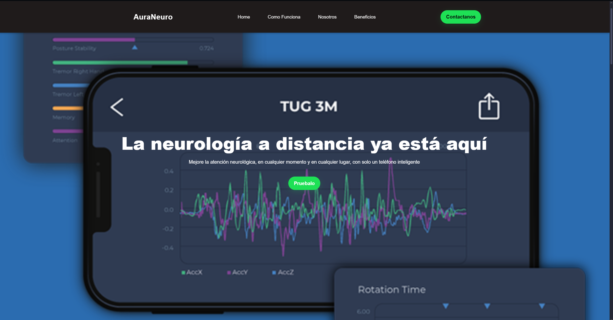  
La sección de **Inicio** presenta un mensaje introductorio que resume el propósito de la plataforma: mejorar la atención neurológica mediante IoT, IA y telemedicina.  
Se incluyen botones de llamada a la acción (*Call to Action*) para fomentar el registro y exploración de la solución.

---

#### Sección ¿Quiénes Somos?
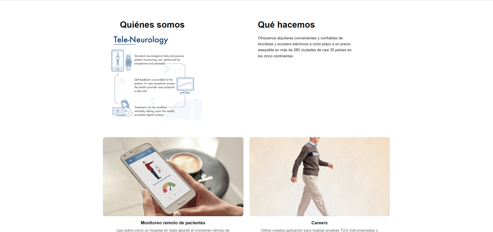  
En esta sección se describe la **misión y visión** de la plataforma, explicando cómo busca optimizar la salud neurológica y apoyar tanto a pacientes como a profesionales médicos.  
El objetivo es generar confianza y mostrar el **valor diferencial** del proyecto.

---

#### Sección Beneficios
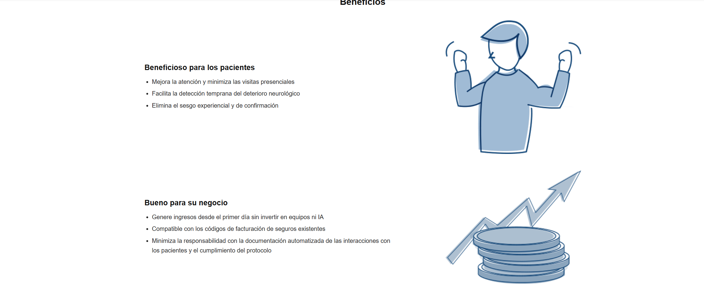  
Aquí se destacan los **principales beneficios** que ofrece la solución, tanto para pacientes (monitoreo en tiempo real, prevención, seguimiento) como para profesionales de la salud (acceso a datos confiables, analítica avanzada, telemedicina).  
La información se presenta de forma visual y accesible.

---

#### Sección Cómo Funciona
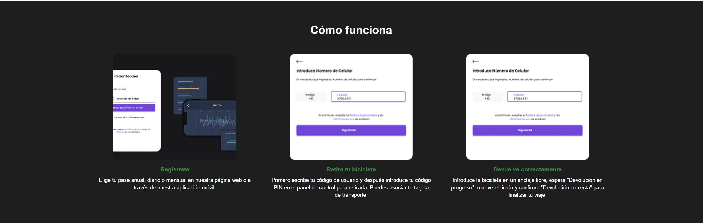  
Esta sección explica el **flujo operativo de la plataforma**, desde la recolección de datos mediante dispositivos IoT hasta su análisis con IA y la generación de alertas o recomendaciones para médicos y pacientes.  
Se busca que el usuario entienda de manera sencilla el **valor tecnológico** de la propuesta.

---

#### Sección Información y Recursos
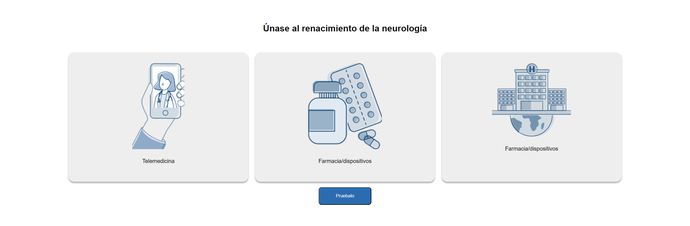  
Incluye recursos adicionales, datos técnicos y explicaciones sobre la integración de la plataforma con servicios médicos externos.  
Está pensada para usuarios más especializados (profesionales de salud, instituciones médicas) que buscan detalles adicionales antes de adoptar la solución.

---

#### Vista general en dispositivos
  
La página está optimizada para **dispositivos móviles y web**, asegurando accesibilidad en diferentes contextos de uso.  
Esto refuerza el objetivo de crear una plataforma inclusiva y práctica para todos los segmentos definidos.

### 4.4. Web Applications UX/UI Design  
#### 4.4.1. Web Applications Wireframes  
- Login Page  
  
- Insert Number Page  
   
- Verify Otp Page  
   
- Insert Data User Page  
  
- Inicio Page  
  
- Data Page  
  
- User Page  
  
- Recetas Page  
  
- Chats Page  
  
- Map Page  
  

#### 4.4.2. Web Applications Wireflow Diagrams  
  
#### 4.4.3. Web Applications Mock-ups  
- Login Page  
  
- Insert Number Page  
   
- Verify Otp Page  
   
- Insert Data User Page  
  
- Inicio Page  
  
- Data Page  
  
- User Page  
  
- Recetas Page  
  
- Chats Page  
  
- Map Page  
  
#### 4.4.4. Web Applications User Flow Diagrams  
  
### 4.5. Web Applications Prototyping  

### Introducción
En esta sección se presentan los prototipos interactivos de la aplicación AuraNeuro, diseñados tanto para desktop como para mobile web browser. Estos prototipos simulan la navegación y los principales flujos de interacción, basados en los User Flow Diagrams previamente definidos.

Los criterios principales que guiaron las decisiones de interacción fueron:

- **Consistencia con la arquitectura de información:** se respetan los sistemas de organización, etiquetado y navegación definidos en los diagramas de flujo, garantizando coherencia en la experiencia de usuario.  
- **Usabilidad e inclusión:** se priorizó un diseño accesible, simple y claro, de manera que los usuarios puedan completar sus objetivos (registro, acceso a beneficios, contacto y monitoreo) de manera fluida.  
- **Coherencia visual:** los prototipos mantienen el sistema de diseño propuesto, con tipografía legible, componentes reutilizables y una paleta cromática uniforme para garantizar continuidad entre pantallas.  

---

### Prototipo Desktop
Los prototipos de escritorio muestran los siguientes flujos clave:

1. **Acceso al Home (Landing Page).**  
2. **Registro de usuario** a través del formulario de contacto.  
3. **Exploración de secciones informativas**:  
   - Quiénes somos.  
   - Acerca de nosotros.  
   - Beneficios.  
   - Cómo funciona.  
4. **Interacción con beneficios y servicios**, como la explicación de ventajas para pacientes y para negocios.  

**Screenshot de ejemplo (Desktop):**  

Enlace al video de simulación (Microsoft Stream):  
 [Video Prototipo Desktop](https://upcedupe-my.sharepoint.com/:v:/g/personal/u202320574_upc_edu_pe/EU3tLSOOMqBKoPOduEP8hT8B5YirLUIadNh7OPgbE-ZeIg?nav=eyJyZWZlcnJhbEluZm8iOnsicmVmZXJyYWxBcHAiOiJTdHJlYW1XZWJBcHAiLCJyZWZlcnJhbFZpZXciOiJTaGFyZURpYWxvZy1MaW5rIiwicmVmZXJyYWxBcHBQbGF0Zm9ybSI6IldlYiIsInJlZmVycmFsTW9kZSI6InZpZXcifX0%3D&e=7NroAo)

---

### Prototipo Mobile
Los prototipos móviles priorizan la navegación simplificada en pantallas pequeñas, asegurando la accesibilidad de todas las funciones principales:

1. **Inicio adaptado a mobile.**  
2. **Acceso al menú hamburguesa** para navegar entre secciones.  
3. **Visualización compacta de beneficios y secciones informativas.**  
4. **Sección de contacto optimizada en formulario vertical.**  

**Screenshot de ejemplo (Mobile):**  

Enlace al video de simulación (Microsoft Stream):  
 [Video Prototipo Mobile](https://upcedupe-my.sharepoint.com/:v:/g/personal/u202320574_upc_edu_pe/EVOCLtICjRlCnIbePhVTKRkBQjhxFgmXg-lHkXVoBIPzgA?nav=eyJyZWZlcnJhbEluZm8iOnsicmVmZXJyYWxBcHAiOiJTdHJlYW1XZWJBcHAiLCJyZWZlcnJhbFZpZXciOiJTaGFyZURpYWxvZy1MaW5rIiwicmVmZXJyYWxBcHBQbGF0Zm9ybSI6IldlYiIsInJlZmVycmFsTW9kZSI6InZpZXcifX0%3D&e=r7TzqS) 
 
 ---

### Conexión con los User Flow Diagrams
Los prototipos presentados corresponden directamente a los **User Flows** definidos en la sección 4.4:

- Registro de usuario.  
- Inicio en la landing page.  
- Exploración de secciones informativas: *Quiénes somos, Beneficios, Cómo funciona y Acerca de nosotros*.  
- Interacción con el formulario de contacto.  

**Screenshots de secciones clave:**

- Quiénes somos  
  

- Acerca de nosotros  
  

- Beneficios  
  

- Cómo funciona  
  

- Contacto  
  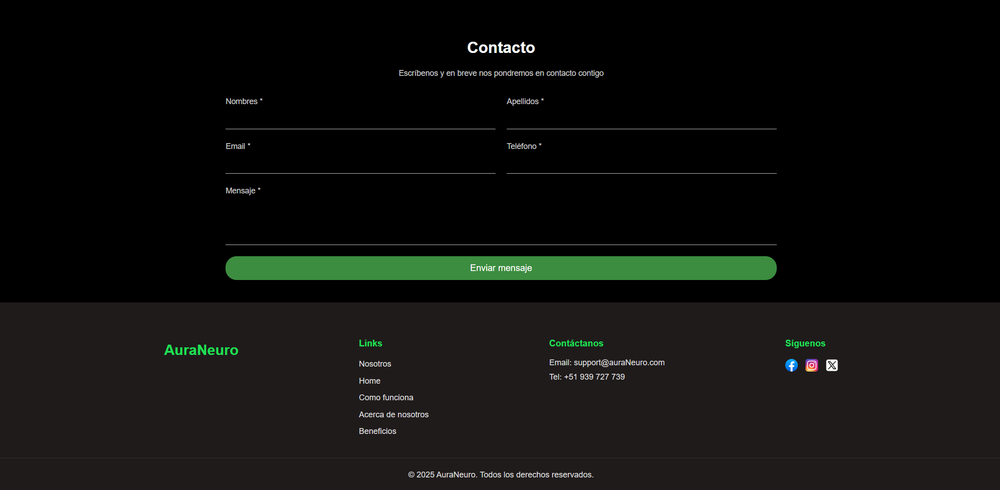

---

En conclusión, los prototipos de **AuraNeuro** permiten visualizar cómo los usuarios finales navegarán en las versiones **desktop** y **mobile**, asegurando que los flujos definidos en los diagramas se traduzcan en interacciones claras, consistentes y alineadas con la propuesta de valor de la aplicación.

### 4.6. Domain-Driven Software Architecture  

#### 4.6.1. Design-Level EventStorming  

Nuestro objetivo es estructurar el dominio de AuraNeuro en contextos claros, detallando los principales flujos de interacción (monitoreo de pacientes → procesamiento de datos IoT → análisis mediante IA → alertas y notificaciones → acceso de profesionales de la salud) y los cruces entre contextos (suscripciones, telemedicina, notificaciones).

**Captura:**  
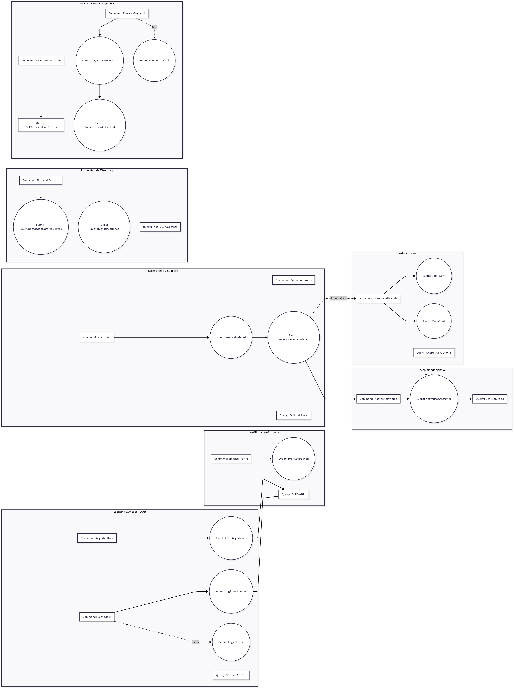

**Bounded Contexts identificados:**
- **Identity & Access (IAM):** registro, login, autorización de usuarios.  
- **Profiles & Preferences:** datos del paciente, preferencias médicas.  
- **Stress Test & Support:** ingestión de datos IoT, score neurológico, reportes de evolución.  
- **Recommendations & Activities:** recomendaciones personalizadas y asignación de rutinas.  
- **Professionals Directory:** directorio de neurólogos/terapeutas, solicitud de contacto.  
- **Subscriptions & Payments:** gestión de planes, facturación y pasarela de pago.  
- **Notifications:** envío de alertas y recordatorios vía email/SMS/push.  
- **Analytics & Reporting:** métricas de uso, reportes clínicos.  

**Aggregates, Commands, Events, Queries (resumen):**
- **User:** `RegisterUser`, `LoginUser` → `UserRegistered`, `LoginSucceeded` / `LoginFailed` → `GetUserProfile`.  
- **Profile:** `UpdateProfile` → `ProfileUpdated` → `GetProfile`.  
- **TestSession:** `StartTest`, `SubmitAnswers` → `TestSubmitted`, `StressScoreCalculated` → `GetLastScore`.  
- **Plan/Activities:** `AssignActivities` → `ActivitiesAssigned` → `GetActivities`.  
- **Psychologist:** `CreateProProfile`, `RequestContact` → `PsychologistPublished`, `PsychologistContactRequested`.  
- **Subscription:** `StartSubscription`, `ProcessPayment` → `SubscriptionActivated`, `PaymentProcessed` / `PaymentFailed`.  
- **Notification:** `SendEmail/Push` → `EmailSent/PushSent`.  

**Flujo principal (happy path):**
1. El paciente inicia un test neurológico y se generan métricas biométricas.  
2. La IA calcula el **score neurológico** y asigna recomendaciones.  
3. Si se supera un umbral crítico, se generan alertas y se notifica al cuidador/familiar.  
4. El neurólogo accede al dashboard y puede contactar o ajustar la terapia.  

---

#### 4.6.2. Software Architecture Context Diagram  

El diagrama de contexto muestra la interacción de los tres segmentos principales (Pacientes, Cuidadores/Familiares y Proveedores IoT), junto con los neurólogos/terapeutas, dentro del ecosistema AuraNeuro. También se evidencian las integraciones externas (EHR/HIS, pasarelas de pago, servicios de mensajería y notificaciones).  

**Captura del diagrama de contexto:**  
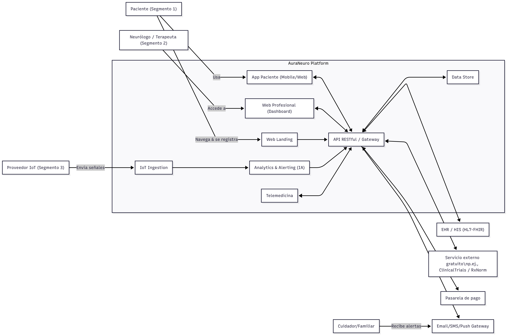

---

#### 4.6.3. Software Architecture Container Diagrams  

El container diagram representa los principales contenedores de la plataforma AuraNeuro:  
- **Clientes:** navegador (desktop/mobile), app móvil/PWA del paciente, dashboard del profesional.  
- **Backend:** API Gateway + BFF, motor de reglas e IA, servicios de notificaciones, telemedicina (WebRTC), motor de ingestión IoT.  
- **Persistencia:** base de datos relacional, time-series DB/Data Lake, cache.  
- **Integraciones externas:** EHR/HIS, servicios clínicos externos, pasarela de pago, mensajería (email/SMS/push).  

**Captura del container diagram:**  
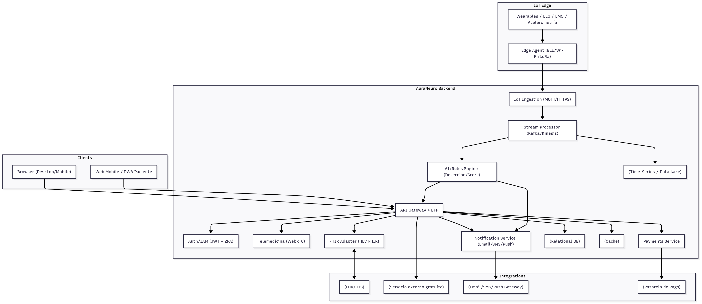

---

#### 4.6.4. Software Architecture Components Diagrams  

El component diagram detalla los servicios internos que conforman el Domain Core de AuraNeuro, incluyendo la lógica de negocio y la infraestructura. Se muestran los componentes principales como:  
- **AuthService / IAM** para gestión de identidades.  
- **TestSessionService** para captura y análisis de datos neurológicos.  
- **AlertingService** para generación de alertas en tiempo real.  
- **ProfessionalDirectoryService** para gestión de neurólogos y terapeutas.  
- **FHIRAdapter** para interoperabilidad con estándares clínicos (HL7-FHIR).  
- **Telemed Orchestrator** para habilitar videollamadas seguras.  

**Captura del component diagram:**  

---

### 4.7. Software Object-Oriented Design  

En esta sección se presentan y explican los diagramas de clases UML que muestran el mayor nivel de detalle sobre la implementación de los componentes para cada *bounded context* de la plataforma AuraNeuro.  

La propuesta incluye **clases, interfaces, enumeraciones y sus relaciones**, detallando atributos, métodos y visibilidad (*public, private, protected*). Asimismo, se especifican **multiplicidades y asociaciones** entre clases, asegurando consistencia con los bounded contexts definidos previamente en la arquitectura de software.

---

#### 4.7.1. Class Diagrams  

#### A) Identity & Access (IAM)
Este diagrama modela el proceso de **registro, autenticación y gestión de sesiones**.  
Incluye las clases principales `Usuario`, `Sesion` y las interfaces de autenticación (`AuthProvider`).  
Se utiliza la enumeración `EstadoUsuario` para controlar el estado de la cuenta.  

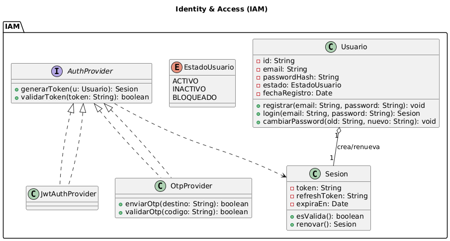

---

#### B) Profiles & Preferences
Este diagrama representa la **gestión de perfiles de usuario** y sus preferencias de notificación.  
Incluye la clase `Perfil`, que se relaciona con `Preferencias` y las enumeraciones `Genero` y `CanalNotificacion`.  

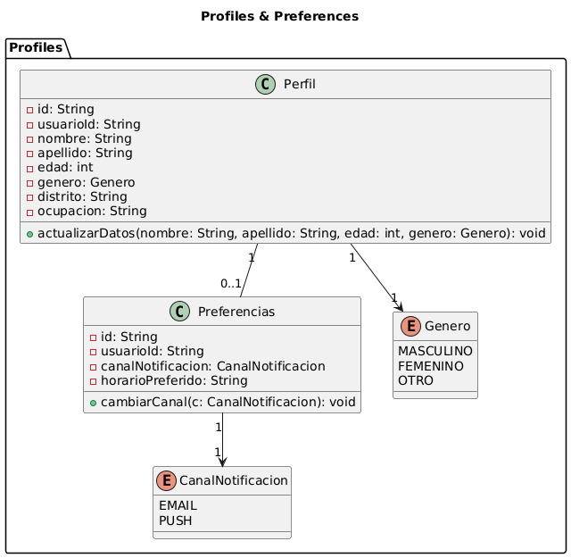

---

#### C) IoT & Biometric Monitoring
Este diagrama modela la integración con **dispositivos IoT** (wearables, EEG, EMG) y la recolección de señales biométricas.  
La clase `Dispositivo` se relaciona con `SeñalBiometrica`, y se utiliza la enumeración `TipoDispositivo` para clasificar el hardware.  

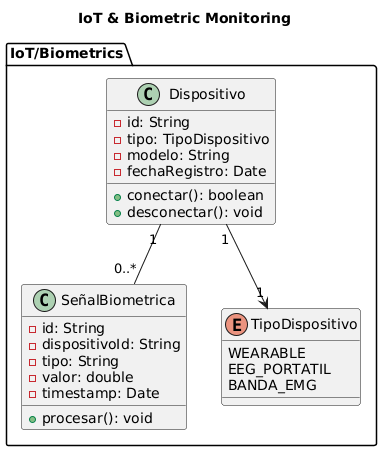

---

#### D) Telemedicine (WebRTC)
Este diagrama representa el flujo de la **telemedicina**, con clases que gestionan las citas (`Cita`), salas virtuales (`Sala`) y mensajería instantánea (`MensajeChat`).  
Se incluye la enumeración `EstadoCita` para el ciclo de vida de la consulta.  

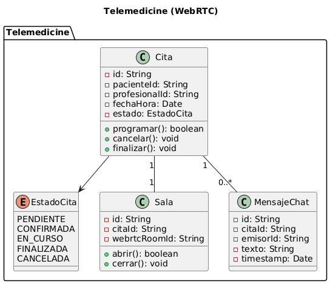

---

#### E) Subscriptions & Payments
Este diagrama describe la gestión de **planes de suscripción y pagos**.  
Las entidades principales son `Suscripcion`, `Plan` y `Pago`, relacionadas con la pasarela de pago (`PasarelaPago`).  
Se emplean las enumeraciones `EstadoSuscripcion`, `EstadoPago` y `MetodoPago`.  

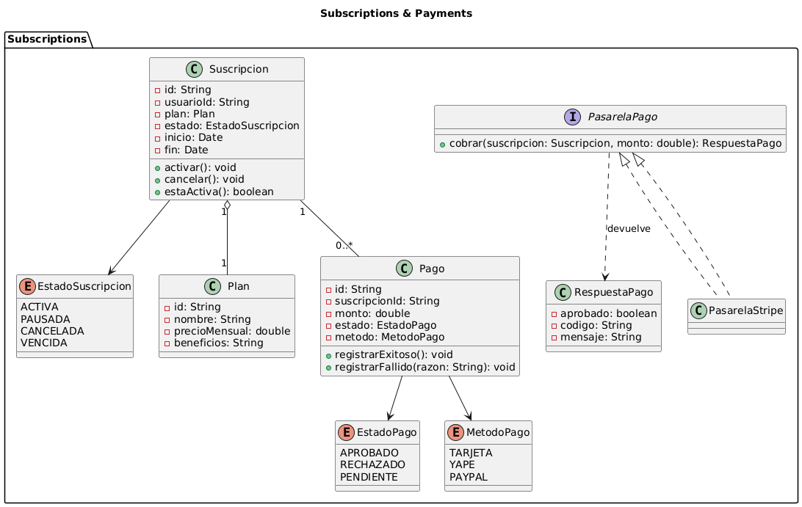

---

#### F) Notifications
El diagrama de **notificaciones** modela cómo se generan, envían y marcan como entregadas o fallidas las alertas al usuario.  
Se incluyen las clases `Notificacion`, `ServicioCorreo` y `SMTPProvider`, junto con las enumeraciones `Canal` y `EstadoEnvio`.  

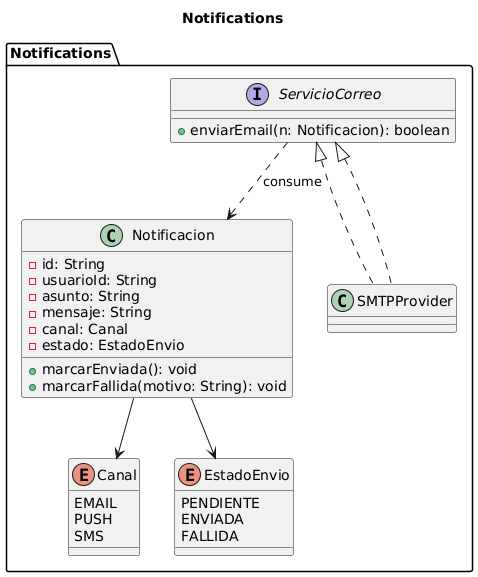

---

#### G) Analytics & Alerting
Este diagrama muestra el uso de **IA y reglas de detección de anomalías**.  
Incluye las clases `MotorIA`, `Regla`, `EventoAnomalia` y `Alerta`.  
La severidad de los eventos se gestiona con la enumeración `NivelSeveridad`.  

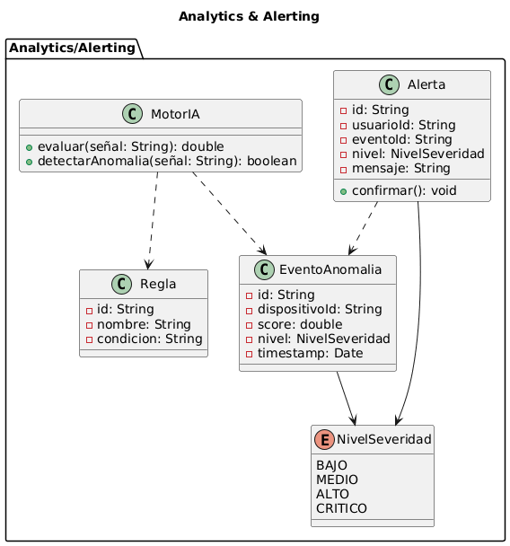

---

#### H) EHR / FHIR Adapter
Este diagrama representa la integración con sistemas clínicos externos vía **FHIR**.  
Se definen las clases `FHIRAdapter`, `Observacion` y `PacienteRef`, junto con la enumeración `TipoObservacion` (ej. frecuencia cardiaca, saturación, sueño).  

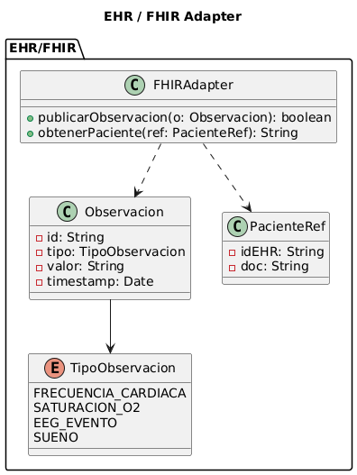

---

### 4.8. Database Design  

#### 4.8.1. Database Diagrams  

La base de datos **AuraNeuro** fue diseñada siguiendo principios de **normalización (3FN)**, nomenclatura consistente en **MAYÚSCULAS** y uso de tipos de datos simples (INT, VARCHAR, DATE, DATETIME, BIT).  
El diseño busca garantizar **persistencia confiable**, **integridad referencial** y **evitar bucles** en las relaciones entre entidades.

---

### Principales características
- **Claves primarias**: todas las tablas utilizan un atributo ID_* como **PRIMARY KEY**.  
- **Claves foráneas**: definidas según bounded contexts, evitando ciclos entre entidades.  
- **Constraints**:  
  - UNIQUE en PACIENTE.ID_USR (relación 1–1 con USUARIO).  
  - UNIQUE en combinaciones clave (USUARIO_ROL, PACIENTE_DISPOSITIVO).  
- **Integridad referencial**: garantizada en relaciones 1–N y N–N.  
- **Optimización**: índices compuestos en tablas críticas como CITA, REGISTRO_BIOMETRICO y ADHERENCIA.  

---

### Bounded Contexts reflejados en el diagrama

#### Identity & Access
- **ORGANIZACION → USUARIO** (1–N)  
- **USUARIO ↔ ROL** mediante **USUARIO_ROL** (N–N)  
- **API_CLIENTE → API_TOKEN** (1–N)  

#### Patient Care
- **USUARIO → PACIENTE** (1–1)  
- **PACIENTE → CITA → MEDICO** (consultas presenciales o virtuales)  
- **CITA → TELECONSULTA** (1–1)  
- **PACIENTE → TRATAMIENTO → ADHERENCIA**  
- **PACIENTE → CONTACTO_EMERGENCIA**  
- **PACIENTE → CONSENTIMIENTO**  

#### IoT & Eventing
- **PACIENTE → PACIENTE_DISPOSITIVO → REGISTRO_BIOMETRICO**  
- **PACIENTE → EPISODIO → ALERTA**  
- **DISPOSITIVO** como catálogo de hardware compatible  

#### Interoperabilidad / Estándares
- **PACIENTE → EXPORTACION_FHIR** (tracking de recursos HL7 FHIR)  

---

### Diagrama de la base de datos
El siguiente diagrama evidencia las tablas, atributos principales, claves primarias (PK), foráneas (FK) y relaciones entre los bounded contexts:

  

---

### Validaciones de consistencia
- No existen bucles: MEDICO no referencia a USUARIO.  
- Relaciones claras y unidireccionales:  
  - CITA → MEDICO y CITA → PACIENTE  
  - ADHERENCIA → TRATAMIENTO`  
  - REGISTRO_BIOMETRICO → PACIENTE_DISPOSITIVO  
  - ALERTA → EPISODIO`  
- Se mantiene integridad en:
  - **1–1**: PACIENTE–USUARIO  
  - **1–N**: CITA–PACIENTE  
  - **N–N**: USUARIO–ROL  

---

## Capítulo V: Product Implementation, Validation & Deployment  

### 5.1. Software Configuration Management  
#### 5.1.1. Software Development Environment Configuration  
Esta sección detalla las herramientas utilizadas durante el desarrollo del software, organizadas según las distintas fases del proyecto.

*Project Management

-Google Meet: https://meet.google.com/

-Plataforma utilizada para realizar reuniones virtuales con los miembros del equipo. Permite compartir pantalla, imágenes, texto y video, todo en tiempo real. Es compatible con navegadores web, dispositivos móviles y computadoras, y solo requiere una cuenta activa para su uso.

-Product UX/UI Design

-UXpressia: https://uxpressia.com/

Fue clave para construir perfiles detallados de usuarios, mapear sus emociones, metas y comportamientos mediante herramientas como User Personas, Journey Maps y Empathy Maps.

-Figma: https://www.figma.com/ Plataforma colaborativa de diseño usada para crear wireframes y mockups. Su facilidad para compartir y editar en tiempo real la convirtió en una herramienta fundamental en el desarrollo de interfaces visuales.

*Software Development

-Landing Page

Se desarrolló la landing page con tecnologías como HTML5, CSS3 y JavaScript, apoyados en Bootstrap para lograr un diseño responsivo y acelerar el desarrollo de una interfaz adaptable a diversos dispositivos.

*IDE’s de desarrollo

-Visual Studio Code: https://code.visualstudio.com/

Usamos este IDE por su rendimiento, facilidad de uso y herramientas integradas para la edición, depuración y control de versiones. Fue esencial para implementar la landing page de forma ágil y ordenada.

-GitHub: https://github.com/

Plataforma para alojar el repositorio del proyecto y gestionar el control de versiones del código fuente y la documentación, facilitando la colaboración y el seguimiento de cambios.

*Software Deployment

-GitHub Pages

Utilizamos GitHub Pages para desplegar la landing page de forma gratuita y directamente desde el repositorio del proyecto. Esta herramienta permite alojar sitios estáticos fácilmente, integrándose con el flujo de trabajo de GitHub y facilitando una publicación continua con cada cambio en el repositorio.

*Software Documentation

-Canva: https://www.canva.com/

Empleamos Canva para la creación de material visual y presentaciones gráficas del proyecto. Su interfaz sencilla e intuitiva permite diseñar documentos importantes que ayudan a comunicar ideas de forma clara y profesional.

-Markdown:

Un lenguaje de marcado ligero y sencillo para crear documentos con formato, empleándose para redactar la documentación del proyecto de manera clara y estructurada.

#### 5.1.2. Source Code Management  

El equipo gestiona el código fuente utilizando **GitHub** como plataforma de control de versiones.  

- **Landing Page**: https://github.com/UPC-1ASI0730-2520-7468-Mithycore/LandingPageAuraNeuro

#### Workflow de Versionado – GitFlow
Para el control de versiones se aplica la estrategia **GitFlow**.La organización de ramas es la siguiente:

- **`main`**: contiene el código estable y liberado en producción.  
- **`develop`**: integra el trabajo de todas las features y sirve como base para la preparación de releases.  
- **Feature branches**: creados a partir de `develop` para nuevas funcionalidades. 
- **Release branches**: creados a partir de `develop` cuando se prepara una nueva versión estable. 
- **Hotfix branches**: creados a partir de `main` para resolver errores críticos detectados en producción. 

#### Convenciones de Commits
Se adoptó el estándar **Conventional Commits** para los mensajes de commit, garantizando claridad y trazabilidad.

Esto permite generar changelogs automáticos y facilita la integración continua.  

---

#### 5.1.3. Source Code Style Guide & Conventions  

En el proyecto **AuraNeuro**, se adoptaron convenciones de código para mantener consistencia, legibilidad y mantenibilidad. Todos los identificadores, clases, variables y comentarios se escriben en **inglés**. Las guías aplicadas se basan en estándares reconocidos para HTML, CSS, JavaScript y C#.

## 1. HTML
- Uso de HTML semántico: `<header>`, `<main>`, `<section>`, `<footer>`, `<article>`
- Clases e IDs en **kebab-case**: `hero-content`, `contact-form`, `navbar-container`
- Comentarios: `<!-- Comentario -->`
- Imágenes siempre con `alt` descriptivo

## 2. CSS
- Archivo principal: `Styles.css`
- Clases e IDs en **kebab-case**
- Variables CSS: `--variable-name`
- Responsividad con media queries

## 3. JavaScript
- Variables: `camelCase`
- Constantes: `UPPER_SNAKE_CASE`
- Funciones descriptivas; manejadores con prefijo `onEvent`
- `"use strict";` al inicio de scripts

#### 5.1.4. Software Deployment Configuration  

La aplicación se desplegará en la nube mediante:

-Vercel para el Landing Page.

-Azure o AWS para el backend con API RESTful y base de datos.

-Contenedores Docker para mantener consistencia en los entornos. 

### 5.2. Landing Page, Services & Applications Implementation  
#### 5.2.1. Sprint 1  
##### 5.2.1.1. Sprint Planning 1  

| **Sprint #** | Sprint 1 |
|--------------|----------|
| **Sprint Planning Background** | El Sprint 1 tiene como objetivo entregar el MVP del Landing Page de Mithycore y el formulario de contacto funcional, como primera pieza publicable que permita validar la propuesta de valor con visitantes y captar leads. |
| **Date** | 2025-09-20 |
| **Time** | 07:00 PM |
| **Location** | Reunión virtual (Google Meet ). |
| **Prepared By** |  Gutierre Tume, Jeremy  |
| **Attendees (to planning meeting)** | Eduardo Fabián Chacaliaza Minaya / Romero Meza Jhimy Pool / Gutierre Tume, Jeremy / Fabricio Fabián Quispe Barzola / Eduardo Fabián Chacaliaza Minaya |
| **Sprint 1 – Review Summary** | Durante el Sprint 0 (fase de descubrimiento) se completaron entrevistas con pacientes y profesionales, se definieron User Personas, Empathy Maps, User Task Matrix y Product Backlog. También se diseñó el prototipo del Landing Page en Figma. El Product Owner validó el prototipo y priorizó implementar el Landing Page como entregable inicial. |
| **Sprint 1 – Retrospective Summary** | El equipo destacó como aciertos la calidad de las entrevistas y la claridad del backlog. Como oportunidades de mejora se identificaron: necesidad de definir criterios de aceptación más claros y mejorar la estimación de esfuerzo. Se acordó implementar reuniones diarias breves y registrar evidencias en GitHub. |
| **Sprint 1 Goal** | Entregar y publicar el **Landing Page MVP** de Mithycore con formulario de contacto funcional y accesible en producción. |
| **Sprint 1 Velocity** | 20 Story Points |
| **Sum of Story Points** | 20 |

##### 5.2.1.2. Aspect Leaders and Collaborators  

Se identificaron los siguientes aspectos clave del Sprint:  

- **Landing Page (Hero + Servicios principales)**  
- **Formulario de Contacto**  
- **Sección About & Careers**  
- **Repositorio & Despliegue (CI/CD en GitHub + Vercel)**  
- **Estilo y experiencia de usuario (UX/UI)**  

Cada aspecto fue asignado a un **líder** (L) responsable de su entrega y uno o más **colaboradores** (C) que apoyan en la implementación, revisión y validación.  

---

| **Team Member (Last Name, First Name)** | **Role** | **GitHub Username** | **Landing Page (Hero + Servicios)** | **Formulario de Contacto** | **About & Careers** | **Repositorio & Despliegue (CI/CD)** | **Estilo UX/UI** |
|-----------------------------------------|----------|---------------------|-------------------------------------|-----------------------------|---------------------|---------------------------------------|-----------------|
| Gutierrez Tume, Stanley Jeremy           | Team Leader | `Stan-gt213891`   | L                                   | C                           | C                   | L                                     | C               |
| Meza Huanacune, Juan José                | Backend Engineer | `JuanMHZ1250`   | C                                   | L                           | C                   | C                                     | C               |
| Chacaliaza Minaya, Eduardo Fabián        | Frontend & UX/UI Engineer | `educmz`   | C                                   | C                           | C                   | C                                     | L               |
| Quispe Barzola, Fabricio Fabián          | Data & IoT Integration Engineer | `BrooklynKarmis` | C                                   | C                           | C                   | L                                     | C               |
| Romero Meza, Jhimy Pool                  | Frontend & UX/UI Engineer | `jhimyromeromeza` | C                                   | C                           | L                   | C                                     | L               |

---

##### 5.2.1.3. Sprint Backlog 1  

El Sprint 1 se centró en implementar y desplegar el **Landing Page MVP** de Mithycore en un entorno web accesible mediante navegador, utilizando **HTML, CSS y JavaScript**.  
El objetivo principal fue entregar un sitio mínimo viable que permita a los usuarios conocer la propuesta de valor de la plataforma y comunicarse a través de un formulario de contacto funcional.  

| **Sprint #** | **User Story** | **Work-Item / Task** | **Descripción** | **Estimación (Horas)** | **Assigned To** | **Status** |
|--------------|----------------|-----------------------|-----------------|-------------------------|-----------------|------------|
| Sprint 1 | US06.1 – Sección principal (Hero) | T1.1 | Maquetar estructura HTML de la sección principal (hero con mensaje de valor y CTA). | 5h | Eduardo | Done |
| Sprint 1 | US06.1 – Sección principal (Hero) | T1.2 | Estilizar hero con CSS (tipografía, botones, background). | 4h | Jhimy | Done |
| Sprint 1 | US06.2 – Servicios destacados | T2.1 | Maquetar sección de servicios con HTML y CSS. | 5h | Jhimy | Done |
| Sprint 1 | US06.2 – Servicios destacados | T2.2 | Implementar íconos/ilustraciones y verificar responsividad. | 3h | Eduardo | Done |
| Sprint 1 | US06.3 – Quiénes somos / What we do | T3.1 | Redactar e integrar contenido de misión y visión. | 2h | Stanley | Done |
| Sprint 1 | US06.3 – Quiénes somos / What we do | T3.2 | Estilizar sección en CSS y validar mobile-first. | 3h | Eduardo | Done |
| Sprint 1 | US06.4 – About & Careers | T4.1 | Maquetar sección “About & Careers” en HTML. | 3h | Jhimy | Done |
| Sprint 1 | US06.4 – About & Careers | T4.2 | Insertar contenido y enlaces de contacto/reclutamiento. | 2h | Fabricio | Done |
| Sprint 1 | US06.5 – Formulario de contacto | T5.1 | Implementar formulario en HTML (nombre, email, mensaje). | 4h | Juan José | Done |
| Sprint 1 | US06.5 – Formulario de contacto | T5.2 | Validaciones básicas con JavaScript. | 3h | Juan José | Done |
| Sprint 1 | US06.5 – Formulario de contacto | T5.3 | Configurar envío de datos (mock o log en consola/backend). | 4h | Fabricio | Done |
| Sprint 1 | General Task | T6.1 | Configurar repositorio GitHub y despliegue en Vercel/GitHub Pages. | 5h | Stanley | Done |

---

##### 5.2.1.4. Development Evidence for Sprint Review  

Durante el Sprint 1 se avanzó con la implementación del **Landing Page MVP** de Mithycore en el repositorio `LandingpageAplicacionesWeb`.  
Se realizaron ajustes en la estructura del archivo principal, correcciones en el footer y adición de secciones clave (Navbar, Hero, About, Footer).  

A continuación, se listan los commits registrados en GitHub:

| Repository                  | Branch | Commit Id | Commit Message                                     | Committed on (Date) |
|------------------------------|--------|-----------|---------------------------------------------------|----------------------|
| LandingpageAplicacionesWeb  | main   | 16c192f   | fix resume file main to index                     | 21/09/2025           |
| LandingpageAplicacionesWeb  | main   | 3d8b36a   | fix resume file                                   | 21/09/2025           |
| LandingpageAplicacionesWeb  | main   | b39818d   | fix author in the footer                          | 21/09/2025           |
| LandingpageAplicacionesWeb  | main   | 433f758   | fix change name index file                        | 21/09/2025           |
| LandingpageAplicacionesWeb  | main   | fea442d   | fix: Add Sections, Navbar, hero, about and foter  | 20/09/2025           |

##### 5.2.1.5. Execution Evidence for Sprint Review  
  
Durante el Sprint 1 se implementó y desplegó el **Landing Page MVP** de Mithycore utilizando **HTML, CSS y JavaScript**.  
El entregable principal fue una página accesible en navegador, con las siguientes secciones:  

- Home
- Como funciona
- Nosotros
- Beneficios
- Contactanos

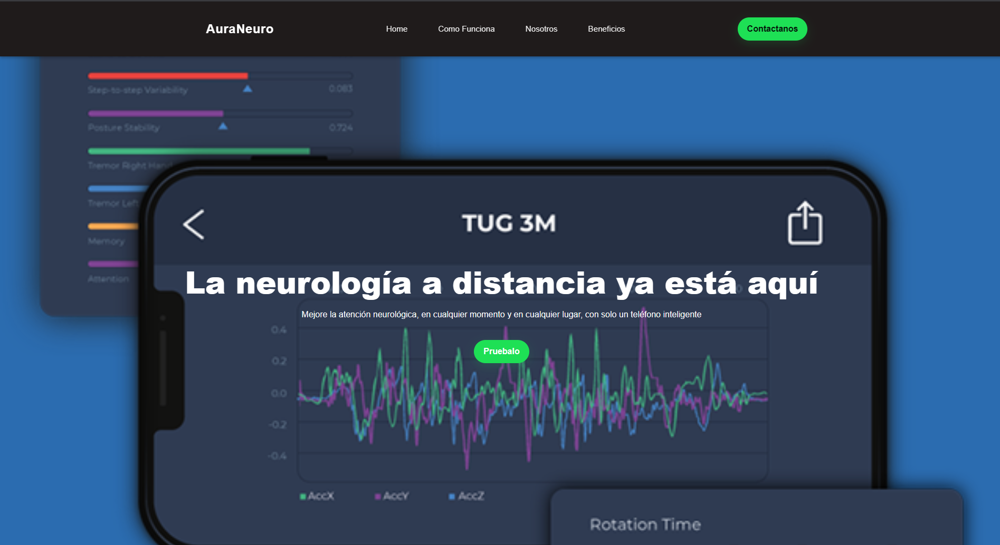  
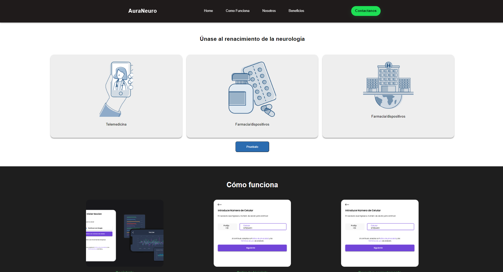  
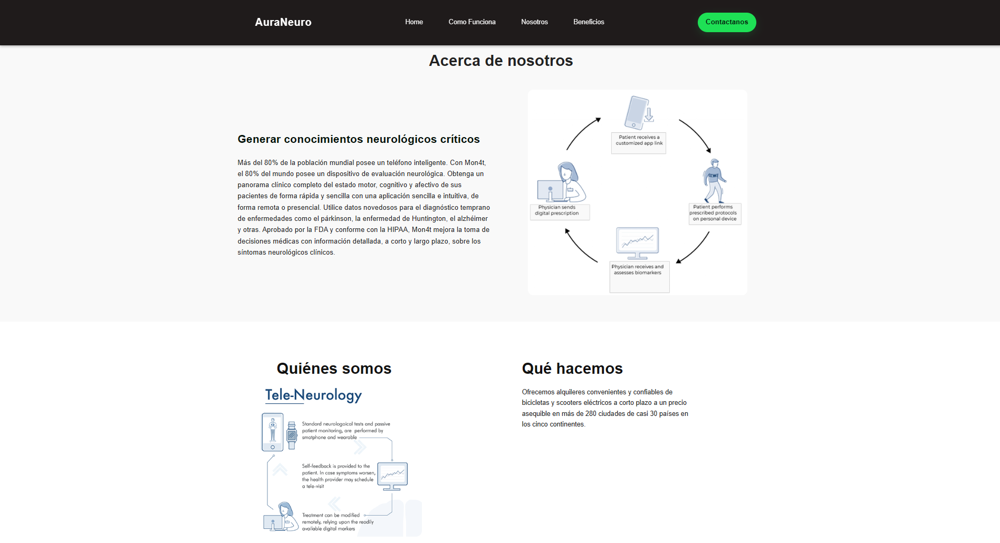  
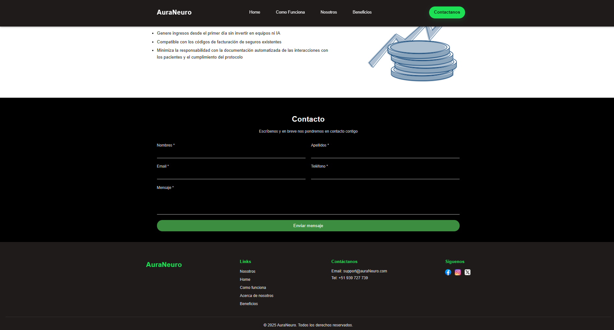  

URL del despliegue: https://upc-1asi0730-2520-7468-mithycore.github.io/LandingPageAuraNeuro/

##### 5.2.1.6. Services Documentation Evidence for Sprint Review  

Durante el Sprint 1, el equipo documentó e implementó el **Contact Service**, el cual se integra con el formulario de contacto del **Landing Page MVP**.  
La documentación fue elaborada utilizando **OpenAPI (Swagger)**, permitiendo visualizar las rutas, métodos HTTP, parámetros, respuestas esperadas y ejemplos de uso.  

---

### Contact Service Endpoints 

**Documentación de Endpoints – Contact API**

| **Endpoint**   | **Acción Implementada**           | **Método HTTP** | **Sintaxis de Llamada**    | **Parámetros** |
|----------------|----------------------------------|-----------------|----------------------------|----------------|
| `/contact`     | Enviar un mensaje de contacto    | POST            | `/api/v1/contact`          | `name`, `email`, `message` (Body) |
| `/contact`     | Obtener todos los mensajes       | GET             | `/api/v1/contact`          | Ninguno |
| `/contact/{id}`| Obtener mensaje por ID           | GET             | `/api/v1/contact/{id}`     | `id` (Path) |

---
 
##### 5.2.1.7. Software Deployment Evidence for Sprint Review  

Durante el Sprint 1, el equipo realizó el **despliegue del Landing Page MVP** .  
Este proceso se llevó a cabo utilizando **GitHub Pages** como proveedor de hosting gratuito, lo que permitió que la página esté disponible públicamente en la web.  

- Actividades realizadas en el Sprint

1. **Creación y configuración del repositorio en GitHub**  
   - Se creó el repositorio oficial del proyecto: https://github.com/UPC-1ASI0730-2520-7468-Mithycore
   - Se estableció la estructura de ramas:  
     - `main` → Rama principal y estable para despliegue.  
     - `develop` → Rama de integración.  
     - `feature/landing-page` → Rama dedicada al desarrollo del Landing Page.  

2. **Configuración de GitHub Pages**  
   - Se habilitó la opción de GitHub Pages en la rama `main`.  
   - Se configuró el despliegue automático al realizar un **merge** en `main`.  
   - El Landing Page se encuentra disponible en la siguiente URL:  
  (https://github.com/UPC-1ASI0730-2520-7468-Mithycore/LandingPageAuraNeuro)

3. **Validación del despliegue en navegador**  
   - Se probó la visualización en diferentes navegadores (Chrome, Edge, Firefox).  
  

- Vista del Landing Page desplegado en navegador.

 

##### 5.2.1.8. Team Collaboration Insights during Sprint  

Durante el Sprint 1, el equipo de Mithycore trabajó de manera colaborativa en la implementación y despliegue del **Landing Page MVP** utilizando **HTML, CSS y JavaScript**.  
Cada integrante del equipo asumió un rol específico (frontend, backend, integración, UX/UI, CI/CD), pero también colaboró en revisión de código, pruebas y documentación.  

---

- **Distribución del trabajo:**  
  - **Stanley Jeremy (Team Leader):** coordinación general y despliegue CI/CD.  
  - **Juan José (Backend Engineer):** implementación inicial del endpoint `/api/contact`.  
  - **Eduardo (Frontend & UX/UI):** desarrollo de la sección principal y estilos.  
  - **Fabricio (Data & IoT Integration):** soporte en mock de backend y despliegue.  
  - **Jhimy (Frontend & UX/UI):** implementación de secciones de servicios y About.  
- **Revisiones de código:** se realizaron revisiones cruzadas en Pull Requests para garantizar calidad y consistencia del código.  
- **Comunicación:** se utilizaron reuniones virtuales diarias de 15 min y un board de Trello para gestión de tareas.  

---

---

## Conclusiones  
- El proyecto responde a una necesidad clara: mejorar la atención neurológica mediante monitorización remota, detección temprana y seguimiento continuo apoyado en dispositivos IoT, analítica con IA y telemedicina. La propuesta combina prevención, personalización y reducción de hospitalizaciones, por lo que su impacto clínico y social es relevante.  

- Aura Neuro (nombre propuesto) articula tres ejes: dispositivos IoT para recolección de señales neurológicas, análisis en la nube con modelos de IA para detección y priorización de riesgos, y un ecosistema de interacción (app móvil + dashboard médico + teleconsultas). Esto facilita decisiones clínicas basadas en datos objetivos y continuidad del cuidado.  

- Existen soluciones consolidadas (Mon4t, BioSerenity, Empatica, PDMonitor, etc.) que validan la viabilidad técnica y clínica del enfoque. Estas referencias permiten aprender sobre diseño hardware-software, validación clínica y cumplimiento normativo; también evidencian áreas de oportunidad (integración multi-sensor, tests cognitivos remotos, mayor cobertura de enfermedades).  

- El backlog inicial es adecuado como primer MVP, pero requiere ampliación: se estimó un backlog realista de 40–50 historias para cubrir casos de conexión, errores, usabilidad, seguridad, roles adicionales y pruebas técnicas (logging, escalabilidad, rate limits, i18n). Se recomendó aplicar INVEST y priorizar con MoSCoW.  

---

## Bibliografía  

- Ceribell. (2024). Evaluating the impact of point-of-care electroencephalography on length of stay in the ICU: SAFER-EEG trial sub-analysis. Neurocritical Care. [Enlace](https://link.springer.com/article/10.1007/s12028-024-02039-6)  

- Claassen, J., Hirsch, L. J., Foreman, B., Mayer, S. A., & Vespa, P. M. (2024). Utility and rationale for continuous EEG monitoring: A primer for the general intensivist. *Critical Care, 28*(1), 45. [Enlace](https://ccforum.biomedcentral.com/articles/10.1186/s13054-024-04986-0)  

- Rodriguez Ruiz, A., et al. (2025). Survey on neurological monitoring practices and clinician perspectives. *Journal of Clinical Neurophysiology, 42*(1), 56–65. [Enlace](https://www.sciencedirect.com/science/article/pii/S1052305725000266)  

- *Frontiers in Neurology*. (2023). Multimodal monitoring: Practical recommendations in neurocritical care. [Enlace](https://www.frontiersin.org/journals/neurology/articles/10.3389/fneur.2023.1135406/full)  

- Michigan Medicine. (2023). At-home monitoring cuts hospital admissions by nearly 60%. *Medical Economics*. [Enlace](https://www.medicaleconomics.com/view/at-home-monitoring-cuts-hospital-admissions-by-nearly-60-study-finds)  

- Ceribell. (2022). Reduction in length of ICU stays with point-of-care EEG. *Ceribell Press Release*. [Enlace](https://ceribell.com/press_releases/reduction-in-length-of-icu-stays)

- Biondi, A., Laiou, P., Bruno, E., Viana, P. F., Schreuder, M., Hart, W., Nurse, E., Pal, D. K., & Richardson, M. P. (2021). Remote and long-term self-monitoring of electroencephalographic and noninvasive measurable variables at home in patients with epilepsy (EEG@HOME): Protocol for an observational study. *JMIR Research Protocols, 10*(3), e25309. https://doi.org/10.2196/25309  

- Biondi, A., Laiou, P., Bruno, E., Viana, P. F., Schreuder, M., Hart, W., … & Richardson, M. P. (2024). Feasibility and acceptability of an ultra-long-term at-home EEG monitoring system (EEG@HOME) for people with epilepsy. *Epilepsy & Behavior, 151*, 109609. https://doi.org/10.1016/j.yebeh.2024.109609  

- Kubota, Y., Nakamoto, H., Egawa, S., Kawamata, T., et al. (2018). Continuous EEG monitoring in ICU. *Journal of Intensive Care, 6*, Article 39. https://doi.org/10.1186/s40560-018-0310-Z  

- Rossetti, A. O., Schindler, K., Sutter, R., et al. (2020). Continuous vs Routine Electroencephalogram in Critically Ill Adults With Altered Consciousness and No Recent Seizure: A Multicenter Randomized Clinical Trial. *JAMA Neurology, 77*(10), 1225-1232. https://doi.org/10.1001/jamaneurol.2020.2264  

- Walishetti, A., Wong, A., & Yang, Y. (2024). Evaluating Home-Based EEG Systems for Public Health Telemonitoring: A Scoping Review. *[Preprint Scoping Review]*. Recuperado de https://www.researchgate.net/publication/385050548_Evaluating_Home-Based_EEG_Systems_for_Public_Health_Telemonitoring_A_Scoping_Review  
 
## Anexos

[🎥 Ver exposición completa](https://upcedupe-my.sharepoint.com/:v:/g/personal/u202320574_upc_edu_pe/EXaMP6Z0sDdPjiwa04tJcX4BwF1OHo-7UdXBFPwqlOl5Jw?nav=eyJyZWZlcnJhbEluZm8iOnsicmVmZXJyYWxBcHAiOiJTdHJlYW1XZWJBcHAiLCJyZWZlcnJhbFZpZXciOiJTaGFyZURpYWxvZy1MaW5rIiwicmVmZXJyYWxBcHBQbGF0Zm9ybSI6IldlYiIsInJlZmVycmFsTW9kZSI6InZpZXcifX0%3D&e=UpDqOn)
